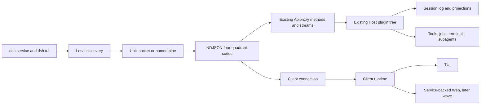

# Agent Note: Local Service and Multi-Client Application Protocol

Status: proposed

English | [中文](2026-08-16-local-service-multi-client-protocol.zh.md)

## Problem

DeepSeek Harness already has the business protocol needed by a rich client: `host/apiproxy` owns typed unary calls, answerable server requests, the session mux, Host events, and business failures; `client/connection` owns stream readiness and reconnect; `client/runtime` owns session and workspace mirrors; Session and projection packages own durable history and higher-sequence-wins views. The missing capability is not another business API. It is an independently released local client transport and service lifecycle that make those contracts safe across process boundaries, service restarts, multiple clients, and version skew.

A second `app-protocol` API would create competing method names, receipts, event logs, and replay rules. Keeping the current browser-only physical carrier would instead couple TUI lifetime to a Web server and leave local discovery, peer trust, service supervision, and restart reconciliation undefined.

## Proposal

Promote the existing four-quadrant Apiproxy contract into experimental protocol `dsh.app.v0`. Extend `host.describe`, `events.mux`, and `events.host` with negotiation, cursors, and synchronization markers. Add a local IPC carrier over a user-private Unix socket or Windows named pipe. Compose the existing Host plugin tree into one user-level service process and let Web, TUI, tests, and future clients bind the same `IApiClient` surface.

The service and protocol are additive. Existing HTTP/WebSocket Web transport, the automation JSONL protocol in `packages/sdk/protocol`, and the headless one-shot remain distinct supported surfaces. The automation protocol is not expanded into the application protocol, and protocol work does not move domain rules or durable state into a client package.

## Admission and ownership decision

The capability is `fit` for `client/deepseek-harness`, with split ownership inside the subproject:

| Concern | Canonical owner | Explicitly not owned by |
| --- | --- | --- |
| Agent, session, queue, approval, question, job, subagent, terminal, and projection semantics | existing Host/domain plugins | service carrier or TUI |
| Typed application methods and event shapes | `packages/host/apiproxy` | a new TUI-only protocol |
| Durable session sequence | Session | transport cursor or UI row index |
| Connection, retry, and baseline merge | `packages/client/connection` and `packages/client/runtime` | renderer plugins |
| Process lifetime, local discovery, peer admission, and drain | service bundle | CLI parser or client runtime |
| Layout, focus, draft, viewport, and terminal cleanup | TUI runtime | service |

## Existing contract reuse

| Existing primitive | Decision | Required change |
| --- | --- | --- |
| `ClientRequest`, `ServerResponse`, `ServerRequest`, `ClientResponse` | retain as the only wire message quadrants | add a carrier-independent frame codec and schemas at the IPC boundary |
| Stable `RpcId`, `RpcResult`, and `RpcReceipt` | retain | add typed service and contract failures; do not add a second receipt vocabulary |
| `HostApi.describe` | evolve into the compatibility handshake | accept optional client metadata and return protocol/capability facts |
| `EventsApi.mux` | retain as the session stream | implement `since`; add explicit synchronized and replay-gap frames |
| `EventsApi.host` | retain as the Host stream | add process-local revision, baseline cut, and replay-gap behavior |
| `ConnectionController` | retain | make readiness wait for protocol synchronization, not only physical open |
| `SessionRuntime` and `WorkspaceRuntime` | retain | expose a Node/local-IPC composition and service-instance reconciliation |
| Session projection values | retain | continue snapshot plus full-value push with sequence watermarks |
| `packages/sdk/protocol` | retain for automation only | no TUI application methods are added there |

## Logical topology



## Protocol identity and negotiation

`host.describe` becomes the first successful unary call of every connection. Its request remains backward compatible by making the new `client` member optional:

```ts
interface ClientHello {
  name: string;
  version: string;
  instanceId: string;
  supportedProtocols: string[];
  capabilities?: { name: string; version: number }[];
}
```

The response retains all current Host fields and adds:

```ts
interface ProtocolDescription {
  protocolVersion: "dsh.app.v0";
  serviceInstanceId: string;
  schemaHash: string;
  pluginManifestHash: string;
  capabilities: { name: string; version: number }[];
  hostRevision: number;
}
```

`serviceInstanceId` is regenerated on every service process start. `schemaHash` covers the application-facing Typert and frame schemas, not implementation files. `pluginManifestHash` covers enabled Host capabilities and client contribution manifests. Capabilities are versioned independently so one optional feature does not force a protocol-major fork.

The client selects the highest exact protocol identifier present in both lists. `dsh.app.v0` deliberately has no compatibility promise across arbitrary versions; a schema mismatch enters `contract_mismatch` and disables mutations. Unknown additive fields are tolerated. Unknown message quadrants, method names, enum variants in a closed union, or required capabilities are not tolerated.

## Local carrier

### Endpoint and peer trust

The default endpoint is below the DSH user-data directory, never inside a workspace. Unix uses a socket in a directory accessible only to the current user and verifies peer credentials when the platform exposes them. Windows uses a named pipe with a current-user ACL. Filesystem mode alone is not treated as authentication on platforms where peer identity can be checked.

Remote TCP, public WebSocket, SSH forwarding, and shared-machine cross-user access are excluded from v0. They require a separate authentication, authorization, origin, and secret-distribution decision.

### Framing

IPC uses UTF-8 NDJSON: exactly one `RpcMessage` per line. JSON string newlines are escaped by serialization. The carrier enforces a configurable maximum frame size, rejects invalid UTF-8 and schema-invalid messages, and closes after one bounded error response when correlation remains possible. Large process output and binary assets are chunked or referenced by an owner API; they are not smuggled into an unbounded frame.

One duplex connection multiplexes unary calls, stream pushes, answerable server requests, and their client responses. Each direction has one ordered write queue. Backpressure pauses stream production or coalesces explicitly coalescible projections; it never drops durable session events, answerable requests, terminal exit, or failure frames. Diagnostics use the service log, not the protocol stream.

### Connection admission

The first client request must be `host.describe`. Before it succeeds, the server accepts only transport-level close. After negotiation, the server binds the connection to `client.instanceId`, negotiated capabilities, peer identity, and a bounded in-flight request budget. A duplicate `rpcId` on the same active connection is a protocol error. A retried business action uses its documented stable identity, such as a preallocated message id or expected revision, rather than relying on a transport reconnect to deduplicate arbitrary calls.

## Stream synchronization

Physical stream open is not application readiness. Each generation completes these phases:

```text
connect -> describe -> open streams -> capture cuts -> replay/baseline
        -> synchronized -> pull lists/history -> merge buffered increments
        -> ready
```

### Session mux

`events.mux({ since })` implements the existing `since` member. For every attached or explicitly subscribed session, the server:

1. registers a live tap and captures durable sequence `cut`;
2. emits `session/subscribed` with `lastSeq = cut`, requested cursor, and a continuity result;
3. replays durable `SessionEvent` values from `since + 1` through `cut` in ascending sequence while buffering newer live events;
4. emits full snapshots for queue, jobs, projections, and every still-pending approval or question with its original `rpcId`;
5. emits `session/synchronized` with the highest delivered durable sequence;
6. flushes buffered events and continues live delivery.

If the requested cursor is ahead of the session, below retained history, or cannot be proven continuous, the stream emits `session/replay-gap`. The client marks that session `reconcile_required`, disables mutations for it, fetches a fresh history tail plus projections, and resubscribes from the returned sequence. A gap is never converted into an empty successful replay.

Ephemeral token/reasoning/process deltas are not replayed. Their owners must provide a convergent completed fact, current process snapshot, or explicit `unknown_after_restart` state.

### Host stream

The service assigns a monotonically increasing process-local `hostRevision` to Host mutations and keeps a bounded replay ring. `events.host` accepts `sinceRevision` and first emits `host/subscribed` with the current cut and `serviceInstanceId`. Every subsequent Host mutation carries its revision.

Host lists remain unary authoritative baselines. The client opens the stream before calling `session.list` and `workspace.list`, buffers revisions above the captured cut while those pulls run, then folds them over the baseline using the existing ordered-baseline approach. If the revision is outside the replay ring, the service emits `host/replay-gap`; the client repeats the baseline pull.

A changed `serviceInstanceId` invalidates all process-local cursors, pending transport calls, terminal attachment assumptions, and live interaction buffers. Durable session sequences may still resume after the client obtains a new Host baseline.

## Mutation and multi-client semantics

The protocol preserves owner-specific concurrency instead of adding a generic last-write-wins rule:

| Mutation | Concurrency rule | Client-visible result |
| --- | --- | --- |
| Prompt/follow-up | caller preallocates message id; duplicate accepted id is idempotent | response plus durable user-message event |
| Busy submit | Host chooses `steered` or `queued`; placement is returned and pushed | composer shows actual placement |
| Queue edit/reorder/delete | `expectedRevision` is required | new full queue snapshot or `queue-conflict` |
| Settings or plugin config | existing namespace revision or manifest revision | authoritative new snapshot or conflict |
| Approval/question | original server `rpcId`; first valid response wins | `RpcReceipt`, then resolved frame |
| Interrupt/terminate | idempotent against target run/process identity | accepted/already-settled/not-found |
| Checkpoint restore | preview id plus expected session/file revision | receipt followed by owner events |

A unary `ok` means the owner accepted or completed the documented operation; it is not permission for a client to synthesize the resulting state. Every stateful surface waits for the response and/or authoritative event described by that method.

The audit record may include client name and instance id, but client identity does not grant additional domain authorization. Raw peer credentials, bearer tokens, prompts, provider payloads, private tool arguments, and full reasoning never enter ordinary event or evidence payloads.

## Service lifecycle

### Single instance and discovery

One service runs per DSH home. Startup takes an exclusive service lock, creates the endpoint atomically, and publishes runtime metadata only after the socket or pipe is accepting and `host.describe` succeeds internally. Stale discovery data is removed only after validating that its recorded process is absent or does not own the endpoint.

`dsh service start` is idempotent: it reports the compatible existing instance or starts one. `dsh tui` defaults to connect-or-start. `dsh service status` uses `host.describe`, not only a PID file. `dsh service stop` sends a local control request, waits for drain, and reports whether forced termination was required.

### Retention and restart

The service keeps a session attached while any owner reports active work: turn, queued input, pending interaction, job, terminal, subagent, checkpoint operation, or subscriber. Idle sessions may be detached under an owner-defined policy without deleting durable logs.

On graceful stop the service rejects new mutations, broadcasts `service/drain`, waits for bounded Host disposal and persistence flush, closes streams, removes discovery state, and exits. On crash, the next instance rebuilds durable Session and projection state. Process-local jobs or PTYs that cannot be proven alive and reattached become explicit `orphaned` or `unknown_after_restart` records; they never reappear as running.

### Logs and diagnostics

Long-lived diagnostics go to a rotating file or structured sidecar chosen by service configuration. Terminal-owned stdout/stderr never receive logs while a TUI is attached. Records include timestamp, service instance, connection id, redacted client identity, method/event name, correlation id, duration, result class, and bounded error summary. Payload bodies are excluded by default.

## Failure contract

The protocol adds closed business/contract failures where current `internal` would be ambiguous:

| Code | Meaning | Required client behavior |
| --- | --- | --- |
| `protocol-mismatch` | no common application protocol | show required versions; no mutation |
| `schema-mismatch` | same protocol id but incompatible schema | enter `contract_mismatch` |
| `capability-unavailable` | optional method or stream is absent | disable only that feature |
| `service-draining` | service is shutting down | stop new mutations and detach |
| `replay-gap` | continuity cannot be proven | refresh authoritative baseline |
| `stale-service-instance` | request targets a previous process | reconnect and reconcile |
| `client-overloaded` | bounded in-flight or write budget exceeded | back off; do not blind retry mutation |
| `permission-denied` | Host policy refused an action | preserve state and show owner reason |

Malformed carrier messages and peer-admission failures are transport failures, not domain events. They receive bounded diagnostics and close the connection.

## Planned package changes

No new parallel SDK hierarchy is introduced. The expected ownership is:

```text
packages/host/apiproxy/          protocol negotiation and replay contracts
packages/client/connection/      local IPC carrier and generation handshake
packages/client/runtime/         service-instance reconciliation and Node face
packages/bundle/service/         long-lived Host composition and control plane
apps/cli/                        service and tui dispatch
packages/test-support/app-ipc/   carrier and multi-client fixtures, if reuse proves useful
```

`packages/bundle/service` contains composition and lifecycle only. It does not fork tools, sessions, terminals, hooks, or persistence. A shared IPC test helper is extracted only after at least two package tests need it.

## Target commands

```bash
dsh service start
dsh service status
dsh service stop
dsh service logs
dsh tui
dsh tui --no-start
dsh tui --session <session-id>
```

`dsh service start` defaults to a foreground child supervised by the CLI only for development; the released background behavior must use a platform-defined detachment strategy and a real readiness handshake. The spec does not permit a shell script containing credentials or an undocumented hidden TCP port.

## Verification requirements

- Codec property tests cover arbitrary Unicode, escaped newlines, partial reads, coalesced reads, maximum frames, invalid JSON, and schema failures.
- Contract tests run every unary method and both streams over in-process, current Web, and local IPC carriers and compare typed results.
- Reconnect tests inject disconnects before the response, after the response, during replay, during baseline pulls, and while responding to an approval.
- Multi-client tests race queue edits, prompts, approvals, interrupts, settings, and plugin reloads and assert owner-specific conflict semantics.
- Restart tests change `serviceInstanceId`, restore durable history, and mark non-recoverable processes honestly.
- Security tests verify Unix permissions or Windows ACLs, peer rejection, endpoint replacement defense, frame bounds, path redaction, and log redaction.
- Process tests prove start/status/stop idempotency, stale discovery recovery, graceful drain, forced-stop reporting, and terminal restoration.

Integration, component, system, and end-to-end runs write the repository's required evidence bundle under `temp/integration-test-runs/<run-id>/` through a runner command; tests do not hand-author evidence metadata.

## Alternatives considered

**Create new `packages/sdk/app-protocol`, `app-server`, and `app-client` packages.** Rejected because Apiproxy, Connection, Runtime, Session Events, and projections already own the business contract. A parallel hierarchy would duplicate names and convergence rules before proving a missing primitive.

**Use the current Web HTTP/WebSocket carrier unchanged.** Rejected as the service boundary because it has no independent-client version negotiation, local process discovery, current-user peer admission, or explicit service restart contract. It remains a conformance carrier during migration.

**Run a loopback Web server and connect the TUI through it.** Rejected for v0 because local port selection, browser-origin trust, access tickets, and exposed network listeners add policy that a private socket or pipe does not need. A future remote carrier can adapt the same logical protocol after authentication is designed.

## Risks

**Protocol evolution can destabilize Web.** New request members stay optional, response additions stay additive during v0, and existing Web carrier conformance is blocking before service adoption.

**Replay buffers can become an unbounded second log.** Durable replay continues to come from Session history; the Host revision ring is bounded and falls back to an explicit baseline refresh.

**A stale endpoint can become a local redirection attack.** Discovery verifies lock ownership, endpoint identity, peer credentials or ACL, and live `host.describe` before trusting metadata.

**Service ownership can absorb domain logic.** Package review rejects handlers that copy session, queue, tool, permission, terminal, or projection rules into the carrier or bundle.

**Crash recovery can overpromise process continuity.** Every process-local owner must report live, orphaned, or unknown after restart; absence of reattachment is visible product state.

## Acceptance criteria

1. A Node client and the browser client use one typed Apiproxy business surface; no TUI-only method mirror exists.
2. TUI exit does not stop a running turn, queued work, or service-owned job.
3. Reconnect either proves continuous delivery or enters an explicit reconcile state; no gap is silently treated as success.
4. Two clients converge after concurrent queue, interaction, and interrupt actions according to the owning service's rule.
5. Service restart is visible through `serviceInstanceId`, restores durable facts, and marks unrecoverable runtime resources honestly.
6. A protocol or schema mismatch leaves inspection diagnostics available but keeps mutations disabled.
7. Local endpoint access is current-user-only on supported platforms, and protocol/log evidence contains no secret or raw model payload.
8. Existing `dsh web`, headless, and automation-protocol tests remain green before Web is migrated to the service.

## Consequences

This design spends complexity on one durable contract instead of two. It makes Apiproxy a released multi-client boundary, so schema evolution and replay tests become stricter. It also leaves some runtime resources unrecoverable across a crash until their owning packages add reattachment. The product benefit is that every client sees the same accepted actions, failures, history, and projections, and the service can evolve independently of any one renderer.
