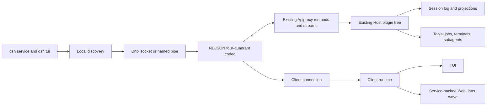

# Agent Note：本地服务与多客户端应用协议

Status: proposed

[English](2026-08-16-local-service-multi-client-protocol.md) | 中文

## 问题

DeepSeek Harness 已经具备富客户端需要的业务协议：`host/apiproxy` 拥有类型化单次调用、可应答的服务端请求、会话 mux、Host 事件与业务失败； `client/connection` 拥有流就绪与重连；`client/runtime` 拥有会话和工作区镜像；Session 与 projection 包拥有持久历史和“更高序列号优先”的视图。缺少的不是另一套业务 API，而是独立发布的本地客户端传输和服务生命周期，使这些契约在跨进程、服务重启、多客户端与版本偏移时仍然安全。

再建一套 `app-protocol` API 会形成相互竞争的方法名、回执、事件日志与重放规则。如果继续只使用当前浏览器物理载体，又会把 TUI 生命周期绑到 Web 服务，并让本地发现、对端信任、服务监管和重启对账保持未定义。

## 方案

把现有四象限 Apiproxy 契约提升为实验协议 `dsh.app.v0`。扩展 `host.describe`、`events.mux` 和 `events.host`，加入协商、游标与同步标记。新增基于当前用户私有 Unix socket 或 Windows named pipe 的本地 IPC 载体。把现有 Host 插件树组合为用户级服务进程，让 Web、TUI、测试和未来客户端绑定同一个 `IApiClient` 表面。

服务和协议均为增量新增。现有 HTTP/WebSocket Web 传输、 `packages/sdk/protocol` 中的自动化 JSONL 协议，以及 headless 单次执行继续作为不同的受支持表面。自动化协议不扩张为应用协议，协议工作也不把领域规则或持久状态移动到客户端包。

## 准入与所有权决策

该能力对 `client/deepseek-harness` 判定为 `fit`，在子项目内部拆分所有权：

| 关注点 | 规范所有者 | 明确不由谁拥有 |
| --- | --- | --- |
| Agent、Session、队列、审批、问题、job、subagent、terminal 与 projection 语义 | 现有 Host/领域插件 | 服务载体或 TUI |
| 类型化应用方法与事件形状 | `packages/host/apiproxy` | 新建的 TUI 专用协议 |
| 持久会话序列 | Session | 传输游标或 UI 行号 |
| 连接、重试与基线合并 | `packages/client/connection` 与 `packages/client/runtime` | renderer 插件 |
| 进程生命周期、本地发现、对端准入与 drain | service bundle | CLI 解析器或客户端运行时 |
| 布局、焦点、草稿、viewport 与终端清理 | TUI runtime | service |

## 复用现有契约

| 现有原语 | 决策 | 必需变更 |
| --- | --- | --- |
| `ClientRequest`、`ServerResponse`、`ServerRequest`、`ClientResponse` | 保留为唯一线协议四象限 | 在 IPC 边界增加与载体无关的 frame codec 和 schema |
| 稳定的 `RpcId`、`RpcResult` 与 `RpcReceipt` | 保留 | 增加类型化 service/contract 失败；不新增第二套回执词汇 |
| `HostApi.describe` | 演进为兼容性握手 | 接受可选客户端元数据，返回协议与 capability 事实 |
| `EventsApi.mux` | 保留为 session stream | 实现 `since`；增加显式 synchronized 与 replay-gap frame |
| `EventsApi.host` | 保留为 Host stream | 增加进程内 revision、baseline cut 与 replay-gap 行为 |
| `ConnectionController` | 保留 | 就绪等待协议同步，而不只是物理连接打开 |
| `SessionRuntime` 与 `WorkspaceRuntime` | 保留 | 暴露 Node/local-IPC 组合和 service-instance 对账 |
| Session projection 值 | 保留 | 继续使用 snapshot、full-value push 与序列 watermark |
| `packages/sdk/protocol` | 仅保留为自动化协议 | 不向其中加入 TUI 应用方法 |

## 逻辑拓扑



## 协议身份与协商

`host.describe` 成为每次连接第一个成功的单次调用。请求通过把新 `client` 成员设计为可选来保持向后兼容：

```ts
interface ClientHello {
  name: string;
  version: string;
  instanceId: string;
  supportedProtocols: string[];
  capabilities?: { name: string; version: number }[];
}
```

响应保留当前所有 Host 字段，并增加：

```ts
interface ProtocolDescription {
  protocolVersion: "dsh.app.v0";
  serviceInstanceId: string;
  schemaHash: string;
  pluginManifestHash: string;
  capabilities: { name: string; version: number }[];
  hostRevision: number;
}
```

每次服务进程启动都重新生成 `serviceInstanceId`。`schemaHash` 覆盖面向应用的 Typert 与 frame schema，而不是实现文件。`pluginManifestHash` 覆盖已启用 Host capability 和客户端 contribution manifest。各 capability 独立版本化，避免一个可选能力迫使整个协议主版本分叉。

客户端从双方列表中选择最高的完全匹配协议标识。`dsh.app.v0` 刻意不承诺任意版本之间兼容；schema 不匹配时进入 `contract_mismatch` 并禁用 mutation。未知的增量字段可容忍；未知 message quadrant、method、闭合 union 中的 enum variant 或必需 capability 不容忍。

## 本地载体

### Endpoint 与对端信任

默认 endpoint 位于 DSH 用户数据目录下，绝不位于 workspace 内。Unix 在仅当前用户可访问的目录创建 socket，并在平台支持时验证 peer credential。Windows 使用配置了当前用户 ACL 的 named pipe。在能够检查对端身份的平台上，不把文件 mode 单独当作认证。

远程 TCP、公共 WebSocket、SSH 转发与共享机器上的跨用户访问不属于 v0。它们需要单独决定认证、授权、origin 与 secret 分发。

### Framing

IPC 使用 UTF-8 NDJSON：每行恰好一个 `RpcMessage`。序列化会转义 JSON 字符串中的换行。载体执行可配置最大 frame 大小，拒绝无效 UTF-8 与不符合 schema 的消息；如果仍可关联，先返回一条有界错误再关闭连接。大型进程输出与二进制资产由所有者 API 分块或引用，不能塞进无界 frame。

一条双向连接复用 unary call、stream push、可应答 server request 与 client response。每个方向各有一个有序写队列。背压会暂停流生产，或合并明确允许合并的 projection；绝不丢弃持久 SessionEvent、可应答请求、terminal exit 或 failure frame。诊断写 service log，不写协议流。

### 连接准入

首个客户端请求必须是 `host.describe`。成功前，服务端只接受 transport close。协商后，服务端把连接绑定到 `client.instanceId`、已协商 capability、对端身份与有界 in-flight 预算。同一活动连接上重复 `rpcId` 属于协议错误。重试业务动作应使用其已定义的稳定身份，例如预分配 message id 或 expected revision，不能依赖 transport 重连替任意调用去重。

## Stream 同步

物理 stream 打开不等于应用就绪。每一代连接完成以下阶段：

```text
connect -> describe -> open streams -> capture cuts -> replay/baseline
        -> synchronized -> pull lists/history -> merge buffered increments
        -> ready
```

### Session mux

`events.mux({ since })` 实现现有 `since` 成员。对每个已 attached 或显式订阅的 session，服务端：

1. 注册 live tap 并捕获持久序列 `cut`；
2. 发出 `session/subscribed`，携带 `lastSeq = cut`、请求游标与 continuity 结果；
3. 按序重放 `since + 1` 到 `cut` 的持久 `SessionEvent`，同时缓冲更新的 live event；
4. 发出 queue、jobs、projections 的完整快照，以及仍 pending 的 approval/question，并复用其原始 `rpcId`；
5. 发出 `session/synchronized`，携带已交付的最高持久序列；
6. 刷出缓冲事件并继续 live delivery。

如果请求游标领先于 session、早于保留历史，或无法证明连续性，stream 发出 `session/replay-gap`。客户端把该 session 标记为 `reconcile_required`，禁用其 mutation，获取新 history tail 与 projections，再从返回序列重新订阅。gap 绝不能被转成空的成功重放。

临时 token/reasoning/process delta 不重放。其所有者必须提供可收敛的完成事实、当前 process snapshot，或显式 `unknown_after_restart` 状态。

### Host stream

服务给 Host mutation 分配进程内单调递增 `hostRevision`，并保留有界 replay ring。 `events.host` 接受 `sinceRevision`，先发出携带当前 cut 与 `serviceInstanceId` 的 `host/subscribed`。其后的每个 Host mutation 都携带 revision。

Host list 仍是 unary 权威基线。客户端在调用 `session.list` 与 `workspace.list` 前打开 stream；pull 期间缓冲高于已捕获 cut 的 revision，再使用现有 ordered-baseline 方法折叠到基线。如果 revision 已超出 replay ring，服务发出 `host/replay-gap`，客户端重复基线 pull。

`serviceInstanceId` 变化会使所有进程内 cursor、pending transport call、terminal attach 假设和 live interaction buffer 失效。客户端取得新的 Host 基线后，仍可按持久 session sequence 恢复。

## Mutation 与多客户端语义

协议保留各所有者的并发规则，而不是增加通用 last-write-wins：

| Mutation | 并发规则 | 客户端可见结果 |
| --- | --- | --- |
| Prompt/follow-up | 调用方预分配 message id；重复已接受 id 幂等 | response 加持久 user-message event |
| Busy submit | Host 选择 `steered` 或 `queued`；返回并推送 placement | composer 显示实际 placement |
| Queue edit/reorder/delete | 必须携带 `expectedRevision` | 新完整 queue snapshot 或 `queue-conflict` |
| Settings 或 plugin config | 使用现有 namespace revision 或 manifest revision | 权威新 snapshot 或 conflict |
| Approval/question | 使用原始 server `rpcId`；首个有效回答获胜 | `RpcReceipt`，随后 resolved frame |
| Interrupt/terminate | 对目标 run/process identity 幂等 | accepted/already-settled/not-found |
| Checkpoint restore | preview id 加 expected session/file revision | receipt，随后 owner events |

Unary `ok` 表示所有者接受或完成了该方法定义的操作；它不授权客户端自行合成结果状态。每个有状态表面等待该方法定义的 response 和/或权威 event。

审计记录可包含 client name 与 instance id，但 client identity 不赋予额外领域授权。原始 peer credential、bearer token、prompt、provider payload、私有 tool argument 与完整 reasoning 绝不进入普通 event 或 evidence payload。

## 服务生命周期

### 单实例与发现

每个 DSH home 运行一个 service。启动时获取独占 service lock，原子创建 endpoint，并且仅在 socket/pipe 已接受连接且内部 `host.describe` 成功后发布 runtime metadata。只有确认记录的进程不存在或不拥有 endpoint，才能移除过期 discovery 数据。

`dsh service start` 幂等：报告兼容的现有实例，否则启动新实例。`dsh tui` 默认connect-or-start。`dsh service status` 调用 `host.describe`，而不是只读 PID file。 `dsh service stop` 发送本地 control request，等待 drain，并报告是否需要强制终止。

### Retention 与重启

只要任一所有者报告存在活动工作，service 就保持 session attached：turn、queued input、pending interaction、job、terminal、subagent、checkpoint operation 或 subscriber。空闲 session 可按所有者定义的策略 detach，但不能删除持久日志。

优雅停止时，service 拒绝新 mutation，广播 `service/drain`，在有界时间内等待 Host dispose 与 persistence flush，关闭 stream，移除 discovery state 后退出。崩溃后，新实例重建持久 Session 与 projection 状态。无法证明仍存活并可重新 attach 的进程内 job 或 PTY 变为显式 `orphaned` 或 `unknown_after_restart`，绝不能重新显示为 running。

### 日志与诊断

长生命周期诊断写入由 service 配置选择的轮转文件或结构化 sidecar。TUI attached 时，终端拥有的 stdout/stderr 绝不接收日志。记录包含 timestamp、service instance、connection id、脱敏 client identity、method/event name、correlation id、duration、result class 与有界错误摘要；默认不记录 payload body。

## 失败契约

协议新增闭合的业务/契约失败，避免当前 `internal` 语义含糊：

| Code | 含义 | 客户端必需行为 |
| --- | --- | --- |
| `protocol-mismatch` | 没有共同 application protocol | 显示所需版本；禁止 mutation |
| `schema-mismatch` | 协议 id 相同但 schema 不兼容 | 进入 `contract_mismatch` |
| `capability-unavailable` | 可选 method 或 stream 不存在 | 只禁用该 feature |
| `service-draining` | service 正在关闭 | 停止新 mutation 并 detach |
| `replay-gap` | 无法证明连续性 | 刷新权威 baseline |
| `stale-service-instance` | request 指向旧进程 | reconnect 并 reconcile |
| `client-overloaded` | 超过有界 in-flight 或 write budget | back off；不盲目重试 mutation |
| `permission-denied` | Host policy 拒绝 action | 保留状态并显示 owner reason |

格式错误的 carrier message 与 peer-admission failure 是 transport failure，不是 domain event。它们产生有界诊断并关闭连接。

## 计划中的包变更

不新增平行 SDK 层级。预期所有权如下：

```text
packages/host/apiproxy/          protocol negotiation and replay contracts
packages/client/connection/      local IPC carrier and generation handshake
packages/client/runtime/         service-instance reconciliation and Node face
packages/bundle/service/         long-lived Host composition and control plane
apps/cli/                        service and tui dispatch
packages/test-support/app-ipc/   carrier and multi-client fixtures, if reuse proves useful
```

`packages/bundle/service` 只包含 composition 与 lifecycle，不 fork tools、sessions、terminals、hooks 或 persistence。只有至少两个 package test 确实需要复用时，才抽取共享 IPC test helper。

## 目标命令

```bash
dsh service start
dsh service status
dsh service stop
dsh service logs
dsh tui
dsh tui --no-start
dsh tui --session <session-id>
```

开发环境中，`dsh service start` 可以先使用由 CLI 监管的 foreground child；发布后的后台行为必须使用平台定义的 detach 策略与真实 readiness handshake。本规格不允许包含 credential 的 shell script，也不允许未记录的隐藏 TCP port。

## 验证要求

- Codec 属性测试覆盖任意 Unicode、转义换行、partial read、coalesced read、最大 frame、无效 JSON 与 schema failure。
- Contract test 通过 in-process、当前 Web 和 local IPC carrier 运行每个 unary method 与两条 stream，并比较类型化结果。
- Reconnect test 在 response 前、response 后、replay 中、baseline pull 中，以及回答 approval 时注入断连。
- Multi-client test 并发 queue edit、prompt、approval、interrupt、settings 与 plugin reload，断言各 owner 的冲突语义。
- Restart test 改变 `serviceInstanceId`，恢复持久 history，并如实标记不可恢复 process。
- Security test 验证 Unix permission 或 Windows ACL、peer rejection、endpoint replacement 防御、frame bound、path redaction 与 log redaction。
- Process test 证明 start/status/stop 幂等、stale discovery 恢复、graceful drain、forced-stop 报告与 terminal restoration。

Integration、component、system 与 end-to-end 运行通过 runner 命令把仓库要求的 evidence bundle 写入 `temp/integration-test-runs/<run-id>/`；测试不手写 evidence metadata。

## 考虑过的替代方案

**新建 `packages/sdk/app-protocol`、`app-server` 与 `app-client`。** 拒绝，因为 Apiproxy、Connection、Runtime、Session Events 与 projections 已经拥有 business contract。在证明缺少原语前，新平行层级只会重复名称与收敛规则。

**原样使用当前 Web HTTP/WebSocket carrier。** 拒绝作为 service boundary，因为它没有 independent-client version negotiation、local process discovery、current-user peer admission 或显式 service restart contract。迁移期间它继续作为 conformance carrier。

**运行 loopback Web server，让 TUI 通过它连接。** v0 拒绝，因为 local port selection、browser-origin trust、access ticket 与暴露 network listener 会引入 private socket/pipe 不需要的 policy。未来 remote carrier 可以在认证设计完成后适配同一 logical protocol。

## 风险

**Protocol evolution 可能令 Web 不稳定。** v0 中新 request member 保持 optional、response addition 保持 additive，并在 service adoption 前阻塞验证现有 Web carrier conformance。

**Replay buffer 可能变成无界第二日志。** Durable replay 继续来自 Session history；Host revision ring 有界，溢出时显式回退到 baseline refresh。

**Stale endpoint 可能成为本地重定向攻击。** Discovery 在信任 metadata 前验证 lock ownership、endpoint identity、peer credential/ACL 与 live `host.describe`。

**Service ownership 可能吞入 domain logic。** Package review 拒绝在 carrier/bundle 中复制 session、queue、tool、permission、terminal 或 projection rule 的 handler。

**Crash recovery 可能夸大 process continuity。** 每个 process-local owner 在重启后必须报告 live、orphaned 或 unknown；不能 reattach 是可见 product state。

## 验收标准

1. Node client 与 browser client 使用同一个类型化 Apiproxy 业务表面；不存在 TUI 专用 method 镜像。
2. 退出 TUI 不会停止 running turn、queued work 或 service-owned job。
3. Reconnect 要么证明连续交付，要么进入显式 reconcile 状态；绝不把 gap 静默当作成功。
4. 两个客户端并发执行 queue、interaction 与 interrupt 后，按所有者规则收敛。
5. Service restart 通过 `serviceInstanceId` 可见，恢复持久事实，并如实标记不可恢复 runtime resource。
6. Protocol 或 schema mismatch 时仍可查看诊断，但 mutation 保持禁用。
7. 支持的平台上，本地 endpoint 仅当前用户可访问，协议/日志 evidence 不含 secret 或原始模型 payload。
8. Web 迁移到 service 之前，现有 `dsh web`、headless 与 automation-protocol 测试继续通过。

## 后果

该设计把复杂度投入到一套持久契约，而不是两套。Apiproxy 会成为已发布的多客户端边界，因此 schema 演进和 replay 测试必须更严格。部分 runtime resource 在各自所有者增加 reattach 能力前，仍无法跨 crash 恢复。产品收益是所有客户端看到同样的已接受 action、failure、history 与 projection，service 也可独立于任何单一 renderer 演进。
