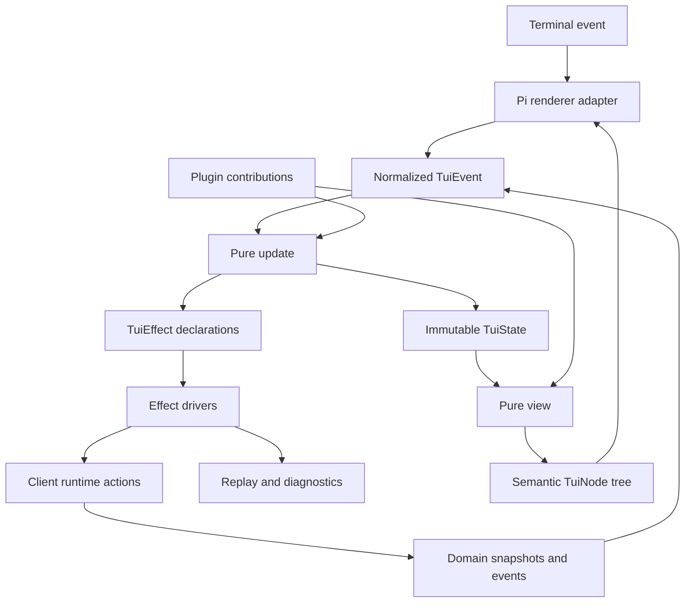

# Agent Note: Pi TUI Runtime and Plugin SDK

Status: proposed

English | [中文](2026-08-16-pi-tui-runtime-plugin-sdk.zh.md)

## Problem

The removed DSH TUI proved that terminal presentation cannot survive as an in-process collection of special cases. Raw mode, alternate screen, focus, overlays, continuous repaint, streaming output, and teardown make direct business logic inside component callbacks difficult to test and unsafe to reload. Reusing Web React slots would also expose `ReactNode`, DOM assumptions, and browser module loading to a terminal client.

The new TUI must be a complete plugin host: built-in conversation, tools, approvals, tasks, status, and navigation must use the same public contribution mechanism as trusted custom plugins. At the same time, the public API cannot leak Pi component objects or make one renderer an irreversible product contract.

## Proposal

Add a renderer-neutral TUI runtime built around deterministic state transitions and a semantic scene tree. Use `@earendil-works/pi-tui` as the initial renderer through a narrow adapter because it matches DSH's Node engine, supports main and alternate screens, differential rendering, synchronized output, application-owned scrolling, overlays, bracketed paste, and IME cursor placement. Keep `@oh-my-pi/pi-tui` as an evaluated future backend, not the v0 default, because its Bun and native-package requirements would otherwise change DSH's release/runtime posture before measured need.

Trusted TUI plugins register effect-owned contributions against DSH contracts. They receive typed snapshots, actions, semantic primitives, and bounded services; they do not receive Host internals, raw protocol streams, the Pi TUI instance, or another plugin's state.

## Architectural invariants

1. Domain truth comes only from `client/runtime` snapshots and typed actions.
2. `update(state, event)` is deterministic and returns state plus declared effects; it performs no I/O.
3. `view(state, viewport)` is deterministic and returns a semantic scene; it does not read the clock, environment, filesystem, service, or terminal.
4. The Pi adapter owns raw input parsing, lifecycle, focus realization, differential rendering, and terminal restoration.
5. Every registration and runtime effect has one Cordis owner and one disposer.
6. A plugin failure falls back to generic rendering and diagnostics; it does not remove the underlying Host fact.
7. Built-ins have no private contribution category unavailable to a trusted third-party plugin.
8. Visible terminal text is escaped, width-bounded, and reset per line; raw model or tool text cannot inject control sequences.

## Runtime layering



The system has four faces:

| Face | Responsibility |
| --- | --- |
| Host | business state, policy, durable events, actions, receipts |
| Client | connection, projection mirrors, conversation assembly, typed commands |
| TUI composition | plugin loading, contribution order, config, trust, diagnostics |
| Renderer | terminal capabilities, input decoding, scene realization, cleanup |

## Package topology

The first implementation uses three packages, not one package per panel:

```text
@deepseek-ai/dsh-tui-runtime       reducer, event/effect contracts, semantic nodes, registries
@deepseek-ai/dsh-tui-renderer-pi   Pi adapter, terminal lifecycle, input decoder, frame driver
@deepseek-ai/dsh-tui-app           built-in plugins and released TUI composition
```

Feature packages split out only when they own an independently reusable Host or client face. Initially, built-in plugins live in named directories inside `tui-app` and register through the public API. This proves the seam without creating a package explosion.

The planned `@deepseek-ai/dsh-tui-runtime` package may depend on surface-neutral client contracts and Cordis types. It has no dependency on React, DOM, Pi, Node terminal streams, or provider SDKs. `renderer-pi` depends on Pi and Node terminal APIs but not Host domain packages. `tui-app` composes the runtime, renderer, client runtime, and built-in plugin rows.

## Core state model

The root snapshot is serializable except for opaque effect correlation ids:

```ts ignore-check
interface TuiState {
  phase:
    | "connecting"
    | "synchronizing"
    | "ready"
    | "offline"
    | "contract_mismatch"
    | "reconcile_required"
    | "shutting_down";
  viewport: { width: number; height: number };
  route: { workspaceId?: string; sessionId?: string; pane: string };
  focus: { region: string; owner: string; returnTo?: string };
  overlays: OverlayState[];
  composer: ComposerState;
  transcript: TranscriptViewState;
  navigation: NavigationViewState;
  inspector: InspectorViewState;
  notifications: NotificationState[];
  plugins: Record<string, PluginSliceState>;
  frame: { requested: number; rendered: number };
}
```

Domain entities are not copied into arbitrary plugin slices. The state keeps stable references and presentation state; selectors read immutable snapshots from the client-runtime input event. Drafts, expansion, selection, scroll, focus, local search, and overlay state are TUI-owned. Session running state, queue contents, permissions, jobs, tasks, models, tools, and receipts remain client/Host-owned.

## Event, update, and effect contract

Normalized events form a closed core plus namespaced plugin events:

| Event family | Examples |
| --- | --- |
| Terminal | `key`, `paste`, `mouse`, `resize`, `focus`, `suspend`, `resume` |
| Connection | `connected`, `offline`, `contractMismatch`, `reconcileRequired` |
| Domain | `sessionSnapshot`, `conversationChanged`, `interactionRequested`, `jobChanged` |
| Clock | `tick`, `deadlineReached` with injected timestamp |
| Lifecycle | `start`, `shutdownRequested`, `shutdownComplete`, `panic` |
| Plugin | `plugin:<id>/<event>` validated by the owning plugin event schema |

The update result is explicit:

```ts ignore-check
interface UpdateResult {
  state: TuiState;
  effects: TuiEffect[];
}
```

Core effect families are `callAction`, `openStream`, `cancel`, `readClipboard`, `openEditor`, `writeReplay`, `writeDiagnostic`, `notifyTerminal`, `setTitle`, and `requestFrame`. An effect driver converts completion or failure back into an event. Effects are keyed; replacing or disposing the owner cancels the old effect and ignores late completion.

Plugins cannot execute an action from `view`. They return a semantic action id; the reducer validates current state and emits the typed client action. This prevents stale rendered controls from bypassing state guards.

## Semantic scene contract

`view` returns a small renderer-neutral vocabulary:

```ts ignore-check
type TuiNode =
  | { kind: "text"; text: SafeText; tone?: Tone; wrap?: boolean }
  | { kind: "stack"; axis: "horizontal" | "vertical"; children: TuiNode[] }
  | { kind: "box"; border?: Border; padding?: Insets; child: TuiNode }
  | { kind: "scroll"; id: string; follow: "end" | "manual"; child: TuiNode }
  | {
      kind: "input";
      id: string;
      value: string;
      cursor: number;
      multiline: boolean;
    }
  | { kind: "table"; columns: ColumnSpec[]; rows: TuiNode[][] }
  | { kind: "spacer"; size: number }
  | { kind: "overlay"; id: string; modal: boolean; child: TuiNode }
  | { kind: "extension"; renderer: string; payload: unknown };
```

`SafeText` is produced by a sanitizer that removes or visibly escapes C0/C1 control characters, OSC, CSI, DCS, APC, PM, and malformed sequences while preserving newlines and tabs according to the component contract. ANSI style is generated only by the renderer from semantic tones. Hyperlinks and inline images are opt-in capabilities with safe URI and size policies.

The Pi adapter maps semantic stacks, scroll regions, inputs, overlays, and text to Pi components. It may cache component instances by stable node id, but cache identity never becomes observable to plugins.

`extension` is experimental and disabled by default. It requires a declared renderer capability and a trusted plugin. Unknown renderer extensions render a diagnostic fallback, never disappear.

## Plugin lifecycle

### Trust tiers

v0 supports trusted local Node ESM plugins only. Installing or enabling one is equivalent to executing local code and requires an explicit trust record. The runtime does not claim that a capability-shaped API sandboxes Node.

A future declarative tier may describe only predefined nodes, commands, selectors, and actions and can be evaluated separately. It is not simulated by silently restricting arbitrary Node imports.

### Manifest and compatibility

A TUI-capable plugin declares a `./tui` export and manifest facts:

```ts
interface TuiPluginManifest {
  id: string;
  version: string;
  tuiApi: string;
  requiredCapabilities?: { name: string; version: number }[];
  optionalCapabilities?: { name: string; version: number }[];
  contributions: string[];
  trust: "trusted-local";
}
```

Composition validates manifest/schema compatibility before executing the plugin. A missing optional capability disables the affected contribution with diagnostics. A missing required capability refuses that plugin, not the whole TUI, unless it owns a required shell contribution.

### Effect ownership

Plugin activation receives a child Cordis context and a `TuiPluginHost`. Registration, listeners, selectors, timers, pending effects, overlay claims, focus claims, and diagnostics are attached to that child fiber. Disposal:

1. marks the plugin draining and stops new actions;
2. closes or hands back its overlays and focus claims;
3. cancels pending effects and subscriptions;
4. unregisters contributions and state slices;
5. waits for bounded cleanup;
6. activates the replacement only after the old owner settles.

Late results carry owner generation and are ignored after disposal. Reload does not preserve arbitrary in-memory plugin objects. A plugin may persist a schema-versioned presentation slice through the TUI settings service; failed migration resets only that slice and reports a diagnostic.

## Contribution API

The stable v0 categories are deliberately smaller than the full concept list:

| Category | Contract | Ordering |
| --- | --- | --- |
| `command` | id, title, availability selector, typed action | namespaced id; palette sort |
| `keybinding` | key sequence, scope, command id, condition | focus scope, priority, registration order |
| `conversation.node` | selector over canonical node, semantic renderer | priority then registration order |
| `tool.presenter` | selector over Host `ToolEventView`, call/result renderer | first matching specialized view, then generic fallback |
| `panel` | named navigation or inspector panel | region, order, id |
| `composer.dock` | queue, interaction, plan, goal, or mode strip | order, height budget |
| `status.item` | bounded text fact and severity | side, priority, width budget |
| `overlay` | command-opened flow with focus policy | one active modal, queued requests |
| `notification` | attention event presentation | severity and deduplication key |

Later candidates include composer completions, custom detail panes, semantic image nodes, and restricted renderer extensions. They are not required to declare the plugin system complete.

Every renderer returns a bounded semantic node and may decline. The generic conversation, tool, unknown-event, and plugin-error presenters are permanent shell fallbacks.

## Registration and arbitration

Contribution ids are globally unique after namespace expansion. Duplicate ids fail the later registration loudly. Priority defaults to zero; lower values run earlier. Equal priority preserves profile assembly order, not import timing.

Key resolution uses this precedence:

```text
focused modal -> focused input -> focused panel -> active route -> global
```

Within one scope, explicit user bindings precede plugin defaults, then priority and assembly order. Protected terminal safety bindings cannot be silently replaced: exit/detach, interrupt, suspend, focus escape, and debug recovery need an explicit user override naming both the old and new command. A collision is shown by `dsh tui doctor` and in the in-app keymap inspector.

Only one modal overlay owns input. Non-modal overlays may observe render state but do not capture keys. Modal requests are FIFO unless the active overlay explicitly yields to a higher-severity Host interaction. Closing, plugin disposal, or failure restores the recorded previous focus if it still exists; otherwise focus falls back to composer, transcript, then navigation.

## Built-in plugin set

The released `tui-app` composes at least these built-ins through public registrations:

| Built-in | Contributions |
| --- | --- |
| shell | layout, route, help, keymap inspector, diagnostics, status |
| navigation | workspace/session panel, search, recent and archived sessions |
| conversation | user/assistant/reasoning/system nodes, copy and detail actions |
| tools | generic tool presenter plus terminal, diff, file, search, Web, and code views |
| interactions | approval, question, elicitation, permission, and login overlays |
| composer | editor, slash/skill/mention completion, queue/steer policy, draft stash |
| tasks | jobs, plan, todo, goals, subagents, background state |
| recovery | reconnect recap, checkpoint, rewind, summarize, fork |
| notifications | turn completion, failure, approval, background task, service drain |

A built-in may use an internal helper library, but its final placement, command, and rendering must enter through the same registries.

## Required view states

Every actionable contribution receives a state classification and must define text, allowed actions, and fallback:

| State | Mutation posture | Default presentation |
| --- | --- | --- |
| `ready` | enabled by owner capability | normal content |
| `running` | action-specific | progress plus interrupt/background controls |
| `attention_required` | only response and safe navigation | emphasized request |
| `approval_required` | only explicit decision actions | modal or docked approval |
| `stale` | disabled | last known value with stale marker |
| `offline` | local navigation/draft only | reconnect status |
| `permission_denied` | disabled | owner reason and safe next step |
| `contract_mismatch` | disabled | version/schema diagnosis |
| `unknown` | disabled | generic inspectable fallback |
| `reconcile_required` | disabled until refresh | refresh progress and reason |

Color is supplementary. Each state has a word, icon or punctuation marker, and screen-reader/terminal-copy-safe text.

## Rendering, scrolling, and performance

The transcript uses windowed semantic nodes. It retains stable logical ids, estimated heights, measured heights for the current width, and an anchor so streaming above the viewport does not jump the reader. Follow-end is active only while the user is at the tail. Tool and reasoning detail is collapsed by default but remains searchable and copyable.

The frame scheduler coalesces invalidations. Streaming refresh is capped by configuration; input, resize, approval, and completion events request an immediate frame. Idle state performs no periodic full repaint unless a visible time-dependent item registered a deadline.

Initial performance gates at 120 by 40 are:

- p95 key-to-frame below 50 ms with 10,000 logical conversation nodes;
- p95 domain-event-to-frame below 100 ms during bounded streaming;
- no more than two full scene reconstructions for one coalesced input burst;
- bounded retained rendered lines independent of total transcript size;
- zero terminal writes while idle and unchanged.

These are release gates only after a repeatable benchmark exists. A failed gate requires profiling evidence; it does not authorize a renderer rewrite by intuition.

## Debug and replay mode

`dsh tui --debug` writes redacted events, effect starts/settlements, frame counters, focus changes, overlay transitions, renderer timings, and terminal capability detection to a file. It can combine:

```bash
dsh tui --debug --no-alt-screen --fixed-size 120x40 --max-fps 8
dsh tui replay <event-log> --fixed-size 100x30
```

The replay format contains normalized terminal events and redacted domain facts, not raw prompts, provider payloads, hidden instructions, private tool arguments, secrets, or full reasoning. A recording declares protocol/schema/plugin hashes; mismatch is visible and may require a migration fixture.

Frame snapshots cover important states and widths. Reducer property tests cover focus validity, overlay uniqueness, disabled mutation in stale states, disposer idempotency, and late-effect isolation.

## Terminal lifecycle and failure containment

The Pi adapter owns raw mode, alternate screen, bracketed paste, mouse mode, cursor visibility, title, and signal handlers through one RAII-style lifecycle. Startup failure, ordinary stop, signal, uncaught error, and panic all execute the same idempotent restoration. The final fallback writes a plain diagnostic only after restoring the terminal.

Renderer or plugin exceptions are classified:

| Failure | Containment |
| --- | --- |
| one contribution render throws | quarantine contribution generation; render generic fallback |
| reducer invariant fails | stop mutations, record replay, show recovery screen |
| Pi frame exceeds width | replace offending subtree with diagnostic; keep terminal alive |
| input decoder sees unknown sequence | record and ignore or expose literal key inspector |
| terminal capability changes/resume | rebuild adapter, preserve serializable state |
| root renderer panics | restore terminal, leave service running, exit non-zero |

No plugin may write directly to stdout/stderr while the renderer owns the terminal. The plugin host provides diagnostics and notification services.

## Verification requirements

- Pure reducer tests cover every event/state transition and effect declaration.
- Semantic view snapshots cover wide, standard, narrow, minimal-height, CJK, emoji, combining marks, long URLs, control bytes, and unknown events.
- Plugin lifecycle tests cover load, duplicate id, incompatible capability, unload, reload, late completion, focus return, overlay cleanup, and fallback.
- Keymap tests cover scope precedence, user override, protected bindings, terminal aliases, and ambiguous escape sequences.
- Renderer integration tests use a fake terminal for raw mode, synchronized output, diff writes, resize, paste, IME marker, suspend/resume, and cleanup.
- Process smoke tests launch the assembled profile under a PTY, exercise a minimal user flow, crash one plugin, and verify terminal restoration.
- Benchmarks use recorded domain/event fixtures and report scene, layout, diff, and write time separately.

## Alternatives considered

**Reuse Web `ui-slots` directly.** Rejected because its public types and lifecycle are React/DOM-shaped. TUI reuses client/domain state, not Web rendering objects.

**Expose Pi components as the ordinary plugin API.** Rejected because renderer identity, focus handles, and cache objects would become permanent plugin contracts and make deterministic replay weaker.

**Use `@oh-my-pi/pi-tui` as the initial backend.** Deferred because the current DSH runtime is Node/pnpm, while OMP requires Bun and native packages. It remains a measured backend option if Pi cannot meet accepted capability or performance gates.

**Implement the TUI in Rust/Ratatui.** Deferred because it would add FFI/protocol/plugin packaging before TypeScript/Pi shows a measured limitation. A native renderer kernel remains possible behind the semantic scene.

## Risks

**The semantic scene may be too small for valuable plugins.** Extension requests are evaluated against repeated use cases; renderer-specific escape remains experimental and never replaces a generic fallback.

**Trusted plugins can compromise the local process.** Install and enable flows state the trust consequence; v0 makes no sandbox claim and keeps lower-trust declarative plugins separate.

**Pure updates can be bypassed by convenience callbacks.** Review and tests require all actions and I/O to pass through effects, including built-ins.

**Large transcripts can still trigger expensive full views.** Windowing, stable ids, frame coalescing, retained-line bounds, and benchmark gates are required before alpha claims.

**Terminal input varies across emulators and multiplexers.** Key commands have palette fallbacks, unknown sequences are inspectable, and protected recovery bindings require explicit override.

## Acceptance criteria

1. The released TUI can replace Pi with a test renderer without changing plugin or domain contracts.
2. Built-ins appear in the same registries and diagnostics as custom trusted plugins.
3. Reducer and semantic rendering tests reproduce failures without raw mode.
4. Unloading a plugin removes every contribution, focus/overlay claim, subscription, timer, and pending effect before replacement activation.
5. A renderer or plugin failure leaves Host state inspectable through a generic fallback and never claims an action succeeded.
6. Terminal state is restored after normal exit, signal, startup failure, plugin exception, and renderer panic.
7. Unknown/control-rich model or tool text cannot execute terminal controls.
8. Large transcripts remain responsive through windowing and bounded frame work, with benchmark evidence for release claims.

## Consequences

The semantic scene adds an abstraction between plugins and Pi, so it will not expose every Pi feature on day one. That is intentional: stable plugin contracts describe DSH interaction semantics, while renderer-specific capability remains an experimental opt-in. The result is a TUI that can be tested, replayed, reloaded, and evolved without making terminal internals another business layer.
