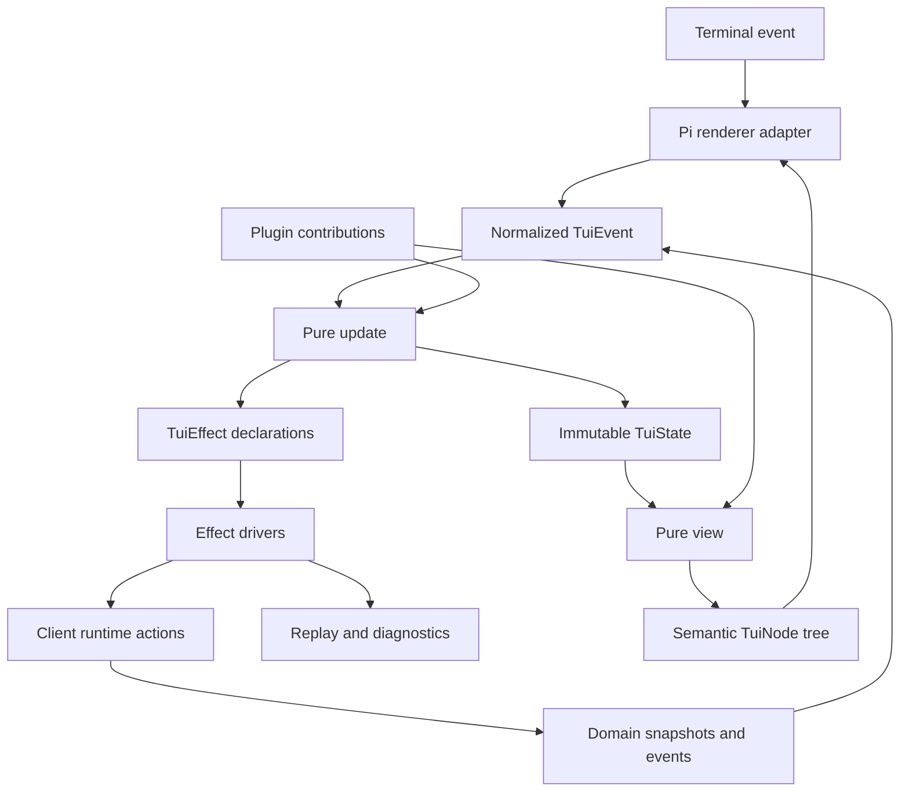

# Agent Note：Pi TUI 运行时与插件 SDK

Status: proposed

[English](2026-08-16-pi-tui-runtime-plugin-sdk.md) | 中文

## 问题

被移除的 DSH TUI 已经证明，终端表现层不能以进程内特例集合长期存在。Raw mode、alternate screen、焦点、overlay、持续 repaint、流式输出与 teardown，会让直接写在 component callback 里的业务逻辑难以测试，也无法安全 reload。复用 Web React slot 还会把 `ReactNode`、DOM 假设与浏览器 module loading 暴露给终端客户端。

新 TUI 必须是完整插件宿主：内置 conversation、tools、approvals、tasks、status 与 navigation 必须使用和受信任自定义插件相同的公开 contribution 机制。同时，公开 API 不能泄漏 Pi component object，也不能把单一 renderer 固化为不可逆的产品契约。

## 方案

新增基于确定性状态转移与语义 scene tree 的 renderer-neutral TUI runtime。初始 renderer 通过窄 adapter 使用 `@earendil-works/pi-tui`：它匹配 DSH 的 Node engine，并支持 main/ alternate screen、differential rendering、synchronized output、application-owned scrolling、overlay、bracketed paste 与 IME cursor placement。把 `@oh-my-pi/pi-tui` 保留为未来经过评估的 backend，而不是 v0 默认，因为其 Bun 与 native-package 要求会在缺少测量证据时先改变 DSH 的发布和运行时姿态。

受信任 TUI plugin 面向 DSH 契约注册 effect-owned contribution。它们接收类型化 snapshot、action、semantic primitive 与有界 service；不能获得 Host internals、raw protocol stream、Pi TUI instance 或其他插件的 state。

## 架构不变量

1. Domain truth 只来自 `client/runtime` snapshot 与 typed action。
2. `update(state, event)` 确定性返回 state 与声明式 effect，不执行 I/O。
3. `view(state, viewport)` 确定性返回 semantic scene；不读取 clock、environment、filesystem、service 或 terminal。
4. Pi adapter 拥有 raw input parsing、lifecycle、focus realization、differential rendering 与 terminal restoration。
5. 每个 registration 与 runtime effect 都只有一个 Cordis owner 和一个 disposer。
6. Plugin failure 回退到 generic rendering 与 diagnostics，不删除底层 Host fact。
7. Built-in 不得拥有受信任第三方插件无法使用的私有 contribution category。
8. 可见终端文字经过转义、宽度约束并逐行 reset；原始 model/tool text 不能注入控制序列。

## 运行时分层



系统分为四个 face：

| Face | 职责 |
| --- | --- |
| Host | 业务状态、policy、持久事件、action、receipt |
| Client | connection、projection mirror、conversation assembly、typed command |
| TUI composition | plugin loading、contribution order、config、trust、diagnostics |
| Renderer | terminal capability、input decoding、scene realization、cleanup |

## 包拓扑

首个实现使用三个包，而不是每个 panel 一个包：

```text
@deepseek-ai/dsh-tui-runtime       reducer, event/effect contracts, semantic nodes, registries
@deepseek-ai/dsh-tui-renderer-pi   Pi adapter, terminal lifecycle, input decoder, frame driver
@deepseek-ai/dsh-tui-app           built-in plugins and released TUI composition
```

只有 feature 拥有独立可复用 Host 或 client face 时才拆出包。初期 built-in plugin 位于 `tui-app` 内的具名目录，并通过公开 API 注册。这样能证明 seam，而不制造 package explosion。

计划中的 `@deepseek-ai/dsh-tui-runtime` package 可以依赖 surface-neutral client contract 与 Cordis type，但不依赖 React、DOM、Pi、Node terminal stream 或 provider SDK。`renderer-pi` 依赖 Pi 与 Node terminal API，但不依赖 Host domain package。`tui-app` 组合 runtime、renderer、client runtime 和内置 plugin row。

## 核心状态模型

除不透明 effect correlation id 外，root snapshot 可序列化：

```ts ignore-check
interface TuiState {
  phase:
    | "connecting"
    | "synchronizing"
    | "ready"
    | "offline"
    | "contract_mismatch"
    | "reconcile_required"
    | "shutting_down";
  viewport: { width: number; height: number };
  route: { workspaceId?: string; sessionId?: string; pane: string };
  focus: { region: string; owner: string; returnTo?: string };
  overlays: OverlayState[];
  composer: ComposerState;
  transcript: TranscriptViewState;
  navigation: NavigationViewState;
  inspector: InspectorViewState;
  notifications: NotificationState[];
  plugins: Record<string, PluginSliceState>;
  frame: { requested: number; rendered: number };
}
```

Domain entity 不复制进任意 plugin slice。state 保存稳定引用与 presentation state；selector 从 client-runtime input event 读取 immutable snapshot。draft、expansion、selection、scroll、focus、local search 与 overlay state 由 TUI 拥有。Session running state、queue content、permission、job、task、model、tool 与 receipt 仍由 client/Host 拥有。

## Event、update 与 effect 契约

Normalized event 由闭合 core 加 namespaced plugin event 构成：

| Event family | 示例 |
| --- | --- |
| Terminal | `key`、`paste`、`mouse`、`resize`、`focus`、`suspend`、`resume` |
| Connection | `connected`、`offline`、`contractMismatch`、`reconcileRequired` |
| Domain | `sessionSnapshot`、`conversationChanged`、`interactionRequested`、`jobChanged` |
| Clock | 带注入时间戳的 `tick`、`deadlineReached` |
| Lifecycle | `start`、`shutdownRequested`、`shutdownComplete`、`panic` |
| Plugin | 由 owner plugin event schema 验证的 `plugin:<id>/<event>` |

Update result 显式定义：

```ts ignore-check
interface UpdateResult {
  state: TuiState;
  effects: TuiEffect[];
}
```

Core effect family 为 `callAction`、`openStream`、`cancel`、`readClipboard`、`openEditor`、 `writeReplay`、`writeDiagnostic`、`notifyTerminal`、`setTitle` 与 `requestFrame`。Effect driver 把 completion/failure 转回 event。Effect 有 key；替换或 dispose owner 时取消旧 effect，并忽略 late completion。

Plugin 不能从 `view` 执行 action。它返回 semantic action id；reducer 验证当前 state 后发出 typed client action。这样可以阻止 stale rendered control 绕过状态 guard。

## Semantic scene 契约

`view` 返回小型 renderer-neutral vocabulary：

```ts ignore-check
type TuiNode =
  | { kind: "text"; text: SafeText; tone?: Tone; wrap?: boolean }
  | { kind: "stack"; axis: "horizontal" | "vertical"; children: TuiNode[] }
  | { kind: "box"; border?: Border; padding?: Insets; child: TuiNode }
  | { kind: "scroll"; id: string; follow: "end" | "manual"; child: TuiNode }
  | {
      kind: "input";
      id: string;
      value: string;
      cursor: number;
      multiline: boolean;
    }
  | { kind: "table"; columns: ColumnSpec[]; rows: TuiNode[][] }
  | { kind: "spacer"; size: number }
  | { kind: "overlay"; id: string; modal: boolean; child: TuiNode }
  | { kind: "extension"; renderer: string; payload: unknown };
```

`SafeText` 由 sanitizer 产生：移除或可视化转义 C0/C1 control character、OSC、CSI、DCS、APC、PM 与格式错误的 sequence，同时按 component contract 保留 newline 与 tab。ANSI style 只能由 renderer 从 semantic tone 生成。Hyperlink 与 inline image 是 opt-in capability，并受安全 URI 与尺寸 policy 约束。

Pi adapter 把 semantic stack、scroll region、input、overlay 与 text 映射到 Pi component。它可以按稳定 node id 缓存 component instance，但 cache identity 对 plugin 不可见。

`extension` 是 experimental，默认禁用。它要求已声明 renderer capability 与 trusted plugin。未知 renderer extension 显示 diagnostic fallback，绝不静默消失。

## 插件生命周期

### 信任层级

v0 仅支持 trusted local Node ESM plugin。安装或启用等价于执行本地代码，必须有显式 trust record。Runtime 不声称 capability-shaped API 可以 sandbox Node。

未来 declarative tier 可以只描述预定义 node、command、selector 与 action，并单独评估。不能通过静默限制任意 Node import 来伪装该能力。

### Manifest 与兼容性

支持 TUI 的 plugin 声明 `./tui` export 与以下 manifest fact：

```ts
interface TuiPluginManifest {
  id: string;
  version: string;
  tuiApi: string;
  requiredCapabilities?: { name: string; version: number }[];
  optionalCapabilities?: { name: string; version: number }[];
  contributions: string[];
  trust: "trusted-local";
}
```

Composition 在执行 plugin 前验证 manifest/schema compatibility。缺少 optional capability 时，禁用受影响 contribution 并显示 diagnostics。缺少 required capability 时拒绝该 plugin，而不是整个 TUI；只有它拥有必需 shell contribution 时才使启动失败。

### Effect ownership

Plugin activation 获得 child Cordis context 与 `TuiPluginHost`。Registration、listener、selector、timer、pending effect、overlay claim、focus claim 与 diagnostic 全部绑定到该 child fiber。Disposal 按顺序：

1. 把 plugin 标记为 draining，停止新 action；
2. 关闭或交还其 overlay 与 focus claim；
3. 取消 pending effect 与 subscription；
4. unregister contribution 与 state slice；
5. 等待有界 cleanup；
6. 仅在旧 owner settle 后激活 replacement。

Late result 携带 owner generation，dispose 后忽略。Reload 不保留任意 in-memory plugin object。Plugin 可通过 TUI settings service 持久化 schema-versioned presentation slice；migration 失败只 reset 该 slice，并产生 diagnostic。

## Contribution API

稳定 v0 category 刻意小于完整概念列表：

| Category | 契约 | 排序 |
| --- | --- | --- |
| `command` | id、title、availability selector、typed action | namespaced id；palette sort |
| `keybinding` | key sequence、scope、command id、condition | focus scope、priority、registration order |
| `conversation.node` | canonical node selector、semantic renderer | priority 后 registration order |
| `tool.presenter` | Host `ToolEventView` selector、call/result renderer | 首个 specialized match，然后 generic fallback |
| `panel` | 具名 navigation 或 inspector panel | region、order、id |
| `composer.dock` | queue、interaction、plan、goal 或 mode strip | order、height budget |
| `status.item` | 有界 text fact 与 severity | side、priority、width budget |
| `overlay` | command 打开的 flow 与 focus policy | 一个 active modal，其余排队 |
| `notification` | attention event presentation | severity 与 deduplication key |

后续候选包括 composer completion、custom detail pane、semantic image node 与 restricted renderer extension。它们不是宣布 plugin system 完整的前置条件。

每个 renderer 返回有界 semantic node，也可以 decline。Generic conversation、tool、unknown-event 与 plugin-error presenter 是永久 shell fallback。

## 注册与仲裁

Contribution id 经 namespace 展开后全局唯一。重复 id 使后注册者明确失败。Priority 默认为零，数值较小者先运行。Priority 相同则保持 profile assembly order，而不是 import timing。

Key resolution 使用以下优先级：

```text
focused modal -> focused input -> focused panel -> active route -> global
```

同一 scope 内，显式 user binding 优先于 plugin default，之后按 priority 与 assembly order。受保护的终端安全 binding 不能静默替换：exit/detach、interrupt、suspend、focus escape 与 debug recovery 都要求 user override 同时点名旧 command 和新 command。Collision 会显示在 `dsh tui doctor` 与应用内 keymap inspector 中。

一次只有一个 modal overlay 拥有输入。Non-modal overlay 可观察 render state，但不捕获 key。Modal request 默认 FIFO；只有 active overlay 显式让位给更高 severity 的 Host interaction 时才例外。关闭、plugin disposal 或 failure 后，如果记录的 previous focus 仍存在就恢复，否则按 composer、transcript、navigation 顺序 fallback。

## 内置插件集合

发布的 `tui-app` 至少通过公开注册组合以下 built-in：

| Built-in | Contributions |
| --- | --- |
| shell | layout、route、help、keymap inspector、diagnostics、status |
| navigation | workspace/session panel、search、recent 与 archived sessions |
| conversation | user/assistant/reasoning/system node、copy 与 detail action |
| tools | generic tool presenter 加 terminal、diff、file、search、Web 与 code view |
| interactions | approval、question、elicitation、permission 与 login overlay |
| composer | editor、slash/skill/mention completion、queue/steer policy、draft stash |
| tasks | jobs、plan、todo、goals、subagents、background state |
| recovery | reconnect recap、checkpoint、rewind、summarize、fork |
| notifications | turn completion、failure、approval、background task、service drain |

Built-in 可以使用 internal helper library，但最终 placement、command 与 rendering 必须进入相同 registry。

## 必需视图状态

每个可 action contribution 都接收状态分类，并定义 text、allowed action 与 fallback：

| State | Mutation 姿态 | 默认表现 |
| --- | --- | --- |
| `ready` | 按 owner capability 启用 | normal content |
| `running` | action-specific | progress 加 interrupt/background control |
| `attention_required` | 仅 response 与 safe navigation | 强调 request |
| `approval_required` | 仅显式 decision action | modal 或 docked approval |
| `stale` | 禁用 | last known value 加 stale marker |
| `offline` | 仅 local navigation/draft | reconnect status |
| `permission_denied` | 禁用 | owner reason 与安全 next step |
| `contract_mismatch` | 禁用 | version/schema diagnosis |
| `unknown` | 禁用 | generic inspectable fallback |
| `reconcile_required` | refresh 前禁用 | refresh progress 与 reason |

颜色只作补充。每个 state 都有文字、icon 或标点 marker，以及 screen-reader/terminal-copy-safe text。

## 渲染、滚动与性能

Transcript 使用 windowed semantic node。它保留稳定 logical id、estimated height、当前宽度下 measured height 与 anchor，使 viewport 上方 streaming 不会令读者跳动。只有用户在 tail 时才开启 follow-end。Tool 与 reasoning detail 默认折叠，但仍可搜索和复制。

Frame scheduler 合并 invalidation。Streaming refresh 由配置限频；input、resize、approval 与 completion event 请求 immediate frame。Idle 状态不做周期性 full repaint，除非可见的 time- dependent item 注册了 deadline。

120×40 下的初始性能 gate：

- 10,000 个 logical conversation node 时，p95 key-to-frame 小于 50 ms；
- 有界 streaming 期间，p95 domain-event-to-frame 小于 100 ms；
- 一个合并 input burst 最多触发两次 full scene reconstruction；
- 保留的 rendered line 数量有界，不随 transcript 总量增长；
- idle 且无变化时 terminal write 为零。

只有可重复 benchmark 存在后，这些才成为 release gate。Gate 失败需要 profiling evidence，不能凭直觉授权 renderer rewrite。

## 调试与重放模式

`dsh tui --debug` 把脱敏 event、effect start/settlement、frame counter、focus change、overlay transition、renderer timing 与 terminal capability detection 写入文件。可以组合：

```bash
dsh tui --debug --no-alt-screen --fixed-size 120x40 --max-fps 8
dsh tui replay <event-log> --fixed-size 100x30
```

Replay format 包含 normalized terminal event 与脱敏 domain fact，不包含 raw prompt、provider payload、hidden instruction、private tool argument、secret 或 full reasoning。Recording 声明 protocol/schema/plugin hash；mismatch 可见，且可能要求 migration fixture。

Frame snapshot 覆盖重要 state 与 width。Reducer property test 覆盖 focus validity、overlay uniqueness、stale state 下禁用 mutation、disposer idempotency 与 late-effect isolation。

## 终端生命周期与失败隔离

Pi adapter 通过一个 RAII-style lifecycle 拥有 raw mode、alternate screen、bracketed paste、mouse mode、cursor visibility、title 与 signal handler。Startup failure、ordinary stop、signal、uncaught error 与 panic 都执行同一个幂等 restoration。最终 fallback 只在 terminal 已恢复后写 plain diagnostic。

Renderer 或 plugin exception 按以下方式分类：

| Failure | 隔离方式 |
| --- | --- |
| 单个 contribution render 抛错 | quarantine 该 contribution generation；显示 generic fallback |
| reducer invariant 失败 | 停止 mutation，记录 replay，显示 recovery screen |
| Pi frame 超宽 | 用 diagnostic 替换违规 subtree；保持 terminal 存活 |
| input decoder 收到未知 sequence | 记录并忽略，或暴露 literal key inspector |
| terminal capability 变化/resume | 重建 adapter，保留 serializable state |
| root renderer panic | 恢复 terminal，保持 service 运行，非零退出 |

Renderer 拥有 terminal 时，plugin 不得直接写 stdout/stderr。Plugin host 提供 diagnostics 与 notification service。

## 验证要求

- Pure reducer test 覆盖每个 event/state transition 与 effect declaration。
- Semantic view snapshot 覆盖 wide、standard、narrow、minimal-height、CJK、emoji、combining mark、long URL、control byte 与 unknown event。
- Plugin lifecycle test 覆盖 load、duplicate id、incompatible capability、unload、reload、late completion、focus return、overlay cleanup 与 fallback。
- Keymap test 覆盖 scope precedence、user override、protected binding、terminal alias 与 ambiguous escape sequence。
- Renderer integration test 用 fake terminal 覆盖 raw mode、synchronized output、diff write、resize、paste、IME marker、suspend/resume 与 cleanup。
- Process smoke test 在 PTY 中启动 assembled profile，执行最小 user flow，使一个 plugin crash，并验证 terminal restoration。
- Benchmark 使用记录的 domain/event fixture，分别报告 scene、layout、diff 与 write time。

## 考虑过的替代方案

**直接复用 Web `ui-slots`。** 拒绝，因为其公开 type 与 lifecycle 以 React/DOM 为形状。TUI 复用 client/domain state，不复用 Web rendering object。

**把 Pi component 作为普通 plugin API。** 拒绝，因为 renderer identity、focus handle 与 cache object 会变成永久 plugin contract，并削弱 deterministic replay。

**初始 backend 使用 `@oh-my-pi/pi-tui`。** 暂缓，因为当前 DSH runtime 为 Node/pnpm，而 OMP 要求 Bun 与 native package。如果 Pi 无法达到已接受 capability/performance gate，它仍是需要测量的 backend option。

**使用 Rust/Ratatui 实现 TUI。** 暂缓，因为这会在 TypeScript/Pi 尚未暴露测量限制前增加 FFI/protocol/plugin packaging。Native renderer kernel 未来仍可位于 semantic scene 后。

## 风险

**Semantic scene 可能不足以承载高价值 plugin。** Extension request 按重复 use case 评估；renderer-specific escape 保持 experimental，且绝不替代 generic fallback。

**Trusted plugin 可以破坏本地进程。** Install/enable flow 明确说明 trust consequence；v0 不声称 sandbox，并把低信任 declarative plugin 分离。

**便捷 callback 可能绕过 pure update。** Review/test 要求所有 action 与 I/O，包括 built-in，都经过 effect。

**Large transcript 仍可能触发昂贵 full view。** Alpha claim 前必须具备 windowing、stable id、frame coalescing、retained-line bound 与 benchmark gate。

**不同 emulator/multiplexer 的 terminal input 不一致。** Key command 有 palette fallback，unknown sequence 可检查，protected recovery binding 只能显式 override。

## 验收标准

1. 发布的 TUI 可把 Pi 替换为 test renderer，而无需修改 plugin 或 domain contract。
2. Built-in 与 custom trusted plugin 出现在相同 registry 与 diagnostics 中。
3. Reducer 与 semantic rendering test 可在没有 raw mode 时复现 failure。
4. Unload plugin 会在 replacement activation 前移除所有 contribution、focus/overlay claim、subscription、timer 与 pending effect。
5. Renderer 或 plugin failure 让 Host state 仍可通过 generic fallback 检查，且绝不声称 action 成功。
6. Normal exit、signal、startup failure、plugin exception 与 renderer panic 后 terminal state 都会恢复。
7. Unknown/control-rich model 或 tool text 不能执行 terminal control。
8. Large transcript 通过 windowing 与有界 frame work 保持响应，并有 benchmark evidence 支撑 release claim。

## 后果

Semantic scene 在 plugin 与 Pi 之间增加了一层抽象，因此第一天不会暴露 Pi 的全部功能。这是刻意选择：稳定 plugin contract 描述 DSH interaction semantics，而 renderer-specific capability 保持 experimental opt-in。结果是 TUI 可测试、可重放、可 reload、可演进，不会让 terminal internals 变成另一层业务系统。
