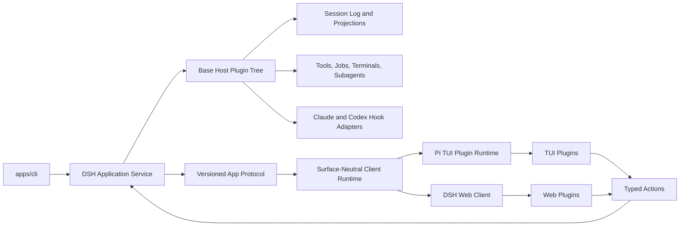
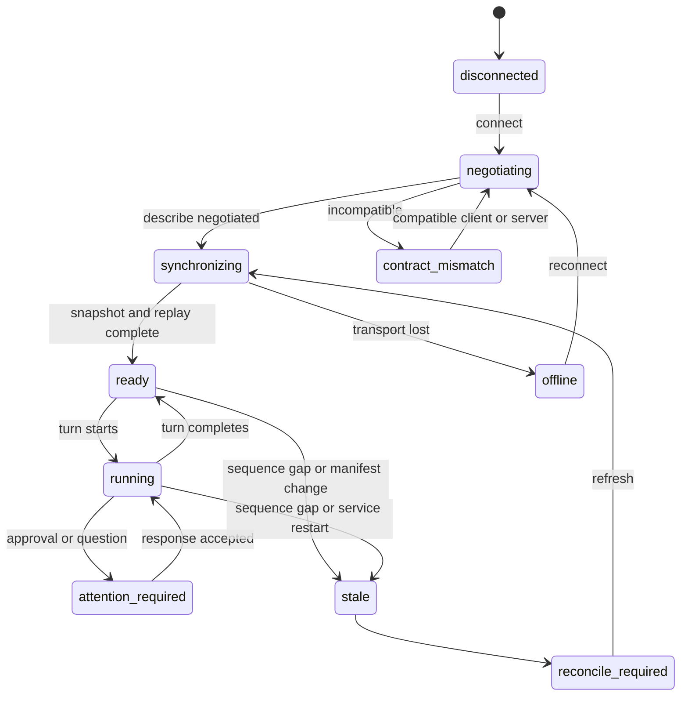
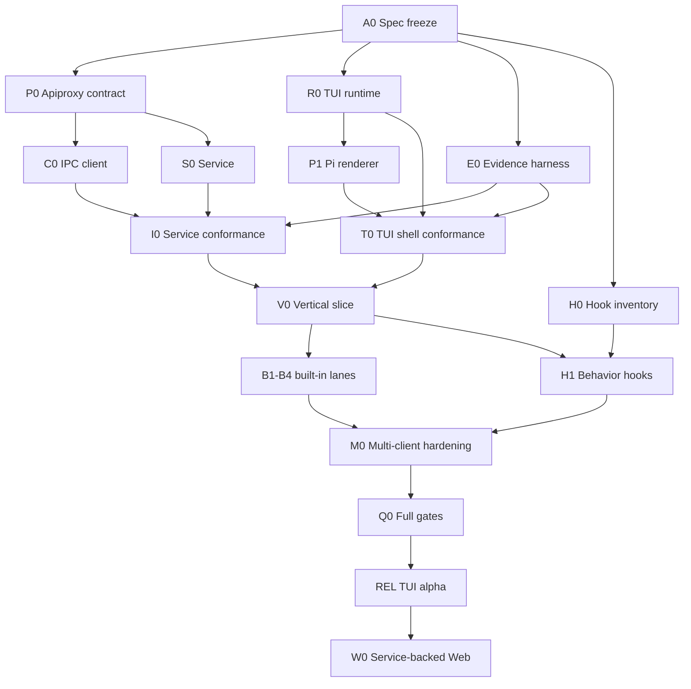

# Agent Note: Service-Backed Plugin TUI Client and Multi-Client Runtime

Status: proposed

English | [中文](2026-08-16-service-backed-plugin-tui-client.zh.md)

## Problem

DeepSeek Harness ships a complete browser client, a typed Host API, durable session events, projections, commands, tools, approvals, jobs, subagents, and dynamic Cordis client plugins, but it does not ship an independent terminal client or a service process that keeps agent work alive after a user interface disconnects. Community terminal clients either restore the removed in-process TUI, bridge a second protocol into DSH, or vendor a complete runtime; each approach duplicates lifecycle, state, or distribution ownership and cannot provide Web-equivalent plugins, reliable background work, and Claude-style interaction on one authoritative session.

The requested product is a full TUI client, not a TUI mode inside the current CLI process. It must compose the same domain capabilities as DSH Web, allow custom terminal plugins, preserve Claude Code interaction habits and hook events, and connect to a Codex-style background service that owns turns, processes, approvals, events, and recovery while no client is attached.

## Proposal

DSH promotes the existing Apiproxy four-quadrant contract into versioned application protocol `dsh.app.v0`, adds a user-level background service and local IPC carrier, reuses the existing surface-neutral client runtime, and adds a Pi-based TUI plugin runtime. DSH Web and DSH TUI remain separate renderers over the same Host facts, actions, receipts, event log, and projections. The first delivery keeps `dsh web` behavior intact and adds the service and TUI additively; a later committed slice lets Web attach to the same service after the protocol and multi-client rules are proven by the TUI.

The TUI is a full-screen application with a Claude-compatible interaction profile, adaptive session navigation, conversation rendering, tool views, approvals, questions, queue and steering controls, background tasks, subagents, terminal sessions, checkpoints, and plugin-contributed panels. Every built-in TUI capability uses the same effect-scoped registration APIs available to third-party plugins.

## Detailed specification packet

- [Local service and multi-client application protocol](2026-08-16-local-service-multi-client-protocol.md) owns negotiation, IPC framing, synchronization, replay, multi-client mutations, process lifecycle, and failure contracts.
- [Pi TUI runtime and plugin SDK](2026-08-16-pi-tui-runtime-plugin-sdk.md) owns the pure state machine, semantic scene, renderer adapter, plugin lifecycle, contribution arbitration, debug replay, and terminal restoration.
- [Claude-compatible TUI interaction and event experience](../feature/2026-08-16-claude-compatible-tui-interaction.md) owns layout, keyboard behavior, composer semantics, detach/reattach, checkpoint UX, and the generated Hook compatibility matrix.
- [TUI and service delivery DAG](2026-08-16-tui-service-delivery-dag.md) owns path leases, parallel nodes, integration barriers, evidence, release gates, and rollback.

## Required capability ledger

| ID | Capability | Requirement | Delivery | Canonical owner | Visible host | Acceptance evidence |
| --- | --- | --- | --- | --- | --- | --- |
| C01 | Independent full-screen TUI client | required | deliver-now | TUI runtime | `dsh tui` | assembled process test and frame snapshots |
| C02 | Detach while agent work continues | required | deliver-now | application service | TUI exit and resume flow | daemon integration evidence |
| C03 | DSH Web-equivalent session, command, skill, model, permission, tool, job, subagent, plan, and question capabilities | required | staged across the committed DAG | owning Host services | TUI plugins | projection, action, and rendered-state conformance tests |
| C04 | Custom TUI plugins with install, enable, disable, reload, and diagnostics | required | deliver-now for trusted local plugins | plugin runtime | TUI and CLI | plugin lifecycle integration test |
| C05 | Claude-compatible keyboard and interaction profile | required | deliver-now | TUI interaction plugin | composer and transcript | fixed-keymap and user-flow snapshots |
| C06 | Claude hook-event compatibility | required | retain-next until the Host bridge is complete | hooks packages | hook diagnostics and TUI event rows | compatibility matrix with no silent ignores |
| C07 | Codex-style background service, request/response protocol, streaming events, resume, steer, interrupt, and queue | required | deliver-now | application service and protocol | every client | protocol conformance and reconnect tests |
| C08 | Background terminals, tasks, jobs, and subagents | required | retain-next in the first committed expansion wave | owning runtime services | task and agent views | detach, reconnect, terminate, and orphan tests |
| C09 | Checkpoint, rewind, summarize, and fork interaction | required | retain-next in the first committed expansion wave | checkpoint service | rewind overlay | file and conversation recovery tests |
| C10 | DSH Web and TUI attaching to the same service | required | retain-next after TUI protocol hardening | application service | Web and TUI | simultaneous-client system test |
| C11 | Declarative restricted-capability UI plugins | exploratory | later | plugin runtime | Web and TUI | threat model and renderer conformance suite |
| C12 | Remote network attachment outside the local machine | optional | not in the first delivery | deployment transport | future clients | separate authentication and transport decision |

No later scope review may remove C01-C10 without a separate user decision. A delivery wave may sequence them, but the capability and its canonical owner remain recorded.

## Ownership and product boundary

The service owns durable session state, agent and plugin lifecycles, authorization, tools, terminal processes, queues, approvals, questions, checkpoints, and action receipts. Domain plugins continue to own their own state and pure projections. The application protocol exposes typed, redacted facts and actions; it does not move business rules into a client.

The surface-neutral client runtime owns transport state, protocol negotiation, replay cursors, projection stores, action correlation, and derived presentation records. It has no React, DOM, terminal, or provider dependency.

The TUI runtime owns terminal setup and cleanup, focus, layout, viewport, scroll position, overlays, draft text, local history, keymaps, renderer selection, and plugin contribution placement. It never reports a mutation as successful until the owning service emits a receipt or authoritative event.

Web remains the rich visual workbench. TUI becomes the terminal-native client optimized for keyboard control, background continuity, event inspection, and low-latency intervention. The two clients share protocol and state semantics, not component implementations.

## System architecture



### Application service

The service is one user-level process per DSH home. It may host multiple workspaces and sessions, reuses the base Host plugin tree, and keeps a loaded session alive while it has an active turn, terminal, job, subagent, pending interaction, queued message, or subscriber. It must not create a second implementation of agents, tools, session storage, or projections.

The default local transport is a user-private Unix socket on Unix and a user-private named pipe on Windows. Socket or pipe permissions restrict access to the current user. Stdio remains available for tests and embedded launch. Remote TCP or WebSocket transport is excluded until a separate authentication decision exists.

The service writes diagnostics to stderr or a structured sidecar, never to a protocol stream. On restart it rebuilds durable session projections, marks non-recoverable live processes as `orphaned`, restores queued work and pending interactions, and emits a service-instance change so clients reconcile instead of assuming continuity.

### Application protocol

The protocol retains the existing Apiproxy method map and four message quadrants. `host.describe` becomes the compatibility handshake, while `events.mux` and `events.host` gain implemented cursors, synchronization markers, and explicit replay-gap behavior. The logical contract remains independent of local IPC, current HTTP/WebSocket, or in-process carriers. The existing SDK automation protocol remains a separate automation surface.

Every connection first completes `host.describe` with optional client metadata and receives `protocolVersion`, `serviceInstanceId`, `schemaHash`, `pluginManifestHash`, capabilities, and the current Host revision in addition to existing Host facts. The initial protocol is explicitly `dsh.app.v0` and remains experimental until the final conformance node passes.

### Surface-neutral client runtime

The implementation extends `packages/client/connection` and reuses `packages/client/runtime` for connection management, retries, session snapshots, projection stores, typed actions, answerable server requests, queue mirrors, jobs, and subagents. TUI consumes these non-React services directly. React-only Web slots and components remain Web-owned and are not imported by TUI.

### TUI runtime

The TUI runtime uses `@earendil-works/pi-tui` behind a DSH-owned semantic scene and renderer adapter. Ordinary plugins use stable DSH primitives and do not import Pi internals. A separately marked experimental renderer extension may expose narrowly declared Pi-specific capability to trusted plugins.

The default renderer uses alternate-screen full-screen mode. A `classic` renderer preserves native scrollback for compatibility and debugging. Terminal input is reduced through deterministic `update(state, event)` functions, and frames are produced through deterministic `render(state, width, height)` functions. Domain behavior never runs directly in the terminal event loop.

## Protocol contract

The detailed protocol note owns method evolution and carrier semantics. The governing rules are:

- existing Apiproxy business methods remain canonical; no TUI method mirror is created;
- durable facts replay by Session sequence, projections and process-local state converge through full snapshots, and ephemeral deltas require a completed fact or explicit unknown state;
- session mux and Host streams capture synchronization cuts before baseline pulls, buffer concurrent increments, and report a gap rather than guessing continuity;
- queue and settings edits use owner revisions, approvals and questions remain first-response-wins through the original `rpcId`, and interrupts/terminations are idempotent against the owner identity;
- a changed service instance invalidates process-local cursors and runtime attachment assumptions while preserving durable session recovery;
- stale, gap, schema mismatch, or unknown state disables mutation until authoritative reconciliation succeeds.

## Event compatibility

DSH canonical events remain the internal authority. Compatibility adapters map them to Claude Code and Codex hook dialects. TUI renderers consume canonical conversation nodes and projections, not provider-specific payloads.

The Claude adapter is committed to the official lifecycle including session, instruction, prompt, tool, permission, notification, subagent, task, compaction, elicitation, failure, and session-end events. Unsupported event names or fields are reported by `dsh plugin doctor` and never silently ignored. The existing partial bridge is extended behind its current package boundary rather than reimplemented in TUI.

Hook execution belongs to the service. Hook invocation and result records are durable when they affect model context, permission, tool outcome, or user-visible state. Async observational hooks may emit bounded diagnostics without blocking the turn. Raw prompts, provider payloads, hidden instructions, secrets, and full reasoning are not written to client events or evidence.

## Plugin architecture

Every complete capability may provide Host, shared type, Web, TUI, composition, and observation faces. Packages use explicit exports such as `./host`, `./types`, `./web`, and `./tui`; absence of a face is valid. The composition manifest declares versions, required Host services, protocol capabilities, client contributions, trust level, configuration, and unload behavior.

The first plugin tier is trusted local Node ESM code. Installation requires an explicit trust decision because capability-limited APIs do not sandbox arbitrary Node code. A later declarative tier may expose only predefined components, actions, and projections and therefore support lower-trust distribution.

TUI plugins register effect-scoped contributions through the following categories:

| Category | Purpose |
| --- | --- |
| `conversation.node` | render one durable conversation node kind |
| `tool.presenter` | render a tool call, result, terminal, diff, or location list |
| `sidebar.section` | add workspace or session navigation content |
| `inspector.section` | add plan, task, agent, evidence, or domain detail |
| `composer.dock` | add queue, goal, todo, plan, or pending interaction content |
| `composer.control` | add model, permission, mode, or action controls |
| `status.item` | add bounded status facts |
| `overlay` | add modal selection or detail flows |
| `notification` | render owner-authored attention events |
| `command` | add a human action that does not require a model turn |
| `keybinding` | bind a namespaced action without overriding protected keys silently |

Every registration returns a disposer and belongs to the registering Cordis fiber. Reload removes listeners, timers, overlays, focus claims, pending calls, and terminal effects before the replacement activates. A renderer crash removes or quarantines that contribution, reports a bounded failure to the plugin diagnostics, and leaves the generic event or tool fallback visible.

Built-in TUI functions use the same registrations. No private switch statement or privileged component registry may make built-ins more capable than third-party trusted plugins.

## TUI experience contract

The wide layout presents session navigation, conversation, and an optional inspector. Narrow layouts keep conversation primary and move navigation, tasks, and inspection into overlays. Workspace and session identity remain visible or discoverable in every operational state.

The default `claude` interaction profile preserves Claude Code habits where the terminal permits them: `Esc` interrupts or closes the active dialog, `Ctrl+C` clears input or interrupts according to state, `Ctrl+O` opens transcript detail, `Ctrl+B` backgrounds eligible work, `Ctrl+T` opens tasks, `Ctrl+S` stashes or restores a draft, `Ctrl+R` searches input history, `Shift+Tab` changes permission mode, `Alt+P` changes model, `/` opens commands and skills, `!` enters shell mode, `@` mentions files, agents, or sessions, empty-input `?` opens help, and empty-input double `Esc` opens rewind.

DSH queue and steering remain explicit. The durable preference `busyEnter = queue | steer` selects ordinary Enter while a steer-capable turn is running; the accelerated gesture performs the opposite action. The composer and queue always display the chosen placement so a queued message is not mistaken for steering.

Exiting the TUI while work is active offers detach, interrupt current turn, stop session jobs, or cancel exit. Detach is the default. Reattaching shows a deterministic recap from durable facts and projections: last user prompt, current turn state, pending interactions, active jobs and subagents, modified-file summaries, queued inputs, and the last completed result.

Checkpoint and rewind are service capabilities presented by TUI. The preview distinguishes conversation restoration, file restoration, both, summarization, and fork. It states which shell, subagent, external, symlink, or hard-link changes cannot be restored; file restoration never claims to replace version control.

## Client state machine



`disconnected`, `negotiating`, `synchronizing`, `stale`, `offline`, `contract_mismatch`, `unknown`, and `reconcile_required` have explicit text and allowed-action rules. Stale or unknown state never enables a mutation because a control was previously enabled.

## Package topology

```text
packages/host/apiproxy/          evolved application contract
packages/client/connection/      local IPC carrier and handshake
packages/client/runtime/         reused surface-neutral client state
@deepseek-ai/dsh-tui-runtime     pure state, semantic scene, plugin SDK
@deepseek-ai/dsh-tui-renderer-pi Pi adapter and terminal lifecycle
packages/bundle/service/         long-lived Host composition
packages/bundle/tui-app/         released built-in TUI plugin composition
packages/test-support/           extracted fixtures only after proven reuse
apps/cli/                        service and tui command dispatch
```

The new packages are additive. Existing `packages/sdk/protocol`, Web API, Python SDK, `dsh web`, and `dsh --profile headless` remain available. No new parallel SDK protocol hierarchy is introduced. Shared test or transport utilities are extracted only after proven reuse and with compatibility exports and consumer tests.

## Target CLI

The delivery adds these human-facing commands after their implementations exist:

```bash
dsh service start
dsh service status
dsh service stop
dsh tui
dsh tui --session <session-id>
dsh tui --workspace <path>
dsh tui --renderer classic
dsh plugin create my-plugin --faces host,tui
dsh plugin install ./my-plugin
dsh plugin enable my-plugin
dsh plugin disable my-plugin
dsh plugin reload my-plugin
dsh plugin doctor my-plugin
```

`dsh tui` starts the local service when none is reachable unless `--no-start` is supplied. `dsh service stop` refuses while active work exists unless the user selects or passes an explicit stop policy. Credentials remain in the existing user-level credential stores and never cross the protocol in plugin inventory, diagnostics, or events.

## Compatibility and rollout

All new protocol, CLI, event, config, package, and plugin fields are additive and marked experimental under `dsh.app.v0` until the final conformance node. Existing APIs are not renamed or removed in this proposal. Every event type and method has a generated schema fixture; fields may be added as optional during v0, while removals, renames, type narrowing, or semantic repurposing require an explicit superseding Agent Note, migration, rollback, and consumer update plan.

The service and TUI ship behind an opt-in profile before becoming default-capable. Web continues to launch its current Host composition during the first delivery. The Web-to-service migration starts only after the TUI proves session replay, multi-client actions, plugin compatibility, and service restart behavior.

## Delivery DAG



The detailed DAG note is authoritative for node scope, path leases, acceptance packets, integration barriers, test layers, failure modes, and rollback. The safe parallel foundations are P0, R0, E0, and H0. C0 and S0 may run in parallel after P0. Built-in lanes B1-B4 and H1 may run in parallel only after the real V0 lifecycle slice passes. Post-change review and full gates wait for a stable integrated diff.

## Test and evidence contract

Pure reducers, protocol codecs, stores, presenters, and state machines use the existing Vitest stack. Fullscreen and classic renderers use deterministic fixed-size frame snapshots. Terminal integration is thin: it verifies input decoding, resize, paste, mouse where supported, signal handling, and cleanup around the pure update/render core.

The assembled integration entrypoint is `pnpm run test:tui:integration`. Every run writes redacted evidence under `temp/integration-test-runs/<run-id>/` with generated `summary.json`, `command.txt`, `stdout.log`, `stderr.log`, `env.json`, and `artifacts/`. Failed runs preserve the same evidence and original exit code. The evidence generator removes secrets, authorization values, raw prompts, provider payloads, hidden instructions, private tool arguments, and full reasoning.

Required assembled scenarios are fresh service startup, attach to existing service, start and complete turn, live text and tool deltas, queue and steer, approval and question, plugin load and reload, background job and subagent, terminal output, detach during work, resume after completion, reconnect during work, service restart, stale action, protocol mismatch, plugin mismatch, checkpoint restore, narrow terminal, a 10,000-node release fixture, an observational 200,000-event stress fixture, and terminal cleanup after failure.

## Alternatives considered

**Restore the removed in-process DSH TUI.** Rejected because its process owns both agent runtime and terminal, so exit, crash, update, and background continuation share one failure domain; it also predates current Web projections, queue, plugins, and multi-client behavior.

**Build an independent Rust or Ratatui client with a custom bridge.** Rejected for the first implementation because it creates a second protocol, state reducer, plugin SDK, package toolchain, and release path before TypeScript and Pi show a measured limitation. Rust remains a renderer-kernel option only after windowing and replay benchmarks fail the accepted latency budget.

**Connect TUI directly to the current Web HTTP/SSE endpoints.** Rejected as the final architecture because the current API has no independent-client version negotiation, replayable forwarded events, service lifecycle, or complete server-request contract. Existing API and Typert definitions are reused behind the application protocol rather than treated as sufficient unchanged.

**Make TUI a renderer inside the Web process.** Rejected because a terminal client must work without a browser server, survive UI detach, and allow the service and Web to upgrade independently.

**Expose Pi directly as the public plugin API.** Rejected because it would bind every plugin to renderer internals and make deterministic testing and a future renderer change unnecessarily breaking. `TuiKit` retains an experimental trusted escape hatch without making it the ordinary contract.

## Acceptance criteria

- `dsh tui` connects to or starts a local DSH service, renders an interactive session, and can detach without stopping active work.
- A second TUI client may attach to the same session; a Web client may do so after W1, and their actions converge through revisions, first-wins interactions, idempotency keys, and owner receipts.
- Durable events, projection snapshots, ephemeral deltas, and server requests are distinct protocol classes with tested reconnect behavior.
- Built-in conversation, tool, interaction, task, and checkpoint functions register through the same TUI plugin APIs available to trusted third-party plugins.
- The Claude interaction profile and hook compatibility matrix are documented and tested; unsupported behavior is reported explicitly.
- TUI input, render, and plugin lifecycle state is deterministic and replayable; diagnostics never write through the active terminal screen.
- A plugin crash or unload cannot remove authoritative events, leave active terminal effects, or enable stale actions.
- The 10,000-node release benchmark meets the input-latency and bounded-memory targets, the 200,000-event stress fixture stays observational until its environment and limits are accepted, and first paint never loads complete history.
- All integration, component, system, and e2e runs preserve redacted evidence under the subproject `temp/integration-test-runs` path.
- Existing `dsh web`, SDK, Python SDK, headless profile, session format, and plugin packages remain working throughout the additive rollout.

## Risks

**The application service could become a second Host composition.** The service bundle must extend the base composition and reuse the same owning services; protocol adapters may not copy agent, tool, projection, queue, or permission logic.

**The repository could gain three incompatible client protocols.** Typert descriptions and Session Events remain the single business and durable-event sources; Web, TUI, and SDK transports adapt those sources and receive conformance tests.

**Trusted TUI plugins could be mistaken for sandboxed plugins.** Installation text and diagnostics state that arbitrary Node plugins are trusted code. The declarative restricted tier is a separate future capability and not a security claim attached to the first tier.

**Multi-client actions create races.** Queue revisions, first-wins interactions, idempotency keys, action receipts, service instance identity, and stale-state refusal are required protocol behavior, not UI heuristics.

**Background processes may not survive a service crash.** The service records durable ownership and marks unrecoverable work `orphaned`; it never reports a process as still running without a live owner. Persistent PTY recovery requires a separate backend capability if current terminal sessions cannot reattach.

**Claude compatibility can expand without bound.** The compatibility matrix separates interaction, hook event, checkpoint, plugin packaging, and agent-team behavior. Each committed item has an owner and test; provider-specific behavior does not enter the canonical event model.

**The first slice can become a terminal IDE rewrite.** File tree, full editor, Git workbench, browser panel, remote multi-user deployment, and arbitrary desktop widgets remain outside the first delivery unless they consume existing typed owner capabilities through new approved plugin contributions.
