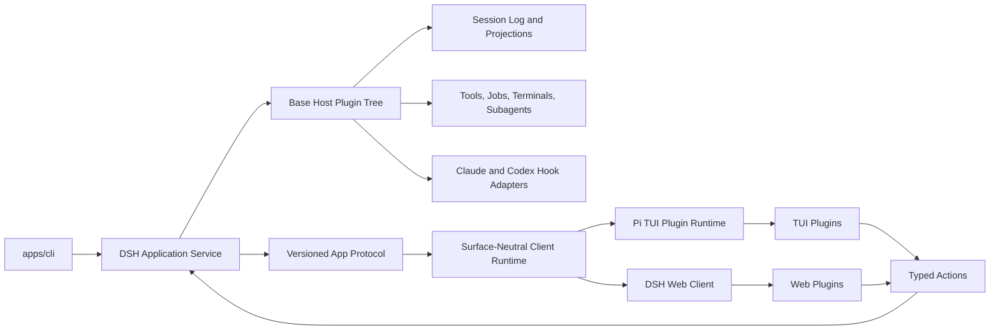
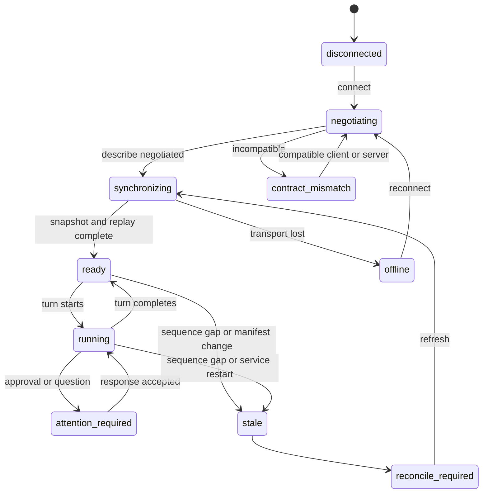
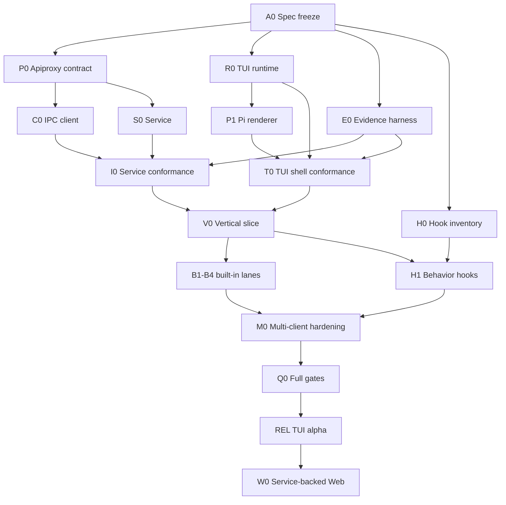

# Agent Note：后台服务驱动的插件化 TUI 客户端与多客户端运行时

Status: proposed

[English](2026-08-16-service-backed-plugin-tui-client.md) | 中文

## 问题

DeepSeek Harness 已交付完整浏览器客户端、类型化 Host API、持久会话事件、投影、命令、工具、审批、任务、subagent 与动态 Cordis 客户端插件，但尚未交付独立终端客户端，也没有在用户界面断开后继续保有 agent 工作的服务进程。社区终端客户端要么恢复已移除的进程内 TUI，要么给 DSH 桥接第二套协议，要么 vendor 整套运行时；这些方式都会重复生命周期、状态或发行所有权，无法让 Web 等价插件、可靠后台执行和 Claude 风格交互共同作用于同一个权威会话。

所要求的产品是完整 TUI 客户端，而不是当前 CLI 进程中的一种 TUI 模式。它必须组合与 DSH Web 相同的领域能力，允许自定义终端插件，保留 Claude Code 的交互习惯与 hook 事件，并连接一个类似 Codex 的后台服务；没有客户端连接时，该服务仍拥有 turn、进程、审批、事件与恢复。

## 提案

DSH 把现有 Apiproxy 四象限契约提升为版本化应用协议 `dsh.app.v0`，增加用户级后台服务与本地 IPC 载体，复用现有与表面无关的客户端运行时，并新增基于 Pi 的 TUI 插件运行时。DSH Web 与 DSH TUI 保持为相互独立的 renderer，共用同一组 Host 事实、action、receipt、事件日志与投影。第一批交付保持 `dsh web` 行为不变，以 additive 方式增加服务与 TUI；在 TUI 证明协议和多客户端规则后，后续已承诺切片再让 Web 连接同一个服务。

TUI 是完整全屏应用，提供 Claude 兼容交互 profile、自适应会话导航、对话渲染、工具视图、审批、问题、queue 与 steering 控制、后台任务、subagent、终端会话、checkpoint，以及插件贡献的面板。每个内置 TUI 能力都使用第三方插件可用的同一套 effect-scoped 注册 API。

## 详细规格包

- [本地服务与多客户端应用协议](2026-08-16-local-service-multi-client-protocol.md) 拥有协商、IPC framing、同步、replay、多客户端 mutation、process lifecycle 与 failure contract。
- [Pi TUI 运行时与插件 SDK](2026-08-16-pi-tui-runtime-plugin-sdk.md) 拥有 pure state machine、semantic scene、renderer adapter、plugin lifecycle、contribution arbitration、debug replay 与 terminal restoration。
- [Claude 兼容的 TUI 交互与事件体验](../feature/2026-08-16-claude-compatible-tui-interaction.md) 拥有 layout、keyboard behavior、composer semantics、detach/reattach、checkpoint UX 与生成的 Hook compatibility matrix。
- [TUI 与服务交付 DAG](2026-08-16-tui-service-delivery-dag.md) 拥有 path lease、parallel node、integration barrier、evidence、release gate 与 rollback。

## 必需能力账本

| ID | 能力 | 要求 | 交付 | 权威所有者 | 可见宿主 | 验收证据 |
| --- | --- | --- | --- | --- | --- | --- |
| C01 | 独立全屏 TUI 客户端 | required | deliver-now | TUI runtime | `dsh tui` | 组装后进程测试与 frame snapshot |
| C02 | agent 工作继续运行时允许客户端 detach | required | deliver-now | application service | TUI 退出与恢复流程 | daemon 集成证据 |
| C03 | 与 DSH Web 等价的会话、命令、skill、模型、权限、工具、任务、subagent、plan 与问题能力 | required | 按已承诺 DAG 分阶段交付 | 各 Host owner service | TUI plugins | 投影、action 与渲染状态一致性测试 |
| C04 | 支持 install、enable、disable、reload 与诊断的自定义 TUI 插件 | required | 可信本地插件 deliver-now | plugin runtime | TUI 与 CLI | 插件生命周期集成测试 |
| C05 | Claude 兼容键盘与交互 profile | required | deliver-now | TUI interaction plugin | composer 与 transcript | 固定 keymap 与用户流程 snapshot |
| C06 | Claude hook 事件兼容 | required | Host bridge 完成前 retain-next | hooks packages | hook diagnostics 与 TUI event row | 不允许静默忽略的兼容矩阵 |
| C07 | 类 Codex 后台服务、请求响应协议、流式事件、resume、steer、interrupt 与 queue | required | deliver-now | application service 与 protocol | 所有客户端 | 协议一致性与重连测试 |
| C08 | 后台 terminal、task、job 与 subagent | required | 第一批已承诺扩展波次 retain-next | 各 runtime owner service | task 与 agent view | detach、reconnect、terminate 与 orphan 测试 |
| C09 | Checkpoint、rewind、summarize 与 fork 交互 | required | 第一批已承诺扩展波次 retain-next | checkpoint service | rewind overlay | 文件与对话恢复测试 |
| C10 | DSH Web 与 TUI 连接同一个服务 | required | TUI 协议固化后 retain-next | application service | Web 与 TUI | 同时连接多客户端的 system test |
| C11 | 声明式受限能力 UI 插件 | exploratory | later | plugin runtime | Web 与 TUI | threat model 与 renderer conformance suite |
| C12 | 本机以外的远程网络连接 | optional | 第一批不交付 | deployment transport | future clients | 独立认证与 transport 决策 |

后续范围评审不得在没有独立用户决定的情况下移除 C01-C10。交付波次可以调整顺序，但能力与其权威所有者继续保留在账本中。

## 所有权与产品边界

服务拥有持久会话状态、agent 与插件生命周期、授权、工具、terminal 进程、queue、审批、问题、checkpoint 与 action receipt。领域插件继续拥有自己的状态与纯投影。应用协议只暴露类型化且脱敏的事实与 action，不把业务规则迁入客户端。

与表面无关的客户端运行时拥有 transport 状态、协议协商、replay cursor、projection store、action 关联与派生 presentation record。它不依赖 React、DOM、terminal 或 provider。

TUI runtime 拥有 terminal 设置与清理、焦点、布局、viewport、滚动位置、overlay、草稿文本、本地历史、keymap、renderer 选择与插件贡献位置。在 owner service 发出 receipt 或权威事件前，它永不把 mutation 显示为成功。

Web 保持为丰富视觉工作台。TUI 成为针对键盘控制、后台连续性、事件检查与低延迟干预优化的终端原生客户端。两个客户端共享协议与状态语义，不共享组件实现。

## 系统架构



### 应用服务

服务是每个 DSH home 一个用户级进程。它可以托管多个 workspace 与 session，复用 base Host plugin tree，并在 session 存在活动 turn、terminal、job、subagent、待处理 interaction、queued message 或 subscriber 时保持其加载。它不得创建 agents、tools、session storage 或 projections 的第二份实现。

默认本地 transport 在 Unix 使用仅当前用户可访问的 Unix socket，在 Windows 使用仅当前用户可访问的 named pipe。Socket 或 pipe 权限限制为当前用户。Stdio 继续服务测试与嵌入式启动。远程 TCP 或 WebSocket 在出现独立认证决策前不进入范围。

服务把诊断写入 stderr 或结构化 sidecar，绝不写入协议流。重启后，它重建持久 session projections，把无法恢复的 live process 标记为 `orphaned`，恢复 queued work 与 pending interaction，并发出 service-instance 变更，使客户端进入 reconcile 而不是假定执行连续。

### 应用协议

协议保留现有 Apiproxy method map 与四个 message quadrant。`host.describe` 成为 compatibility handshake，`events.mux` 与 `events.host` 增加已实现 cursor、synchronization marker 与显式 replay-gap 行为。逻辑契约保持与 local IPC、当前 HTTP/WebSocket 或 in-process carrier 无关。现有 SDK 自动化协议继续作为独立 automation surface。

每条连接先以可选 client metadata 完成 `host.describe`，并在现有 Host fact 之外接收 `protocolVersion`、`serviceInstanceId`、`schemaHash`、`pluginManifestHash`、capabilities 与当前 Host revision。初始协议明确为 `dsh.app.v0`，在最终 conformance 节点通过前保持 experimental。

### 与表面无关的客户端运行时

实现扩展 `packages/client/connection`，并复用 `packages/client/runtime` 的连接管理、重试、session snapshot、projection store、typed action、可应答 server request、queue mirror、job 与 subagent。TUI 直接消费这些非 React service。React-only Web slot 与 component 继续由 Web 拥有，TUI 不导入它们。

### TUI 运行时

TUI runtime 在 DSH 自有 semantic scene 与 renderer adapter 后使用 `@earendil-works/pi-tui`。普通插件使用稳定 DSH primitive，不导入 Pi internal。另行标记的 experimental renderer extension 可以向可信插件暴露窄范围声明的 Pi-specific capability。

默认 renderer 使用 alternate-screen fullscreen 模式。`classic` renderer 保留原生 scrollback，用于兼容性和调试。Terminal input 通过确定性 `update(state, event)` function 做 reduce，frame 通过确定性 `render(state, width, height)` function 生成。领域行为永远不直接运行在 terminal event loop 中。

## 协议契约

详细协议 note 拥有 method evolution 与 carrier semantics。总纲规则为：

- 现有 Apiproxy business method 保持 canonical；不创建 TUI method mirror；
- durable fact 按 Session sequence replay，projection 与 process-local state 通过 full snapshot 收敛，ephemeral delta 必须有 completed fact 或显式 unknown state；
- session mux 与 Host stream 在 baseline pull 前捕获 synchronization cut，缓冲并发 increment，无法证明连续时报告 gap 而不是猜测；
- queue/settings edit 使用 owner revision，approval/question 通过原始 `rpcId` 保持 first-response-wins，interrupt/termination 对 owner identity 幂等；
- service instance 变化使 process-local cursor 与 runtime attachment 假设失效，同时保留 durable session recovery；
- stale、gap、schema mismatch 或 unknown state 在权威 reconciliation 成功前禁用 mutation。

## 事件兼容

DSH canonical event 继续作为内部权威。兼容 adapter 把它们映射到 Claude Code 与 Codex hook dialect。TUI renderer 消费 canonical conversation node 与 projection，不消费 provider-specific payload。

Claude adapter 承诺覆盖官方生命周期中的 session、instruction、prompt、tool、permission、notification、subagent、task、compaction、elicitation、failure 与 session-end event。不支持的 event name 或 field 由 `dsh plugin doctor` 报告，绝不静默忽略。现有 partial bridge 在其当前 package boundary 后扩展，不在 TUI 中重写。

Hook execution 属于 service。Hook invocation 与 result record 在影响 model context、permission、tool outcome 或用户可见状态时必须持久化。Async observational hook 可以发出有界诊断而不阻塞 turn。Raw prompt、provider payload、hidden instruction、secret 与 full reasoning 不写入 client event 或 evidence。

## 插件架构

每个完整 capability 可以提供 Host、shared type、Web、TUI、composition 与 observation face。Package 使用 `./host`、`./types`、`./web`、`./tui` 等显式 export；缺少某个 face 是合法状态。Composition manifest 声明 version、必需 Host service、protocol capability、client contribution、trust level、configuration 与 unload behavior。

第一种 plugin tier 是可信本地 Node ESM code。安装需要显式 trust decision，因为 capability-limited API 并不能 sandbox 任意 Node code。后续 declarative tier 可以只暴露预定义 component、action 与 projection，从而支持更低信任的分发。

TUI plugin 通过下列 category 注册 effect-scoped contribution：

| Category | Purpose |
| --- | --- |
| `conversation.node` | 渲染一种 durable conversation node |
| `tool.presenter` | 渲染 tool call、result、terminal、diff 或 location list |
| `sidebar.section` | 增加 workspace 或 session navigation content |
| `inspector.section` | 增加 plan、task、agent、evidence 或 domain detail |
| `composer.dock` | 增加 queue、goal、todo、plan 或 pending interaction content |
| `composer.control` | 增加 model、permission、mode 或 action control |
| `status.item` | 增加有界 status fact |
| `overlay` | 增加 modal selection 或 detail flow |
| `notification` | 渲染 owner 撰写的 attention event |
| `command` | 增加不需要 model turn 的 human action |
| `keybinding` | 绑定 namespaced action，且不能静默覆盖 protected key |

每次注册都返回 disposer，并属于注册方 Cordis fiber。Reload 在替换项激活前移除 listener、timer、overlay、focus claim、pending call 与 terminal effect。Renderer crash 会移除或 quarantine 对应 contribution，把有界失败报告到插件诊断，并继续显示 generic event 或 tool fallback。

内置 TUI 功能使用相同注册。任何 private switch statement 或 privileged component registry 都不得让内置功能比第三方可信插件拥有更多能力。

## TUI 体验契约

宽屏布局显示 session navigation、conversation 与可选 inspector。窄屏保持 conversation 为主，把 navigation、task 与 inspection 移入 overlay。Workspace 与 session identity 在每个 operational state 中保持可见或可发现。

默认 `claude` interaction profile 在 terminal 允许时保留 Claude Code 习惯：`Esc` 中断或关闭活动 dialog，`Ctrl+C` 根据状态清空 input 或中断，`Ctrl+O` 打开 transcript detail，`Ctrl+B` 把可后台化工作移入后台，`Ctrl+T` 打开 tasks，`Ctrl+S` stash 或恢复 draft，`Ctrl+R` 搜索 input history，`Shift+Tab` 更改 permission mode，`Alt+P` 更改 model，`/` 打开 command 与 skill，`!` 进入 shell mode，`@` mention file、agent 或 session，空输入 `?` 打开 help，空输入双 `Esc` 打开 rewind。

DSH queue 与 steering 保持显式。持久 preference `busyEnter = queue | steer` 选择 steer-capable turn 运行时普通 Enter 的行为；加速手势执行相反行为。Composer 与 queue 始终显示实际 placement，使 queued message 不会被误认成 steering。

存在活动工作时退出 TUI，会提供 detach、interrupt current turn、stop session jobs 或 cancel exit。Detach 是默认值。重新连接后显示由 durable fact 与 projection 确定性生成的 recap：最后一条 user prompt、当前 turn state、pending interaction、active job 与 subagent、modified-file summary、queued input 与最后完成结果。

Checkpoint 与 rewind 是由 TUI 呈现的 service capability。Preview 区分 conversation restore、file restore、两者、summarization 与 fork。它必须说明哪些 shell、subagent、external、symlink 或 hard-link change 无法恢复；file restoration 永不声称可以替代 version control。

## 客户端状态机



`disconnected`、`negotiating`、`synchronizing`、`stale`、`offline`、`contract_mismatch`、`unknown` 与 `reconcile_required` 都有显式文案和 allowed-action rule。Stale 或 unknown state 永不因为某个 control 此前启用过而允许 mutation。

## 包拓扑

```text
packages/host/apiproxy/          evolved application contract
packages/client/connection/      local IPC carrier and handshake
packages/client/runtime/         reused surface-neutral client state
@deepseek-ai/dsh-tui-runtime     pure state, semantic scene, plugin SDK
@deepseek-ai/dsh-tui-renderer-pi Pi adapter and terminal lifecycle
packages/bundle/service/         long-lived Host composition
packages/bundle/tui-app/         released built-in TUI plugin composition
packages/test-support/           extracted fixtures only after proven reuse
apps/cli/                        service and tui command dispatch
```

新 package 保持 additive。现有 `packages/sdk/protocol`、Web API、Python SDK、`dsh web` 与 `dsh --profile headless` 继续可用。不新增平行 SDK protocol hierarchy。Shared test/transport utility 只能在证明确有复用，并保留 compatibility export 与 consumer test 后抽取。

## 目标 CLI

交付在实现存在后增加下列 human-facing command：

```bash
dsh service start
dsh service status
dsh service stop
dsh tui
dsh tui --session <session-id>
dsh tui --workspace <path>
dsh tui --renderer classic
dsh plugin create my-plugin --faces host,tui
dsh plugin install ./my-plugin
dsh plugin enable my-plugin
dsh plugin disable my-plugin
dsh plugin reload my-plugin
dsh plugin doctor my-plugin
```

`dsh tui` 在没有可连接后台服务时自动启动本地服务，除非传入 `--no-start`。`dsh service stop` 在存在活动工作时拒绝，除非用户选择或显式传入 stop policy。Credential 继续保存在既有用户级 credential store，绝不通过 plugin inventory、diagnostics 或 event 跨越协议。

## 兼容性与 rollout

所有新 protocol、CLI、event、config、package 与 plugin field 都是 additive，并在最终 conformance 节点前以 `dsh.app.v0` 标记 experimental。本提案不 rename 或 remove 现有 API。每个 event type 与 method 都有生成的 schema fixture；v0 期间可以添加 optional field，而 remove、rename、type narrowing 或 semantic repurposing 必须有显式 superseding Agent Note、migration、rollback 与 consumer update plan。

Service 与 TUI 在成为 default-capable 前先通过 opt-in profile 发布。第一批交付中，Web 继续启动当前 Host composition。只有在 TUI 证明 session replay、multi-client action、plugin compatibility 与 service restart behavior 后，Web-to-service migration 才能开始。

## 交付 DAG



详细 DAG note 对 node scope、path lease、acceptance packet、integration barrier、test layer、failure mode 与 rollback 具有权威性。安全并行基础线为 P0、R0、E0 与 H0。P0 后 C0/S0 可并行。只有真实 V0 lifecycle slice 通过后，built-in lane B1-B4 与 H1 才可并行。Post-change review 与 full gate 等待稳定 integrated diff。

## 测试与证据契约

Pure reducer、protocol codec、store、presenter 与 state machine 复用现有 Vitest stack。Fullscreen 与 classic renderer 使用确定性 fixed-size frame snapshot。Terminal integration 保持薄层：它验证 input decoding、resize、paste、支持平台上的 mouse、signal handling，以及 pure update/render core 外层的 cleanup。

组装后集成入口是 `pnpm run test:tui:integration`。每次运行都在 `temp/integration-test-runs/<run-id>/` 下写入脱敏 evidence，包括生成的 `summary.json`、`command.txt`、`stdout.log`、`stderr.log`、`env.json` 与 `artifacts/`。失败运行保留相同 evidence 和原始 exit code。Evidence generator 移除 secret、authorization value、raw prompt、provider payload、hidden instruction、private tool argument 与 full reasoning。

必需 assembled scenario 包括 fresh service startup、attach existing service、start and complete turn、live text and tool delta、queue and steer、approval and question、plugin load and reload、background job and subagent、terminal output、detach during work、resume after completion、reconnect during work、service restart、stale action、protocol mismatch、plugin mismatch、checkpoint restore、narrow terminal、10,000-node release fixture、观测性的 200,000-event stress fixture 与 failure 后 terminal cleanup。

## 备选方案

**恢复已移除的进程内 DSH TUI。** 否决，因为同一进程拥有 agent runtime 与 terminal，exit、crash、update 与 background continuation 因而共享一个 failure domain；它也早于当前 Web projection、queue、plugin 与 multi-client behavior。

**使用自定义 bridge 构建独立 Rust 或 Ratatui 客户端。** 第一版否决，因为在 TypeScript 与 Pi 出现经过测量的限制前，它会先引入第二套 protocol、state reducer、plugin SDK、package toolchain 与 release path。只有 windowing 与 replay benchmark 无法达到已接受 latency budget 时，Rust 才保留为 renderer-kernel option。

**让 TUI 直接连接当前 Web HTTP/SSE endpoint。** 作为最终架构否决，因为当前 API 没有 independent-client version negotiation、replayable forwarded event、service lifecycle 或完整 server-request contract。现有 API 与 Typert definition 会在 application protocol 后复用，而不是不加修改地被视为充分条件。

**让 TUI 成为 Web 进程内 renderer。** 否决，因为 terminal client 必须可以在没有 browser server 时运行、在 UI detach 后继续执行，并允许 service 与 Web 独立升级。

**把 Pi 直接暴露为 public plugin API。** 否决，因为这会把每个插件绑定到 renderer internal，并让 deterministic testing 与未来 renderer change 产生不必要的 breaking change。`TuiKit` 保留 experimental trusted escape hatch，但不把它变成普通 contract。

## 验收标准

- `dsh tui` 可以连接或启动本地 DSH service、渲染 interactive session，并在不停止 active work 的情况下 detach。
- 第二个 TUI client 可以连接同一 session；W1 完成后 Web client 也可以连接，所有 action 通过 revision、first-wins interaction、idempotency key 与 owner receipt 收敛。
- Durable event、projection snapshot、ephemeral delta 与 server request 是具有已测试重连行为的不同 protocol class。
- 内置 conversation、tool、interaction、task 与 checkpoint 功能通过第三方可信插件可用的相同 TUI plugin API 注册。
- Claude interaction profile 与 hook compatibility matrix 已文档化并受测试保护；unsupported behavior 显式报告。
- TUI input、render 与 plugin lifecycle state 是确定性且可 replay 的；diagnostics 永不写入活动 terminal screen。
- Plugin crash 或 unload 不能移除 authoritative event、残留 active terminal effect 或启用 stale action。
- 10,000-node release benchmark 达到 input-latency 与 bounded-memory target；200,000-event stress fixture 在 environment/limit 被接受前保持 observational；first paint 永不加载完整 history。
- 所有 integration、component、system 与 e2e run 都在 subproject `temp/integration-test-runs` 路径保存脱敏 evidence。
- 现有 `dsh web`、SDK、Python SDK、headless profile、session format 与 plugin package 在 additive rollout 全程保持工作。

## 风险

**Application service 可能成为第二份 Host composition。** Service bundle 必须扩展 base composition 并复用同一组 owner service；protocol adapter 不得复制 agent、tool、projection、queue 或 permission logic。

**仓库可能产生三套互不兼容的 client protocol。** Typert description 与 Session Event 继续作为唯一 business source 与 durable-event source；Web、TUI 与 SDK transport 适配这些 source，并接受 conformance test。

**可信 TUI plugin 可能被误解为 sandboxed plugin。** 安装文案与 diagnostics 必须说明任意 Node plugin 是 trusted code。Declarative restricted tier 是独立未来能力，不是第一种 tier 的安全声明。

**Multi-client action 会产生竞态。** Queue revision、first-wins interaction、idempotency key、action receipt、service instance identity 与 stale-state refusal 是必需 protocol behavior，而不是 UI heuristic。

**后台进程可能无法跨越 service crash。** Service 记录 durable ownership，并把不可恢复工作标记为 `orphaned`；没有 live owner 时绝不报告 process 仍在运行。如果当前 terminal session 无法 reattach，persistent PTY recovery 需要独立 backend capability。

**Claude compatibility 可能无限扩张。** Compatibility matrix 分离 interaction、hook event、checkpoint、plugin packaging 与 agent-team behavior。每个已承诺项都有 owner 与 test；provider-specific behavior 不进入 canonical event model。

**第一批可能膨胀成 terminal IDE 重写。** File tree、完整 editor、Git workbench、browser panel、remote multi-user deployment 与 arbitrary desktop widget 不进入第一批，除非它们通过新批准的 plugin contribution 消费既有 typed owner capability。
