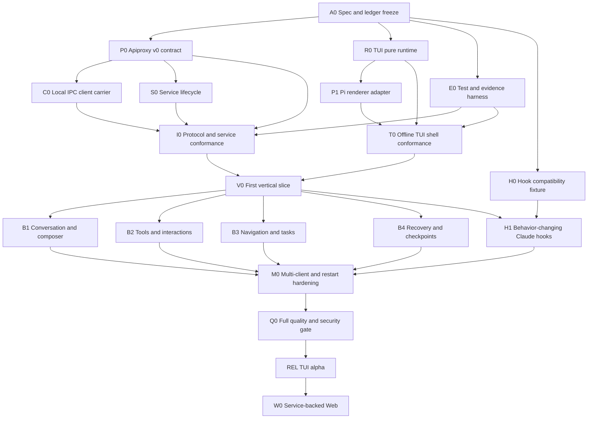

# Agent Note: TUI and Service Delivery DAG

Status: proposed

English | [中文](2026-08-16-tui-service-delivery-dag.zh.md)

## Problem

The service-backed TUI crosses protocol evolution, process lifecycle, client runtime reuse, terminal rendering, plugin SDK, Claude compatibility, CLI composition, security, and system verification. A flat checklist would either serialize independent work or let multiple writers change the same contracts while integration tests observe a moving target. A demo-first plan would also hide the expensive failure modes — replay gaps, service restart, terminal restoration, plugin disposal, and multi-client interaction races — until late.

The delivery plan must preserve every required capability in the umbrella ledger while sequencing reversible vertical slices. It must expose a critical path, safe parallel lanes, path ownership, integration barriers, evidence, and stop/go decisions that can be executed by one engineer or a delegated team.

## Proposal

Use a contract-first DAG with four parallel foundations: application protocol, service process, renderer-neutral TUI runtime, and verification harness. Join them at a narrow vertical slice that can connect, list/resume a session, submit, stream, interrupt, detach, and reattach. Add built-in plugins and H1 Claude hook semantics only after that slice proves the lifecycle. Migrate Web to the service in a later gate after TUI protocol hardening.

Each node has one path lease, one acceptance packet, and no hidden dependency on a future node. Independent read-only design or verification may run in parallel. Contract writers serialize through an integration barrier. A test or review node never modifies tracked source while its input diff is changing.

## Delivery principles

1. Reuse before extraction: extend current Apiproxy, Connection, Runtime, and bundle patterns before creating helpers.
2. One authority per fact: service owns business state; TUI owns presentation.
3. One writer per overlapping path lease.
4. Stable contracts precede carrier, renderer, and built-in feature work.
5. Every wave ends in an assembled process, not only package tests.
6. Failures are classified as introduced, pre-existing, concurrent, environmental, or ambiguous before repair.
7. Full repository gates run only after focused implementation stabilizes.
8. A capability may move to a later committed node but cannot disappear from the ledger without a user decision.

## DAG overview



The critical path is `A0 -> P0 -> C0/S0 -> I0 -> V0 -> M0 -> Q0 -> REL`. `R0/P1/T0`, `E0`, and `H0` run in parallel until their join barriers.

## Node contract

Every implementation node begins with this packet:

```text
objective
acceptance criteria
owned paths
excluded paths
dependencies and accepted contract version
allowed and forbidden actions
focused verification commands
required evidence paths
output envelope: status, summary, evidence, files_modified,
                 verification, risks, confidence
```

Completion of a node means its acceptance criteria and focused checks pass on a stable diff. It does not mean downstream integration has accepted it.

## Foundation nodes

### A0 — Specification and ledger freeze

**Objective:** accept the umbrella and detailed notes as the working contract, resolve contradictory names, and record all required capabilities and owners.

**Owned paths:** the five dated Agent Note pairs and their generated translation pairing records.

**Acceptance:** one package topology, one protocol identity, one Hook baseline, one DAG, no `openspec/`, valid bilingual pairs, Agent Note and Markdown gates pass.

**Exit artifact:** signed-off capability ledger and change-boundary summary.

### P0 — Apiproxy application contract

**Objective:** evolve the existing business protocol into `dsh.app.v0` without adding a parallel method surface.

**Owned paths:**

```text
packages/host/apiproxy/src/api/**
packages/host/apiproxy/tests/**
packages/host/apiproxy/          plus its README pair
```

**Deliverables:** client hello, protocol description, capability schema, service/contract error codes, implemented mux cursor contract, Host revision contract, synchronization/gap frames, generated schema fixtures.

**Acceptance:** old in-process/Web clients compile through compatibility defaults; new contract schemas reject unknown closed variants; replay contract tests cover cut, buffer, gap, and pending request identity.

**Excluded:** socket code, service process, TUI packages, Web UI changes.

### C0 — Local IPC carrier and connection generation

**Objective:** implement a Node/local transport behind the existing client connection surface.

**Owned paths:**

```text
packages/client/connection/src/      including the planned node transport face
packages/client/connection/src/client/connection.ts
packages/client/connection/tests/**
packages/client/connection/          plus its README pair
```

**Deliverables:** NDJSON codec, local socket/pipe client, ordered write queue, frame bounds, handshake negotiation, synchronization-aware readiness, service instance change callbacks.

**Acceptance:** the same `IApiClient` contract suite passes over a fake local server; disconnects at frame boundaries do not duplicate sink delivery; stop aborts every stream and pending call.

**Excluded:** service spawning/discovery policy, business method handlers, TUI.

### S0 — Service bundle and lifecycle

**Objective:** compose the existing Host tree as one user-level service and own discovery, admission, readiness, drain, and restart facts.

**Owned paths:**

```text
packages/bundle/service/**
packages/host/app-ipc/**                 # only if Apiproxy cannot own the carrier server
apps/cli/src/service*.ts
apps/cli/tests/service*.spec.ts
```

**Deliverables:** endpoint selection, lock, stale-owner validation, IPC server, current-user admission, readiness handshake, control methods, log sink, graceful/forced stop, service composition patch.

**Acceptance:** start/status/stop are idempotent; two simultaneous starts yield one owner; stale metadata cannot redirect a client to an attacker endpoint; crash/restart changes instance id and restores durable state.

**Excluded:** TUI dispatch and panels, domain persistence rewrites, remote TCP.

### R0 — Renderer-neutral TUI runtime

**Objective:** implement pure state/update/view, semantic nodes, contribution registries, plugin ownership, and replay diagnostics.

**Owned paths:**

**Package lease:** planned package `@deepseek-ai/dsh-tui-runtime`.

**Deliverables:** state/event/effect types, reducer driver, semantic sanitizer, command/keymap/panel/node/tool/dock/status/overlay/notification registries, focus and overlay arbitration, plugin generation/disposal.

**Acceptance:** pure tests cover required states, collision rules, stale-action guards, late effect isolation, sanitizer, and deterministic replay.

**Excluded:** Pi imports, Node terminal APIs, Host business calls, built-in UI.

### P1 — Pi renderer adapter

**Objective:** realize semantic nodes with Pi and own terminal lifecycle.

**Owned paths:**

```text
packages/tui/renderer-pi/**
```

**Deliverables:** main/alternate renderer choice, input decoder, layout mapping, scroll/focus/overlay mapping, IME cursor, frame scheduler, RAII cleanup, fake terminal fixtures.

**Acceptance:** terminal integration tests prove raw mode, resize, paste, synchronized output, panic restoration, width enforcement, and idle no-write.

**Excluded:** built-in DSH feature rendering and service calls.

### E0 — Verification and evidence harness

**Objective:** make integration evidence and deterministic TUI/service testing available before the vertical slice.

**Owned paths:**

```text
scripts/run-tui-integration-evidence.mjs
packages/test-support/app-ipc/**
packages/test-support/tui/**
vitest.*.config.ts                    # only dedicated additions required by the owner
```

**Deliverables:** disposable DSH home/workspace, mock LLM, fake terminal, PTY runner, fault injector, multi-client fixture, redacted evidence writer.

**Acceptance:** success and failure runs both produce required evidence files and preserve original exit code; secret canaries do not appear in artifacts.

**Excluded:** production protocol, service, or TUI behavior.

### H0 — Claude Hook compatibility fixture

**Objective:** pin the official event inventory and generate an honest local compatibility report before changing behavior.

**Owned paths:**

```text
packages/hooks/hooks-claude-code/tests/   including the planned compatibility fixture/spec
packages/hooks/hooks-claude-code/src/     including the planned compatibility module
```

**Deliverables:** event fixture including `DirectoryAdded`, local mapping dimensions, generated supported/partial/unsupported report, drift test.

**Acceptance:** adding an official fixture event without a local classification fails; parse-and-skip cannot report partial or supported.

**Excluded:** hook execution semantics; those belong to H1.

## Integration barriers

### I0 — Protocol and service conformance

**Dependencies:** P0, C0, S0, E0.

**Required flow:** start service, negotiate, open both streams, list sessions, create/resume, replay from cursor, answer a server request, disconnect, resume, stop service.

**Acceptance:** in-process, Web carrier, and IPC carrier return equivalent typed business results; gaps and restarts are explicit; evidence bundle is complete.

No TUI code is needed. Failure returns to the owning foundation node rather than being patched inside the integration test.

### T0 — Offline TUI shell conformance

**Dependencies:** R0, P1, E0.

**Required flow:** boot with recorded fixtures, navigate, edit/paste, open and close overlays, reload a plugin, render all responsive states, panic one contribution, exit.

**Acceptance:** snapshots and replay are deterministic; terminal restores; plugin failure has a generic fallback; no stdout/stderr logging occurs while raw mode is active.

### V0 — First end-to-end vertical slice

**Dependencies:** I0 and T0.

**Owned integration paths:**

```text
packages/bundle/tui-app/**
apps/cli/src/tui*.ts
apps/cli/src/args.ts
apps/cli/src/bin.ts
apps/cli/tests/tui*.spec.ts
```

**Required flow:** `dsh tui` connect-or-starts the service, lists sessions, resumes one, renders history, submits a prompt, streams the turn, interrupts, detaches, and reattaches with a recap.

**Acceptance:** the process path uses the real service and plugin composition; no built-in bypasses the contribution registry; active work survives local TUI exit; every terminal exit path restores the terminal.

This is the first product demo and the first point where user-flow feedback may change presentation. It does not reopen service/domain ownership.

## Parallel product nodes after V0

These nodes use non-overlapping directories inside `packages/bundle/tui-app` and the public runtime API. If a missing runtime capability appears, it becomes a reviewed R0 follow-up before feature work continues; feature nodes do not add private registries.

### B1 — Conversation and composer

**Lease:** `packages/bundle/tui-app/src/plugins/conversation/**` and `src/plugins/composer/**`.

**Scope:** canonical nodes, density levels, copy, selection, streaming tail, session drafts, slash/skill/mention completion, queue/steer, model and permission selectors.

**Acceptance:** 10,000-node fixture remains windowed; queue placement is Host-authored; draft survives resize, reconnect, switch, and reload.

### B2 — Tools and answerable interactions

**Lease:** `src/plugins/tools/**` and `src/plugins/interactions/**`.

**Scope:** generic and specialized tool cards, terminal/diff/file/search/Web views, approval, question, permission, elicitation, trust/login overlays.

**Acceptance:** generic fallback is permanent; first-response-wins converges across two clients; control-rich output is escaped; detail never exposes raw private payloads.

### B3 — Navigation, tasks, and background work

**Lease:** `src/plugins/navigation/**` and `src/plugins/tasks/**`.

**Scope:** workspace/session navigation, search/archive, plans, todos, goals, jobs, terminals, subagents, background transitions and attention counts.

**Acceptance:** large lists paginate/window; completed/failed/orphaned/unknown states are distinct; closing a view never implies terminating owned work.

### B4 — Recovery and checkpoints

**Lease:** `src/plugins/recovery/**` and checkpoint owner packages explicitly accepted in a separate path lease.

**Scope:** reconnect recap, sequence navigation, checkpoint preview, fork, summarize, conversation restore, file restore integration.

**Acceptance:** preview precedes mutation; non-restorable effects are listed; expected revisions prevent stale restore; file restore never claims version control equivalence.

### H1 — Behavior-changing Claude hooks

**Lease:** `packages/hooks/hooks-claude-code/**` plus narrowly accepted owner extension points. H1 must not modify TUI packages.

**Scope:** the H1 event set from the interaction note: SessionStart, UserPromptSubmit, PreToolUse, PermissionRequest, PostToolUse, PostToolUseFailure, Stop, Elicitation, and ElicitationResult.

**Acceptance:** each event meets applicable trigger, matcher, field, handler, timeout, decision, rewrite, failure, and disposal semantics; the generated compatibility report moves an event to supported only when every dimension passes.

## Hardening and release nodes

### M0 — Multi-client, restart, and load hardening

**Dependencies:** B1-B4 and H1.

**Scenarios:** two TUIs; TUI plus Web; approval answered elsewhere; concurrent queue edits; disconnect before/after response; service restart during turn, PTY, job, and hook; plugin reload during stream; 10,000 events; slow consumer; frame overflow; process signal storm.

**Acceptance:** every scenario converges or enters a named failure state; resource and memory bounds have evidence; no durable event or answerable request is lost; service and terminal recover independently.

### Q0 — Full quality, security, and documentation gate

Run only on a stable integrated diff:

```bash
pnpm run typecheck
pnpm run lint
pnpm run test
pnpm run test:e2e
pnpm run test:snapshot
pnpm run constraints
pnpm run publint
pnpm run doc-sync
git diff --check
```

Focused platform gates cover Linux and Windows IPC. PTY/TUI behavior is observed on macOS, Linux, Windows Terminal, tmux, and SSH according to the release matrix. Security review covers local peer trust, endpoint replacement, plugin trust, control-sequence injection, path/ref exposure, log/evidence redaction, and service control authorization.

Q0 also verifies package READMEs, CLI help, plugin authoring docs, compatibility report, debug/replay docs, limitations, and real commands. It does not repair unrelated pre-existing repository failures without attribution.

### REL — TUI alpha release

Release conditions:

- protocol remains explicitly `dsh.app.v0`;
- service and TUI commands are documented as alpha;
- existing Web remains available and unchanged in default deployment;
- install/upgrade/downgrade and config migration tests pass;
- known unsupported Hook events and runtime restart limits are visible;
- rollback disables the TUI/service profile without changing session logs;
- packed-install smoke test runs from the released artifacts.

### W0 — Service-backed Web

This is a later committed node, not an alpha blocker. Web swaps its physical carrier to the service while preserving the same `ConnectionHandle` and `SessionRuntime`. A simultaneous Web/TUI system test becomes blocking before the service is the default Web deployment.

## Safe parallelism matrix

| Concurrent lanes | Safe when | Join barrier |
| --- | --- | --- |
| P0, R0, E0, H0 | specs accepted; paths do not overlap | P0 contract review; runtime API review |
| C0 and S0 | P0 schemas stable; client/server leases separate | I0 |
| P1 with C0/S0 | R0 semantic contract stable | T0 and V0 |
| B1, B2, B3, B4, H1 | V0 accepted; feature directories leased | M0 |
| test/review lanes | input diff stable | owning node acceptance |

Unsafe parallel combinations include two writers in Apiproxy schemas, a renderer writer changing runtime contracts while built-ins compile, a service writer and CLI/TUI writer both changing argument dispatch, or any post-change review against an active writer.

When only one implementer is available, execute the same DAG topologically. No node assumes parallelism for correctness.

## Test coverage architecture

```text
                       user workflow
                           │
                      process e2e
                 dsh tui ↔ dsh service
                           │
              multi-client/system scenarios
              ┌────────────┴────────────┐
         service component        TUI component/PTTY
         real Host + IPC          fake/real service
              │                         │
       carrier integration       renderer integration
              │                         │
      schema/replay unit       reducer/view/plugin unit
```

| Layer       | Required evidence                                              |
| ----------- | -------------------------------------------------------------- |
| Unit        | typed assertions, property cases, semantic snapshots           |
| Integration | real package boundaries, fault injection, focused logs         |
| Component   | complete service or TUI with real internal dependencies        |
| System      | service plus two clients, restart and concurrency              |
| E2E         | real `dsh` entry, PTY, mock provider, complete user path       |
| Performance | fixture id, environment, percentiles, allocation/memory bounds |
| Security    | trust-boundary cases and redaction canaries                    |

Every non-unit run stores `summary.json`, `command.txt`, `stdout.log`, `stderr.log`, `env.json`, and `artifacts/` through the evidence runner. TUI frames, replay logs, socket metadata, and process trees are artifacts only after redaction.

## Failure-mode matrix

| Failure | Detection | Owner | User-visible state | Recovery test |
| --- | --- | --- | --- | --- |
| no service | connect error | CLI/service | starting or unavailable | connect-or-start |
| incompatible service | handshake | Apiproxy/connection | contract mismatch | downgrade/upgrade fixture |
| replay gap | stream sync | Host/runtime | reconcile required | forced ring overflow |
| service restart | instance id | connection/runtime | reconnect recap | kill/restart process |
| slow client | write budget | carrier | degraded/reconnect | paused reader |
| stale queue edit | expected revision | queue owner | conflict with refresh | two-client race |
| answered elsewhere | `RpcReceipt` | interaction owner | answered elsewhere | simultaneous answer |
| PTY lost on restart | runtime inventory | terminal owner | orphaned/unknown | restart with active PTY |
| plugin render crash | boundary | TUI runtime | generic fallback | throwing presenter |
| plugin unload leak | owner drain timeout | plugin host | plugin degraded | late timer/effect fixture |
| terminal panic | root guard | Pi adapter | restored shell and error | injected render panic |
| hook timeout | hook protocol | hook bridge | timed out plus outcome | blocking handler fixture |
| unsafe control bytes | sanitizer | TUI runtime | escaped text | hostile output fixture |
| evidence secret leak | canary scan | evidence runner | release blocked | seeded secret corpus |

## Performance and capacity gates

The first release targets local single-user operation, not remote multi-tenant scale. Capacity tests still define bounded behavior:

- at least two simultaneous interactive clients and four observation clients;
- 100 attached sessions with ten active session streams;
- 10,000 logical conversation nodes in the selected session;
- sustained bounded streaming plus one active terminal and ten background jobs;
- reconnect after a 30-second client stall without unbounded service memory;
- plugin reload without monotonically increasing listeners, timers, or retained scene nodes.

Thresholds become blocking only with a documented benchmark environment. A capacity miss may reduce an advertised alpha limit, but cannot be hidden by dropping events or disabling correctness checks.

## Decision gates and rollback

| Gate | Go condition | Stop condition | Rollback |
| --- | --- | --- | --- |
| G0 contract | P0 schemas and compatibility tests accepted | parallel protocol surface required | revise spec before carriers |
| G1 service | I0 proves lifecycle and replay | restart/gap ambiguity remains | keep service experimental |
| G2 TUI slice | V0 proves detach/reattach and cleanup | terminal cannot restore reliably | do not publish command |
| G3 feature complete | M0 named states converge | silent lost action/event | return to owner node |
| G4 alpha | Q0 and packed smoke pass | security/redaction/platform blocker | ship no TUI profile |
| G5 Web migration | simultaneous Web/TUI passes | default Web regression | retain current Web carrier |

Rollback is additive: disable/remove the service and TUI profile, preserve session logs and existing Web/headless behavior, and leave plugin config diagnostics. Protocol migrations must not rewrite durable SessionEvent history.

## Alternatives considered

**Use one flat implementation checklist.** Rejected because it hides contract dependencies and cannot define safe parallel ownership or integration barriers.

**Build the visible TUI first and retrofit the service.** Rejected because detach, replay, multi-client receipts, and restart behavior would be mocked at the exact layer that must become authoritative.

**Develop everything on one long-lived integration branch.** Rejected because protocol, renderer, Hook, and built-in changes would be impossible to attribute or verify independently.

**Make Web migration part of the first alpha.** Rejected because it expands the regression surface before the independent-client protocol is proven. W0 remains committed after alpha hardening.

## Risks

**Contract gates can become ceremony without decisions.** Each gate has a concrete flow, named stop condition, and evidence; nodes that add no decision or proof should be removed.

**Path leases can bottleneck necessary cross-cutting changes.** Missing contract work returns to the owning node through a reviewed follow-up instead of being patched privately by feature lanes.

**Parallel foundations can still create an integration cliff.** I0 and T0 join before V0, and V0 is deliberately narrow enough to expose lifecycle mismatches early.

**Dirty-worktree failures can trigger unrelated repairs.** Q0 classifies provenance before change and does not edit unrelated business logic merely to clear a global gate.

**Later capabilities can be silently deferred forever.** Capability-to-node traceability keeps C01-C10 committed, names the blocking gate, and requires a user decision for removal.

## Capability-to-node traceability

| Capability | Primary nodes | Blocking release gate |
| --- | --- | --- |
| independent TUI | R0, P1, V0, B1-B4 | G4 |
| detach/background service | S0, I0, V0, M0 | G2/G4 |
| Web-equivalent domain surfaces | B1-B4 | G3/G4 |
| custom trusted plugins | R0, T0, B1-B4 | G3/G4 |
| Claude interaction profile | B1-B4 | G3/G4 |
| Claude Hook compatibility | H0, H1, later H2-H4 | H1 blocks first compatibility claim |
| multi-client actions/events | P0, C0, I0, M0 | G3/G4 |
| jobs/terminals/subagents | B3, M0 | G3/G4 |
| checkpoint/rewind | B4, M0 | G3/G4 |
| Web and TUI same service | W0 | G5, after alpha |

## Acceptance criteria

1. Every implementation node has an explicit path lease, dependency contract, focused test set, and evidence output.
2. P0, R0, E0, and H0 can advance independently without overlapping writes.
3. No feature node adds a private business protocol or private built-in-only TUI registry.
4. I0 and T0 reject foundation defects before the first end-to-end product slice.
5. V0 proves the complete lifecycle from real CLI entry through detach and reattach, not a hand-mounted component.
6. M0 covers multi-client, restart, load, plugin reload, and Hook interaction races with named outcomes.
7. Q0 runs on a stable diff, attributes unrelated failures, and preserves redacted per-run evidence.
8. Alpha rollback leaves existing Web, headless, automation protocol, and durable session history intact.

## Consequences

The DAG delays some visible breadth until the service and terminal lifecycle are real, but it creates earlier trustworthy integration points. It supports parallel execution without allowing parallel contract invention. The strict join barriers and evidence packets add ceremony; that cost is justified at the boundaries where a silent replay gap, leaked terminal mode, stale approval, or plugin cleanup failure would otherwise become a user data or control problem.
