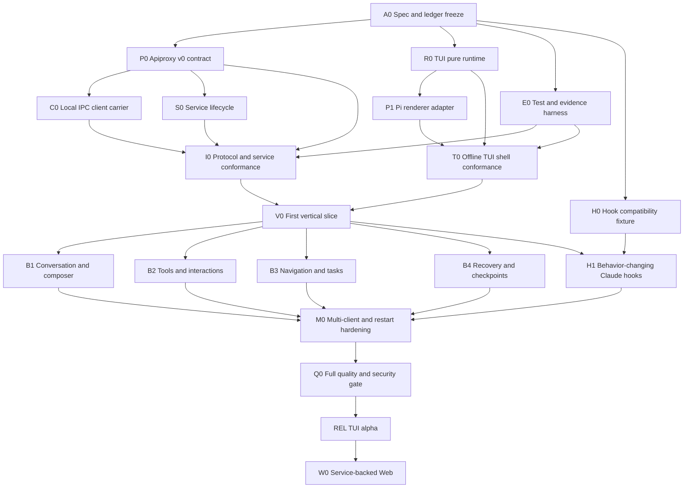

# Agent Note：TUI 与服务交付 DAG

Status: proposed

[English](2026-08-16-tui-service-delivery-dag.md) | 中文

## 问题

Service-backed TUI 横跨 protocol evolution、process lifecycle、client runtime reuse、terminal rendering、plugin SDK、Claude compatibility、CLI composition、security 与 system verification。扁平 checklist 要么串行化本可独立的工作，要么让多个 writer 同时修改同一 contract，而 integration test 观察的仍是移动目标。Demo-first 计划还会把 replay gap、service restart、terminal restoration、plugin disposal 与 multi-client interaction race 等高成本 failure mode 推迟到后期才暴露。

交付计划必须保留总纲 ledger 的每个 required capability，同时按可逆 vertical slice 排序。它必须暴露 critical path、安全 parallel lane、path ownership、integration barrier、evidence 与 stop/go decision，并且既能由一个工程师执行，也能由授权后的团队执行。

## 方案

使用 contract-first DAG，设置四条并行基础线：application protocol、service process、renderer- neutral TUI runtime 与 verification harness。它们在一个窄 vertical slice 汇合：能够 connect、list/resume session、submit、stream、interrupt、detach 和 reattach。只有该 slice 证明 lifecycle 之后，才增加 built-in plugin 与 H1 Claude hook semantics。Web 在 TUI protocol hardening 后的后续 gate 才迁移到 service。

每个 node 只有一个 path lease、一个 acceptance packet，不隐藏依赖未来 node。独立只读设计或 verification 可以并行。Contract writer 通过 integration barrier 串行汇合。Test/review node 不能在输入 diff 仍变化时修改 tracked source。

## 交付原则

1. 先复用、后抽取：在新建 helper 前扩展当前 Apiproxy、Connection、Runtime 与 bundle pattern。
2. 每个 fact 只有一个 authority：service 拥有业务状态，TUI 拥有 presentation。
3. 重叠 path lease 一次只有一个 writer。
4. 稳定 contract 先于 carrier、renderer 与 built-in feature work。
5. 每个 wave 以 assembled process 收尾，而不只跑 package test。
6. Failure 在 repair 前分类为 introduced、pre-existing、concurrent、environmental 或 ambiguous。
7. Full repository gate 只在 focused implementation 稳定后运行。
8. Capability 可以移动到后续 committed node，但未经用户决策不能从 ledger 消失。

## DAG 总览



Critical path 是 `A0 -> P0 -> C0/S0 -> I0 -> V0 -> M0 -> Q0 -> REL`。 `R0/P1/T0`、`E0` 与 `H0` 在各自 join barrier 前并行。

## Node 契约

每个 implementation node 以以下 packet 开始：

```text
objective
acceptance criteria
owned paths
excluded paths
dependencies and accepted contract version
allowed and forbidden actions
focused verification commands
required evidence paths
output envelope: status, summary, evidence, files_modified,
                 verification, risks, confidence
```

Node complete 表示其 acceptance criteria 与 focused check 在稳定 diff 上通过，不表示 downstream integration 已接受。

## 基础节点

### A0 — Specification 与 ledger freeze

**目标：** 接受总纲与详细 notes 作为工作 contract，解决矛盾名称，记录全部 required capability 与 owner。

**Owned paths：** 五组 dated Agent Note 中英对照及其生成的 translation pairing record。

**验收：** 一套 package topology、一项 protocol identity、一条 Hook baseline、一张 DAG；不存在 `openspec/`；双语 pair 有效；Agent Note 与 Markdown gate 通过。

**Exit artifact：** 已确认的 capability ledger 与 change-boundary summary。

### P0 — Apiproxy application contract

**目标：** 把现有 business protocol 演进为 `dsh.app.v0`，不新增平行 method surface。

**Owned paths：**

```text
packages/host/apiproxy/src/api/**
packages/host/apiproxy/tests/**
packages/host/apiproxy/          plus its README pair
```

**交付：** client hello、protocol description、capability schema、service/contract error code、已实现 mux cursor contract、Host revision contract、synchronization/gap frame、生成的 schema fixture。

**验收：** 旧 in-process/Web client 通过 compatibility default 继续 compile；新 contract schema 拒绝未知 closed variant；replay contract test 覆盖 cut、buffer、gap 与 pending request identity。

**排除：** socket code、service process、TUI package、Web UI change。

### C0 — Local IPC carrier 与 connection generation

**目标：** 在现有 client connection surface 后实现 Node/local transport。

**Owned paths：**

```text
packages/client/connection/src/      including the planned node transport face
packages/client/connection/src/client/connection.ts
packages/client/connection/tests/**
packages/client/connection/          plus its README pair
```

**交付：** NDJSON codec、local socket/pipe client、ordered write queue、frame bound、handshake negotiation、synchronization-aware readiness、service instance change callback。

**验收：** 同一 `IApiClient` contract suite 通过 fake local server；frame boundary 注入断连不会重复 sink delivery；stop 会 abort 所有 stream 与 pending call。

**排除：** service spawn/discovery policy、business method handler、TUI。

### S0 — Service bundle 与 lifecycle

**目标：** 把现有 Host tree 组合为一个 user-level service，拥有 discovery、admission、readiness、drain 与 restart fact。

**Owned paths：**

```text
packages/bundle/service/**
packages/host/app-ipc/**                 # only if Apiproxy cannot own the carrier server
apps/cli/src/service*.ts
apps/cli/tests/service*.spec.ts
```

**交付：** endpoint selection、lock、stale-owner validation、IPC server、current-user admission、readiness handshake、control method、log sink、graceful/forced stop、service composition patch。

**验收：** start/status/stop 幂等；两个同时 start 只产生一个 owner；stale metadata 不能把 client 重定向到 attacker endpoint；crash/restart 改变 instance id 并恢复 durable state。

**排除：** TUI dispatch/panel、domain persistence rewrite、remote TCP。

### R0 — Renderer-neutral TUI runtime

**目标：** 实现 pure state/update/view、semantic node、contribution registry、plugin ownership 与 replay diagnostics。

**Owned paths：**

**Package lease：** 计划 package `@deepseek-ai/dsh-tui-runtime`。

**交付：** state/event/effect type、reducer driver、semantic sanitizer、command/keymap/panel/node/ tool/dock/status/overlay/notification registry、focus/overlay arbitration、plugin generation/disposal。

**验收：** pure test 覆盖 required state、collision rule、stale-action guard、late effect isolation、sanitizer 与 deterministic replay。

**排除：** Pi import、Node terminal API、Host business call、built-in UI。

### P1 — Pi renderer adapter

**目标：** 用 Pi 实现 semantic node，并拥有 terminal lifecycle。

**Owned paths：**

```text
packages/tui/renderer-pi/**
```

**交付：** main/alternate renderer choice、input decoder、layout mapping、scroll/focus/overlay mapping、IME cursor、frame scheduler、RAII cleanup、fake terminal fixture。

**验收：** terminal integration test 证明 raw mode、resize、paste、synchronized output、panic restoration、width enforcement 与 idle no-write。

**排除：** built-in DSH feature rendering 与 service call。

### E0 — Verification 与 evidence harness

**目标：** 在 vertical slice 前提供 integration evidence 与确定性 TUI/service test 能力。

**Owned paths：**

```text
scripts/run-tui-integration-evidence.mjs
packages/test-support/app-ipc/**
packages/test-support/tui/**
vitest.*.config.ts                    # only dedicated additions required by the owner
```

**交付：** disposable DSH home/workspace、mock LLM、fake terminal、PTY runner、fault injector、multi-client fixture、脱敏 evidence writer。

**验收：** success/failure run 都产生 required evidence file，并保留原始 exit code；secret canary 不出现在 artifact。

**排除：** production protocol、service 或 TUI behavior。

### H0 — Claude Hook compatibility fixture

**目标：** 在改变行为前固定官方 event inventory，并生成真实 local compatibility report。

**Owned paths：**

```text
packages/hooks/hooks-claude-code/tests/   including the planned compatibility fixture/spec
packages/hooks/hooks-claude-code/src/     including the planned compatibility module
```

**交付：** 包含 `DirectoryAdded` 的 event fixture、local mapping dimension、生成的 supported/ partial/unsupported report、drift test。

**验收：** 官方 fixture 增加 event 而本地未分类时失败；parse-and-skip 不能报告 partial 或 supported。

**排除：** hook execution semantics；它们属于 H1。

## Integration barrier

### I0 — Protocol 与 service conformance

**依赖：** P0、C0、S0、E0。

**必需 flow：** start service、negotiate、打开两条 stream、list sessions、create/resume、按 cursor replay、回答 server request、disconnect、resume、stop service。

**验收：** in-process、Web carrier 与 IPC carrier 返回等价 typed business result；gap/restart 显式；evidence bundle 完整。

不需要 TUI code。Failure 返回对应 foundation node，而不是在 integration test 中打补丁。

### T0 — Offline TUI shell conformance

**依赖：** R0、P1、E0。

**必需 flow：** 使用 recorded fixture 启动，navigate、edit/paste、open/close overlay、reload plugin、render 所有 responsive state，使一个 contribution panic，然后退出。

**验收：** snapshot/replay 确定；terminal 恢复；plugin failure 有 generic fallback；raw mode active 期间没有 stdout/stderr logging。

### V0 — 首个 end-to-end vertical slice

**依赖：** I0 与 T0。

**Owned integration paths：**

```text
packages/bundle/tui-app/**
apps/cli/src/tui*.ts
apps/cli/src/args.ts
apps/cli/src/bin.ts
apps/cli/tests/tui*.spec.ts
```

**必需 flow：** `dsh tui` connect-or-start service、list session、resume、render history、submit prompt、stream turn、interrupt、detach，再 reattach 并显示 recap。

**验收：** process path 使用真实 service 与 plugin composition；没有 built-in 绕过 contribution registry；active work 在本地 TUI exit 后继续；每条 terminal exit path 都恢复 terminal。

这是首次 product demo，也是 user-flow feedback 可以改变 presentation 的首个位置；它不重新打开 service/domain ownership。

## V0 后的并行产品节点

这些 node 使用 `packages/bundle/tui-app` 中互不重叠的目录与公开 runtime API。如果发现缺少 runtime capability，先形成 reviewed R0 follow-up，再继续 feature work；feature node 不新增 private registry。

### B1 — Conversation 与 composer

**Lease：** `packages/bundle/tui-app/src/plugins/conversation/**` 与 `src/plugins/composer/**`。

**范围：** canonical node、density level、copy、selection、streaming tail、session draft、slash/ skill/mention completion、queue/steer、model/permission selector。

**验收：** 10,000-node fixture 保持 windowed；queue placement 由 Host author；draft 在 resize、reconnect、switch 与 reload 后保留。

### B2 — Tool 与可应答 interaction

**Lease：** `src/plugins/tools/**` 与 `src/plugins/interactions/**`。

**范围：** generic/specialized tool card、terminal/diff/file/search/Web view、approval、question、permission、elicitation、trust/login overlay。

**验收：** generic fallback 永久存在；first-response-wins 在两个 client 间收敛；control-rich output 被转义；detail 不暴露 raw private payload。

### B3 — Navigation、task 与 background work

**Lease：** `src/plugins/navigation/**` 与 `src/plugins/tasks/**`。

**范围：** workspace/session navigation、search/archive、plan、todo、goal、job、terminal、subagent、background transition 与 attention count。

**验收：** large list paginate/window；completed/failed/orphaned/unknown 明确区分；关闭 view 绝不暗示 terminate owned work。

### B4 — Recovery 与 checkpoint

**Lease：** `src/plugins/recovery/**`，以及在单独 path lease 中明确接受的 checkpoint owner package。

**范围：** reconnect recap、sequence navigation、checkpoint preview、fork、summarize、conversation restore、file restore integration。

**验收：** preview 先于 mutation；列出 non-restorable effect；expected revision 阻止 stale restore；file restore 绝不声称等价于 version control。

### H1 — 改变行为的 Claude hooks

**Lease：** `packages/hooks/hooks-claude-code/**`，加经窄范围接受的 owner extension point。H1 不得修改 TUI package。

**范围：** interaction note 中的 H1 event：SessionStart、UserPromptSubmit、PreToolUse、PermissionRequest、PostToolUse、PostToolUseFailure、Stop、Elicitation 与 ElicitationResult。

**验收：** 每个 event 满足适用 trigger、matcher、field、handler、timeout、decision、rewrite、failure 与 disposal semantics；只有所有 dimension 通过后，生成的 compatibility report 才把 event 移到 supported。

## Hardening 与 release 节点

### M0 — Multi-client、restart 与 load hardening

**依赖：** B1-B4 与 H1。

**场景：** 两个 TUI；TUI 加 Web；approval answered elsewhere；并发 queue edit；response 前后断连；turn、PTY、job、hook 期间 service restart；stream 期间 plugin reload；10,000 event；slow consumer；frame overflow；process signal storm。

**验收：** 每个场景收敛或进入具名 failure state；resource/memory bound 有 evidence；不丢 durable event 或 answerable request；service 与 terminal 可独立恢复。

### Q0 — 完整质量、安全与文档 gate

只在稳定 integrated diff 上运行：

```bash
pnpm run typecheck
pnpm run lint
pnpm run test
pnpm run test:e2e
pnpm run test:snapshot
pnpm run constraints
pnpm run publint
pnpm run doc-sync
git diff --check
```

Focused platform gate 覆盖 Linux/Windows IPC。PTY/TUI behavior 按 release matrix 在 macOS、Linux、Windows Terminal、tmux 与 SSH 上观察。Security review 覆盖 local peer trust、endpoint replacement、plugin trust、control-sequence injection、path/ref exposure、log/evidence redaction 与 service control authorization。

Q0 还验证 package README、CLI help、plugin authoring docs、compatibility report、debug/replay docs、limitations 与真实 command。它不在没有归因时修复无关 pre-existing repository failure。

### REL — TUI alpha release

Release condition：

- protocol 明确保持 `dsh.app.v0`；
- service/TUI command 标记为 alpha；
- 现有 Web 在默认 deployment 中继续可用且行为不变；
- install/upgrade/downgrade 与 config migration test 通过；
- 已知 unsupported Hook event 与 runtime restart limit 可见；
- rollback 可禁用 TUI/service profile，而不改变 session log；
- packed-install smoke test 从发布 artifact 运行。

### W0 — Service-backed Web

这是后续 committed node，不是 alpha blocker。Web 在保留同一 `ConnectionHandle` 与 `SessionRuntime` 的前提下替换 physical carrier。Service 成为默认 Web deployment 前，simultaneous Web/TUI system test 变为 blocking。

## 安全并行矩阵

| 并行 lanes | 安全条件 | Join barrier |
| --- | --- | --- |
| P0、R0、E0、H0 | specs 已接受；paths 不重叠 | P0 contract review；runtime API review |
| C0 与 S0 | P0 schema 稳定；client/server lease 分离 | I0 |
| P1 与 C0/S0 | R0 semantic contract 稳定 | T0 与 V0 |
| B1、B2、B3、B4、H1 | V0 已接受；feature directory 已 lease | M0 |
| test/review lanes | 输入 diff 稳定 | owner node acceptance |

不安全并行组合包括：两个 writer 同时修改 Apiproxy schema；renderer writer 在 built-in compile 期间改变 runtime contract；service writer 与 CLI/TUI writer 同时修改 argument dispatch；任何 post-change review 针对 active writer。

只有一个 implementer 时，按拓扑顺序执行同一 DAG。任何 node 都不依赖并行才能保证正确性。

## 测试覆盖架构

```text
                       user workflow
                           │
                      process e2e
                 dsh tui ↔ dsh service
                           │
              multi-client/system scenarios
              ┌────────────┴────────────┐
         service component        TUI component/PTTY
         real Host + IPC          fake/real service
              │                         │
       carrier integration       renderer integration
              │                         │
      schema/replay unit       reducer/view/plugin unit
```

| Layer       | 必需 evidence                                                |
| ----------- | ------------------------------------------------------------ |
| Unit        | typed assertion、property case、semantic snapshot            |
| Integration | real package boundary、fault injection、focused log          |
| Component   | complete service 或 TUI 加真实 internal dependency           |
| System      | service 加两个 client、restart 与 concurrency                |
| E2E         | real `dsh` entry、PTY、mock provider、完整 user path         |
| Performance | fixture id、environment、percentile、allocation/memory bound |
| Security    | trust-boundary case 与 redaction canary                      |

每个 non-unit run 通过 evidence runner 保存 `summary.json`、`command.txt`、`stdout.log`、 `stderr.log`、`env.json` 与 `artifacts/`。TUI frame、replay log、socket metadata 与 process tree 只有脱敏后才能成为 artifact。

## Failure-mode 矩阵

| Failure | 检测 | Owner | 用户可见状态 | Recovery test |
| --- | --- | --- | --- | --- |
| no service | connect error | CLI/service | starting 或 unavailable | connect-or-start |
| incompatible service | handshake | Apiproxy/connection | contract mismatch | downgrade/upgrade fixture |
| replay gap | stream sync | Host/runtime | reconcile required | forced ring overflow |
| service restart | instance id | connection/runtime | reconnect recap | kill/restart process |
| slow client | write budget | carrier | degraded/reconnect | paused reader |
| stale queue edit | expected revision | queue owner | conflict with refresh | two-client race |
| answered elsewhere | `RpcReceipt` | interaction owner | answered elsewhere | simultaneous answer |
| PTY lost on restart | runtime inventory | terminal owner | orphaned/unknown | restart with active PTY |
| plugin render crash | boundary | TUI runtime | generic fallback | throwing presenter |
| plugin unload leak | owner drain timeout | plugin host | plugin degraded | late timer/effect fixture |
| terminal panic | root guard | Pi adapter | restored shell and error | injected render panic |
| hook timeout | hook protocol | hook bridge | timed out plus outcome | blocking handler fixture |
| unsafe control bytes | sanitizer | TUI runtime | escaped text | hostile output fixture |
| evidence secret leak | canary scan | evidence runner | release blocked | seeded secret corpus |

## 性能与容量 gate

首个 release 面向 local single-user operation，不面向 remote multi-tenant scale。Capacity test 仍定义有界行为：

- 至少两个 simultaneous interactive client 与四个 observation client；
- 100 个 attached session，其中十个 active session stream；
- selected session 中 10,000 个 logical conversation node；
- 持续有界 streaming 加一个 active terminal 与十个 background job；
- client stall 30 秒后 reconnect，service memory 不无界增长；
- plugin reload 不会令 listener、timer 或 retained scene node 单调增长。

Threshold 只有在 benchmark environment 已记录后才 blocking。Capacity miss 可以降低公开 alpha limit，但不能靠丢 event 或禁用 correctness check 隐藏。

## 决策 gate 与 rollback

| Gate | Go condition | Stop condition | Rollback |
| --- | --- | --- | --- |
| G0 contract | P0 schema 与 compatibility test 已接受 | 需要平行 protocol surface | carrier 前修订 spec |
| G1 service | I0 证明 lifecycle/replay | restart/gap ambiguity 仍存在 | service 保持 experimental |
| G2 TUI slice | V0 证明 detach/reattach/cleanup | terminal 无法可靠恢复 | 不发布 command |
| G3 feature complete | M0 named state 收敛 | silent lost action/event | 返回 owner node |
| G4 alpha | Q0 与 packed smoke 通过 | security/redaction/platform blocker | 不发布 TUI profile |
| G5 Web migration | simultaneous Web/TUI 通过 | default Web regression | 保留当前 Web carrier |

Rollback 是增量的：禁用/移除 service 与 TUI profile，保留 session log 和现有 Web/headless 行为，并留下 plugin config diagnostics。Protocol migration 不得重写 durable SessionEvent history。

## 考虑过的替代方案

**使用一张扁平 implementation checklist。** 拒绝，因为它隐藏 contract dependency，无法定义安全 parallel ownership 与 integration barrier。

**先做可见 TUI，再补 service。** 拒绝，因为 detach、replay、multi-client receipt 与 restart behavior 会在必须成为 authority 的层被 mock。

**所有工作都放在一个长期 integration branch。** 拒绝，因为 protocol、renderer、Hook 与 built-in change 将无法独立归因或验证。

**把 Web migration 纳入 first alpha。** 拒绝，因为 independent-client protocol 尚未证明时会扩大 regression surface。W0 保持为 alpha hardening 后的 committed node。

## 风险

**Contract gate 可能变成没有决策的仪式。** 每个 gate 都有 concrete flow、named stop condition 与 evidence；不增加 decision/proof 的 node 应删除。

**Path lease 可能阻塞必要 cross-cutting change。** 缺少 contract work 时，通过 reviewed follow-up 返回 owner node，而不是由 feature lane 私下打补丁。

**并行 foundation 仍可能制造 integration cliff。** I0/T0 在 V0 前汇合，且 V0 刻意足够窄，以尽早暴露 lifecycle mismatch。

**Dirty-worktree failure 可能诱发无关 repair。** Q0 在变更前分类 provenance，不为清理 global gate 修改无关 business logic。

**后续 capability 可能被永久静默延后。** Capability-to-node traceability 让 C01-C10 保持 committed、点名 blocking gate，并要求用户决策才能删除。

## Capability 到 node 的追踪

| Capability | Primary nodes | Blocking release gate |
| --- | --- | --- |
| independent TUI | R0、P1、V0、B1-B4 | G4 |
| detach/background service | S0、I0、V0、M0 | G2/G4 |
| Web-equivalent domain surfaces | B1-B4 | G3/G4 |
| custom trusted plugins | R0、T0、B1-B4 | G3/G4 |
| Claude interaction profile | B1-B4 | G3/G4 |
| Claude Hook compatibility | H0、H1、后续 H2-H4 | H1 阻塞首次 compatibility claim |
| multi-client actions/events | P0、C0、I0、M0 | G3/G4 |
| jobs/terminals/subagents | B3、M0 | G3/G4 |
| checkpoint/rewind | B4、M0 | G3/G4 |
| Web 与 TUI 同一 service | W0 | G5，alpha 后 |

## 验收标准

1. 每个 implementation node 都有显式 path lease、dependency contract、focused test set 与 evidence output。
2. P0、R0、E0 与 H0 可以在不重叠写入的前提下独立推进。
3. 任何 feature node 都不新增 private business protocol 或 built-in-only TUI registry。
4. I0 与 T0 在首个 end-to-end product slice 前拒绝 foundation defect。
5. V0 从真实 CLI entry 证明 detach/reattach 的完整 lifecycle，不是 hand-mounted component。
6. M0 用具名 outcome 覆盖 multi-client、restart、load、plugin reload 与 Hook interaction race。
7. Q0 在稳定 diff 上运行，归因无关 failure，并保留脱敏 per-run evidence。
8. Alpha rollback 保持现有 Web、headless、automation protocol 与 durable session history 完整。

## 后果

DAG 把部分可见广度推迟到 service 与 terminal lifecycle 真实之后，但更早创建可信 integration point。它支持并行执行，同时禁止并行发明 contract。严格 join barrier 与 evidence packet 增加流程成本；但在 silent replay gap、terminal mode 泄漏、stale approval 或 plugin cleanup failure 会变成用户数据/控制问题的边界上，这个成本合理。
