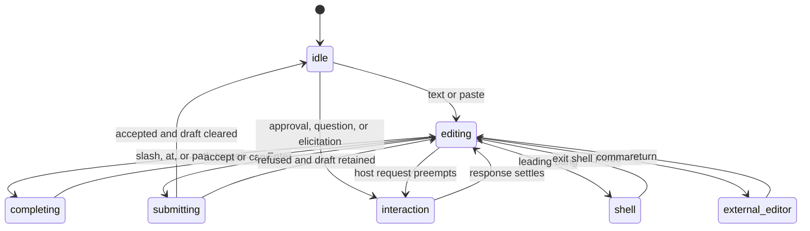

# Agent Note: Claude-Compatible TUI Interaction and Event Experience

Status: proposed

English | [中文](2026-08-16-claude-compatible-tui-interaction.zh.md)

## Problem

Users asking for a Claude-like terminal experience are not asking for copied colors or a list of keyboard shortcuts. They expect a coherent control model: the composer stays primary, running work remains interruptible, tool activity is legible without flooding the transcript, permission and elicitation pauses are unmistakable, background work survives detachment, and session recovery explains what happened while the client was away.

Claude Code hook compatibility is a separate requirement. The current DSH bridge maps seven command-hook events with partial semantics, while Claude Code continues to add lifecycle events, handler types, decision fields, and timing rules. Rendering a Claude-named row in TUI would not make an unsupported hook semantics correct. Hook execution and compatibility must remain Host-owned, with the TUI presenting canonical facts and explicit compatibility diagnostics.

## Proposal

Ship a default `claude` interaction profile over DSH's canonical session, queue, permission, task, subagent, terminal, and checkpoint actions. Preserve high-value Claude habits where terminals can report them reliably, add visible fallback commands where they cannot, and keep DSH's multi-client/background semantics explicit.

Extend the Claude hook bridge in phases behind its current package boundary. Generate a compatibility inventory from the official event list and local mapping table. Each event is `supported`, `partial`, `unsupported`, or `not-applicable`, with missing input/output/timing semantics named. Unknown events and fields are diagnosed; none are silently accepted.

## Experience principles

1. The prompt is the center of gravity; navigation and inspection do not steal focus without a user action or an answerable Host request.
2. Every key has a visible command equivalent in the palette and help.
3. An accepted action and its final outcome are distinct states.
4. Queue, steer, interrupt, detach, and terminate are distinct verbs.
5. The transcript is compact by default and fully inspectable on demand.
6. Background and subagent work is visible as a small status summary first, with progressive detail.
7. Approval, question, elicitation, login, and trust prompts preempt ordinary navigation but never hide their owner or consequence.
8. Reconnect produces a recap from authoritative facts, not an invented story.
9. Claude compatibility is an adapter promise, not the canonical DSH schema.
10. Terminal limitations are surfaced with a fallback; they are not blamed on the user or silently ignored.

## Layout contract

### Responsive modes

| Mode | Width | Composition |
| --- | --- | --- |
| wide | 132 columns or more | 28-column navigation, flexible transcript, 30-column inspector |
| standard | 90 to 131 | transcript plus collapsible inspector; navigation is an overlay |
| narrow | below 90 | one primary pane; navigation, tasks, and inspector are full overlays |
| short | below 20 rows | transcript and composer only; status facts collapse into one line |

The composer and one-line status remain visible whenever terminal height allows. Workspace, session, model, permission mode, connection state, and running/attention state are always visible or reachable with one command.

### Wide layout

```text
┌ Workspaces / Sessions ┬ Conversation                         ┬ Inspector ┐
│ current workspace     │ user, assistant, tools, events      │ plan      │
│ running/attention     │ windowed transcript                 │ tasks     │
│ recent/archived       │                                     │ agents    │
├───────────────────────┴──────────────────────────────────────┴───────────┤
│ queue / approval / question / background dock                          │
│ > composer                                                             │
│ session · model · permission · context · service · hints               │
└─────────────────────────────────────────────────────────────────────────┘
```

The inspector never narrows the conversation below its minimum readable width; it collapses first. Navigation shows status words or symbols, not color alone.

## Conversation presentation

### Default density

- User messages retain clear boundaries and source: user, hook context, queued, steered, command, or plugin.
- Assistant text is continuous prose. Streaming cursors and spinners are local presentation state and disappear on completion.
- Reasoning is represented only by provider-safe summaries or owner-authored status. Full hidden reasoning is neither requested nor logged.
- Tool calls are one-line cards while running and compact result cards after settlement. Destructive or permission-relevant arguments remain visible.
- Consecutive low-value progress events coalesce into one row with a count and duration. Failures, approvals, file changes, terminal exits, and result boundaries never coalesce away.
- Background jobs and subagents appear at the turn tail as a summary; the task overlay owns the full list.

### Detail levels

`Ctrl+O` cycles `compact -> normal -> verbose` for the current session:

| Level | Visible by default |
| --- | --- |
| compact | messages, tool names/outcomes, failures, approvals, final task summaries |
| normal | compact plus selected arguments, durations, changed-file summaries, hook diagnostics |
| verbose | normal plus bounded tool output, event metadata, correlation ids, projection facts |

Secrets and prohibited model internals remain redacted at every level. Verbose is not a raw payload dump.

Selection mode lets users copy plain visible text without ANSI. Copying one tool card includes its title, status, bounded body, and evidence refs. Exporting a session remains a Host action and may include more durable content than the current viewport.

## Composer state machine



Drafts are session-scoped by default. Switching sessions preserves each draft. `Ctrl+S` explicitly stashes or restores the current draft and attachments. Reconnect, plugin reload, or resize never clears a draft.

### Submit placement

When the session is idle, `Enter` submits a new turn. When a turn is active, the preference `busyEnter = queue | steer` chooses the primary placement and the accelerated gesture chooses the opposite:

| Gesture     | Idle          | Busy                                         |
| ----------- | ------------- | -------------------------------------------- |
| `Enter`     | submit        | configured primary placement                 |
| `Alt+Enter` | submit        | alternate placement                          |
| `/queue`    | queue next    | queue next                                   |
| `/steer`    | start if idle | attempt steer; Host may return `queued_next` |
| `Ctrl+J`    | newline       | newline                                      |

Terminals that cannot distinguish `Alt+Enter` show the command fallbacks in the status hint and keymap inspector. After submission, the dock says `steered`, `queued`, or `queued after steer window closed` from the Host result. It never uses a generic sent state.

## Keyboard contract

The default profile learns Claude habits but protects terminal recovery:

| Key | Command | State-specific behavior |
| --- | --- | --- |
| `Esc` | escape or interrupt | closes completion/overlay first; otherwise requests active-turn interrupt |
| double `Esc` | rewind | with empty composer and no active modal, opens checkpoint/rewind preview |
| `Ctrl+C` | clear or detach-exit | clears selection/completion/draft first; repeated empty press opens detach/exit flow |
| `Ctrl+O` | detail level | cycles transcript density |
| `Ctrl+B` | background | backgrounds eligible foreground job; otherwise explains why unavailable |
| `Ctrl+T` | tasks | toggles plan, todo, jobs, subagents, and terminals overlay |
| `Ctrl+S` | stash draft | stashes/restores session draft |
| `Ctrl+R` | history search | searches local submitted prompt history |
| `Shift+Tab` | permission mode | cycles modes allowed by Host policy |
| `Alt+P` | model | opens model selector |
| `Ctrl+G` | external editor | opens `$VISUAL` or `$EDITOR` for the draft when configured |
| `Tab` | completion | accepts or advances completion; otherwise moves within modal controls |
| `/` | commands and skills | completion over registered human commands and skills |
| `!` at empty start | shell mode | enters explicit shell composer mode |
| `@` | mentions | files, agents, sessions, and supported resources |
| `?` on empty input | help | opens context-sensitive help |

`Ctrl+Z` follows platform suspend behavior only after the renderer restores terminal mode; resume re-enters raw mode and reconciles terminal capabilities. Protected bindings can be changed only by an explicit user override recorded by the keymap system.

### Escape and exit ladders

`Esc` is the immediate operational interrupt key; it does not exit the client. If no turn is active, it backs out one focus/overlay level. A second `Esc` within the configured chord window opens rewind only when the composer is empty and no answerable interaction is pending.

`Ctrl+C` preserves work:

1. cancel selection/completion or clear a non-empty draft after confirmation;
2. with empty composer, open exit choices;
3. default exit choice is `detach`; alternatives are `interrupt turn`, `stop session jobs`, and `cancel`;
4. a repeated signal during terminal restoration forces local client exit but never silently sends a service termination.

## Commands, skills, shell, and mentions

Slash completion merges registered human commands, skills, and TUI-local commands with type labels. Model-facing skill invocation remains a normal DSH prompt/action; local commands such as `/theme`, `/keymap`, `/doctor`, and `/reconnect` do not create a model turn.

Shell mode is visibly distinct from prompt mode and shows execution owner, working directory, permission posture, and whether the process is foreground or service-owned background work. `Ctrl+B` may background only a process whose terminal/job owner supports it. Closing a shell view does not imply terminating the process.

Mention completion returns safe references, not arbitrary client-joined paths. File and directory candidates come from Host APIs. Subagents and sessions carry stable ids plus human labels. Inserting a mention records the resolved identity separately from its visible label so later rename does not retarget it.

## Attention and interaction model

Answerable Host requests share one priority queue:

```text
trust/login > permission/approval > elicitation/question > informational notice
```

Priority controls presentation, not authorization. One modal owns focus. Other requests remain visible in the dock with count and owner. The active request shows session, tool/server, requested action, consequence, timeout if any, and all allowed responses. A response remains `submitting` until its `RpcReceipt`; `not-pending` becomes `answered elsewhere`, not a generic failure.

Permission modes are Host facts. `Shift+Tab` requests a mode change and the status line changes only after the authoritative response. If policy locks the mode, the selector explains the owner and offers inspection rather than looping.

## Background service experience

### Detach

Exiting while work is active defaults to detach. The final restored terminal line reports the service/session id and a real resume command:

```text
Detached; session continues in DSH service. Resume: dsh tui --session <session-id>
```

This line appears only after terminal restoration. It does not claim continued work if the service response failed.

### Reattach recap

On reattach the client derives a deterministic recap:

- service restarted or remained continuous;
- last user prompt and its accepted placement;
- turn state and final reason, if settled;
- pending approval/question/elicitation;
- active, completed, failed, orphaned, or unknown jobs/terminals/subagents;
- queued inputs;
- changed-file summary and checkpoint availability;
- last completed assistant result and new notifications since detach.

Each recap item links to its transcript node or detail overlay. Unknown facts say `unknown`; absence is not rewritten as success.

### Notifications

When detached, the service may emit platform notifications only through an explicit notification plugin and user policy. The default product requires no desktop daemon integration. On attachment, missed attention facts are shown in the recap and notification center.

## Checkpoint, rewind, summarize, and fork

Double `Esc` opens a preview, never an immediate destructive restore. The preview options are:

| Action | Meaning |
| --- | --- |
| restore conversation | create a new active branch from selected durable sequence |
| restore files | apply owner-generated file restoration preview |
| restore both | coordinated conversation branch and file restore |
| summarize to here | compact through selected point while preserving an evidence summary |
| fork | create a new session without altering the current one |

The preview lists files, additions/deletions, conflicts, untracked handling, and known non-restorable effects. Shell side effects, external services, subagent workspaces, symlinks, hard links, and processes are never implied to be reversible. File restoration is not presented as a substitute for version control.

## Hook compatibility architecture

DSH canonical interception points and events remain the authority. The Claude bridge owns:

- discovery and merge of Claude hook configuration;
- official event-name and matcher dialect;
- event-specific input projection;
- command/HTTP/MCP-tool/prompt/agent handler execution where supported;
- timeout, concurrency, deduplication, async, and lifecycle behavior;
- decoding event-specific output and mapping it to typed DSH decisions;
- durable redacted invocation/result records when model context, policy, tool output, or user-visible state changes;
- compatibility inventory and diagnostics.

The TUI owns only presentation: hook running, blocked, changed input/output, injected context, timed out, failed, skipped, or unsupported. It consumes canonical `hook/*` facts and never executes a hook process.

## Compatibility baseline and phases

The baseline is the official Claude Code hook reference inspected on 2026-08-16. That reference includes `DirectoryAdded`, so the existing README's “30 events / 23 unsupported” count is already stale. The implementation must generate the inventory from a pinned compatibility fixture rather than keep a hand-maintained count in prose.

| Claude event | Current DSH state | Committed phase | Required owner seam |
| --- | --- | --- | --- |
| `SessionStart` | partial | H1 | synchronous session-start gate, context/session metadata |
| `Setup` | unsupported | H4 | CLI/service setup lifecycle |
| `InstructionsLoaded` | unsupported | H3 | instruction-loading event with source/reason |
| `UserPromptSubmit` | partial | H1 | pre-step timing, event timeout, full decision fields |
| `UserPromptExpansion` | unsupported | H2 | command/skill expansion interception |
| `MessageDisplay` | unsupported | H4 | presentation event without making TUI canonical |
| `PreToolUse` | partial | H1 | allow/ask/deny/defer and typed input rewrite |
| `PermissionRequest` | unsupported | H1 | approval seam with updated input and decision mapping |
| `PostToolUse` | partial | H1 | structured output and output rewrite |
| `PostToolUseFailure` | unsupported | H1 | typed failed-tool interception |
| `PostToolBatch` | unsupported | H2 | batch settlement boundary |
| `PermissionDenied` | unsupported | H2 | policy denial observation and retry hint |
| `Notification` | unsupported | H3 | canonical notification service |
| `SubagentStart` | partial | H2 | parent/child identity, type, gated context |
| `SubagentStop` | partial | H2 | stop decision, transcript and result metadata |
| `TaskCreated` | unsupported | H2 | task registry pre-commit seam |
| `TaskCompleted` | unsupported | H2 | task completion decision seam |
| `Stop` | partial | H1 | loop guard, complete payload, continue/stop semantics |
| `StopFailure` | unsupported | H2 | typed turn failure boundary |
| `TeammateIdle` | unsupported | H4 | agent-team owner; `not-applicable` until teams exist |
| `ConfigChange` | unsupported | H3 | layered config watcher and source facts |
| `CwdChanged` | unsupported | H3 | canonical session cwd change event |
| `DirectoryAdded` | unsupported | H3 | watched-directory lifecycle |
| `FileChanged` | unsupported | H3 | bounded watched-file service |
| `WorktreeCreate` | unsupported | H4 | worktree owner before/after lifecycle |
| `WorktreeRemove` | unsupported | H4 | worktree owner disposal lifecycle |
| `PreCompact` | unsupported | H2 | compaction decision boundary |
| `PostCompact` | unsupported | H2 | compaction result boundary |
| `SessionEnd` | unsupported | H2 | durable termination reason and bounded hook budget |
| `Elicitation` | unsupported | H1 | MCP elicitation approval/question seam |
| `ElicitationResult` | unsupported | H1 | response interception before MCP delivery |

H1 is required for the first compatibility release because it changes prompt, tool, permission, stopping, or elicitation behavior. H2 completes ordinary agent lifecycle semantics. H3 adds observation/configuration events. H4 depends on product owners that may not exist in DSH yet; the inventory must report `not-applicable` with an owner reason instead of pretending support.

### Definition of supported

An event is `supported` only when all applicable dimensions match the pinned Claude contract:

- trigger timing and blocking/non-blocking behavior;
- matcher subject and matcher syntax;
- common and event-specific input fields;
- handler types and their timeout/concurrency semantics;
- exit code, HTTP status, JSON, and event-specific output handling;
- decision merge, input/output rewrite, continue/stop, and retry semantics;
- subagent/session scoping, disposal, async behavior, and replay posture;
- redacted diagnostics and user-visible failure behavior.

If one applicable dimension is missing, status stays `partial` and names it. Parsing an event and skipping it is `unsupported`, not partial.

## Hook execution and transcript UX

Hook execution rows are collapsed by default:

```text
hook PreToolUse · policy-check · allowed · 84 ms
hook PostToolUse · formatter · output updated · 311 ms
hook SessionStart · bootstrap · timed out · context discarded
```

Detail shows event, handler type, matcher, duration, result class, decision, redacted changed-field summary, and evidence reference. It never shows the raw hook stdin/stdout when those may contain prompts, secrets, provider payloads, private tool arguments, or hidden instructions.

A blocking hook is visually attached to the prompt/tool/stop boundary it affected. Async observational hooks appear in the event timeline and cannot retroactively make a completed action look blocked. A hook output rewrite shows that a rewrite occurred and a safe diff summary supplied by the owner; the TUI does not calculate security-sensitive diffs from raw payloads.

## Failure and edge behavior

| Situation | Behavior |
| --- | --- |
| unsupported hook event in config | load continues; doctor and TUI show unsupported event and source |
| unsupported handler type | hook skipped explicitly; no false success |
| blocking hook times out | apply event-specific fail-open/fail-closed contract; show timeout |
| hook process survives plugin disposal | abort, drain boundedly, record cancellation |
| repeated blocking `Stop` | owner loop guard stops infinite continuation and explains cap |
| approval answered in another client | modal settles as answered elsewhere |
| terminal cannot encode a default key | show command fallback and detected sequence |
| TUI disconnects during interaction response | reconnect replays pending request or resolved state |
| service restarts during foreground terminal | mark attachment unknown/orphaned; never show running by assumption |
| plugin contributes unsafe text | sanitizer escapes it; plugin diagnostic identifies owner |

## Verification requirements

- Golden interaction tests cover idle submit, busy queue, busy steer, fallback to queue, interrupt, detach, reattach recap, and answered-elsewhere.
- Key-sequence tests run against xterm-compatible, Kitty, iTerm2, Windows Terminal, tmux, SSH, and an unknown-terminal fixture where practical.
- Layout snapshots cover the four responsive modes and every required state.
- Accessibility/copy tests prove color-independent status and ANSI-free copy.
- Hook compatibility tests are table-driven from the pinned event fixture and fail when an official event is absent from the inventory.
- Each supported/partial event has trigger, matcher, input, output, timeout, merge, failure, disposal, and transcript tests as applicable.
- System tests run real command hooks in disposable workspaces; HTTP/MCP/prompt/ agent handlers enter the matrix only when implemented.
- Reconnect tests answer approvals and elicitation from two clients and inject disconnects at every receipt boundary.

## Alternatives considered

**Clone Claude Code's interface exactly.** Rejected because terminal behavior, provider internals, and product ownership differ. The profile preserves useful muscle memory while keeping DSH receipts, plugins, and multi-client state explicit.

**Make Claude event payloads canonical DSH events.** Rejected because provider-specific fields would leak into every client and domain owner. The bridge projects canonical DSH seams into the Claude dialect.

**Label parsed-but-skipped hooks as partially supported.** Rejected because users would trust behavior that never ran. Support status is dimension-based and generated from tests.

**Make every detail visible in the default transcript.** Rejected because tool, hook, task, and background events would bury the conversation. Progressive disclosure keeps failure and attention boundaries visible.

## Risks

**“Claude-compatible” can be understood as complete parity.** The product displays a generated event/dimension inventory, dates its official baseline, and uses `partial` until every applicable semantic dimension passes.

**Shortcut differences can make the client feel unreliable.** Each key has a command fallback, terminal detection, help text, and fixture coverage; protected recovery bindings remain explicit.

**Interaction breadth can delay the usable core.** V0 blocks on submit, stream, interrupt, detach, and reattach; richer built-ins and later Hook phases remain separate DAG nodes.

**Recovery UI can imply reversibility it does not possess.** Preview and recap use owner facts, list unknown/non-restorable effects, and never equate file restoration with version control.

**Hook output can leak sensitive payloads.** The TUI receives redacted owner summaries and evidence refs rather than raw hook stdin/stdout.

## Acceptance criteria

1. A Claude-experienced user can discover submit, interrupt, detail, task, permission, model, command, shell, mention, rewind, and detach behavior from the status line and help without reading source code.
2. Queue and steer always display the placement accepted by the Host.
3. Detach is the default active-work exit, and reattach produces an evidence-linked deterministic recap.
4. Every keyboard action has a palette command and a fallback for unsupported terminal sequences.
5. Permission, approval, question, and elicitation responses remain pending until an authoritative receipt and converge across clients.
6. The hook inventory covers every event in the pinned official baseline and never labels parse-and-skip behavior as support.
7. H1 events match their applicable trigger, decision, rewrite, timeout, and failure semantics before the first compatibility release.
8. TUI hook rows expose bounded redacted outcomes, not raw payloads or hidden reasoning.

## Consequences

The product intentionally learns Claude's interaction grammar without cloning its internal schema or every incidental key behavior. DSH-specific advantages — multi-client convergence, explicit queue placement, service detachment, plugin diagnostics, and evidence-linked recovery — remain visible. Hook compatibility becomes a maintained conformance surface, which costs ongoing fixture and official-reference review but prevents the more expensive failure of silent, partial compatibility.
