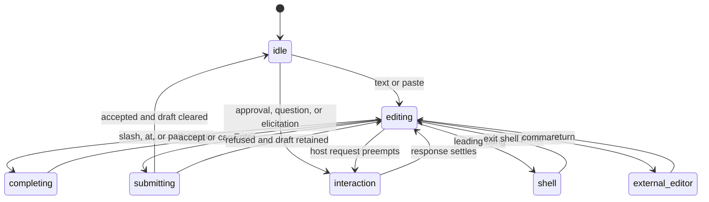

# Agent Note：Claude 兼容的 TUI 交互与事件体验

Status: proposed

[English](2026-08-16-claude-compatible-tui-interaction.md) | 中文

## 问题

用户要求 Claude 式终端体验，并不是要复制颜色或列出一组快捷键。他们期待一致的控制模型：composer 保持中心地位，running work 随时可 interrupt，tool activity 清楚但不淹没 transcript，permission 与 elicitation 暂停不可错过，background work 在 detach 后继续，session recovery 会解释客户端离开期间发生的事情。

Claude Code hook compatibility 是另一项独立要求。当前 DSH bridge 映射七个 command-hook event，且语义均不完整；Claude Code 仍在增加 lifecycle event、handler type、decision field 与 timing rule。在 TUI 画一行 Claude event 名称不会让不支持的 hook 语义变正确。Hook 执行与兼容性必须继续由 Host 拥有，TUI 只展示 canonical fact 与显式 compatibility diagnostics。

## 方案

基于 DSH canonical session、queue、permission、task、subagent、terminal 与 checkpoint action，发布默认 `claude` interaction profile。在 terminal 能可靠报告的范围内保留高价值 Claude 习惯；无法可靠报告时提供可见 command fallback；始终明确 DSH 的 multi-client/background 语义。

在当前 package 边界后分阶段扩展 Claude hook bridge。根据官方 event list 与本地 mapping table 生成 compatibility inventory。每个 event 标记为 `supported`、`partial`、`unsupported` 或 `not-applicable`，并写明缺失的 input/output/timing semantics。未知 event 与 field 产生诊断，绝不静默接受。

## 体验原则

1. Prompt 是交互重心；除用户动作或可应答 Host request 外，navigation/inspection 不抢焦点。
2. 每个 key 都有 palette 与 help 中可见的 command equivalent。
3. Action accepted 与 final outcome 是不同状态。
4. Queue、steer、interrupt、detach 与 terminate 是不同动词。
5. Transcript 默认紧凑，按需可完整检查。
6. Background 与 subagent work 先显示小型 status summary，再渐进展开详情。
7. Approval、question、elicitation、login 与 trust prompt 会抢占普通 navigation，但绝不隐藏 owner 或 consequence。
8. Reconnect 从权威事实生成 recap，不编造故事。
9. Claude compatibility 是 adapter promise，不是 canonical DSH schema。
10. Terminal 限制必须提供 fallback，不把责任推给用户，也不静默忽略。

## 布局契约

### 响应式模式

| Mode | 宽度 | 组合 |
| --- | --- | --- |
| wide | 132 列及以上 | 28 列 navigation、弹性 transcript、30 列 inspector |
| standard | 90 至 131 | transcript 加可折叠 inspector；navigation 使用 overlay |
| narrow | 低于 90 | 一个主 pane；navigation、tasks、inspector 使用全屏 overlay |
| short | 低于 20 行 | 只保留 transcript 与 composer；status fact 折叠为一行 |

Terminal 高度允许时，composer 与单行 status 始终可见。Workspace、session、model、permission mode、connection state 与 running/attention state 始终可见，或能通过一个 command 到达。

### Wide 布局

```text
┌ Workspaces / Sessions ┬ Conversation                         ┬ Inspector ┐
│ current workspace     │ user, assistant, tools, events      │ plan      │
│ running/attention     │ windowed transcript                 │ tasks     │
│ recent/archived       │                                     │ agents    │
├───────────────────────┴──────────────────────────────────────┴───────────┤
│ queue / approval / question / background dock                          │
│ > composer                                                             │
│ session · model · permission · context · service · hints               │
└─────────────────────────────────────────────────────────────────────────┘
```

Inspector 绝不把 conversation 压缩到最低可读宽度以下；它先折叠。Navigation 使用 status word 或 symbol，颜色不是唯一信号。

## Conversation 表现

### 默认密度

- User message 保留清晰边界与 source：user、hook context、queued、steered、command 或 plugin。
- Assistant text 是连续 prose。Streaming cursor/spinner 属于本地 presentation state，完成后消失。
- Reasoning 只表现 provider-safe summary 或 owner-authored status；既不请求也不记录完整 hidden reasoning。
- Tool call 在 running 时是一行 card，settle 后是紧凑 result card。破坏性或 permission-relevant argument 保持可见。
- 连续低价值 progress event 合并为带 count 与 duration 的一行。Failure、approval、file change、terminal exit 与 result boundary 绝不被合并掉。
- Background job 与 subagent 在 turn tail 显示 summary；task overlay 拥有完整列表。

### 详情层级

`Ctrl+O` 为当前 session 循环 `compact -> normal -> verbose`：

| Level | 默认可见内容 |
| --- | --- |
| compact | message、tool name/outcome、failure、approval、final task summary |
| normal | compact 加 selected argument、duration、changed-file summary、hook diagnostic |
| verbose | normal 加有界 tool output、event metadata、correlation id、projection fact |

Secret 与禁止暴露的模型内部信息在每一级都脱敏。Verbose 不是 raw payload dump。

Selection mode 允许复制不带 ANSI 的 plain visible text。复制单个 tool card 时包含 title、status、有界 body 与 evidence ref。导出 session 仍是 Host action，可以包含比当前 viewport 更多的持久内容。

## Composer 状态机



Draft 默认按 session scope 保存。切换 session 保留各自 draft。`Ctrl+S` 显式 stash/restore 当前 draft 与 attachment。Reconnect、plugin reload 或 resize 绝不清空 draft。

### Submit placement

Session idle 时，`Enter` 提交新 turn。Turn active 时，偏好 `busyEnter = queue | steer` 选择主 placement，加速手势选择相反 placement：

| Gesture     | Idle          | Busy                                  |
| ----------- | ------------- | ------------------------------------- |
| `Enter`     | submit        | 已配置 primary placement              |
| `Alt+Enter` | submit        | alternate placement                   |
| `/queue`    | queue next    | queue next                            |
| `/steer`    | idle 时 start | 尝试 steer；Host 可返回 `queued_next` |
| `Ctrl+J`    | newline       | newline                               |

无法区分 `Alt+Enter` 的 terminal 会在 status hint 与 keymap inspector 显示 command fallback。提交后，dock 根据 Host result 显示 `steered`、`queued` 或 `queued after steer window closed`，绝不使用笼统的 sent 状态。

## 键盘契约

默认 profile 学习 Claude 习惯，同时保护 terminal recovery：

| Key | Command | 按状态行为 |
| --- | --- | --- |
| `Esc` | escape 或 interrupt | 先关闭 completion/overlay；否则请求 interrupt active turn |
| double `Esc` | rewind | composer 为空且无 active modal 时打开 checkpoint/rewind preview |
| `Ctrl+C` | clear 或 detach-exit | 先清 selection/completion/draft；重复空输入打开 detach/exit flow |
| `Ctrl+O` | detail level | 循环 transcript density |
| `Ctrl+B` | background | background 合格 foreground job；否则解释不可用原因 |
| `Ctrl+T` | tasks | 切换 plan、todo、jobs、subagents、terminals overlay |
| `Ctrl+S` | stash draft | stash/restore session draft |
| `Ctrl+R` | history search | 搜索本地已提交 prompt history |
| `Shift+Tab` | permission mode | 在 Host policy 允许的 mode 间循环 |
| `Alt+P` | model | 打开 model selector |
| `Ctrl+G` | external editor | 配置存在时，用 `$VISUAL` 或 `$EDITOR` 编辑 draft |
| `Tab` | completion | 接受/前进 completion；否则在 modal control 间移动 |
| `/` | commands and skills | 补全 registered human command 与 skill |
| `!` at empty start | shell mode | 进入显式 shell composer mode |
| `@` | mentions | file、agent、session 与受支持 resource |
| `?` on empty input | help | 打开 context-sensitive help |

`Ctrl+Z` 只有在 renderer 恢复 terminal mode 后才执行平台 suspend；resume 重新进入 raw mode，并重新检查 terminal capability。Protected binding 只能由 keymap system 记录的显式 user override 修改。

### Escape 与 exit ladder

`Esc` 是立即 operational interrupt key，不退出 client。没有 active turn 时，它向外退出一层 focus/overlay。只有 composer 为空且没有 pending answerable interaction 时，配置 chord window 内第二次 `Esc` 才打开 rewind。

`Ctrl+C` 保护正在进行的工作：

1. 取消 selection/completion，或确认后清空非空 draft；
2. composer 为空时打开 exit choices；
3. 默认 exit choice 为 `detach`，其他选项为 `interrupt turn`、`stop session jobs` 与 `cancel`；
4. terminal restoration 期间重复 signal 会强制退出本地 client，但绝不静默发送 service termination。

## Command、skill、shell 与 mention

Slash completion 合并 registered human command、skill 与 TUI-local command，并显示类型 label。Model-facing skill invocation 仍是普通 DSH prompt/action；`/theme`、`/keymap`、`/doctor`、 `/reconnect` 等 local command 不创建 model turn。

Shell mode 与 prompt mode 视觉上明确区分，显示 execution owner、working directory、permission posture，以及 process 是 foreground 还是 service-owned background work。只有 terminal/job owner 支持时，`Ctrl+B` 才能 background process。关闭 shell view 不等于 terminate process。

Mention completion 返回 safe reference，而不是由客户端任意 join 的 path。File/directory candidate 来自 Host API。Subagent/session 使用 stable id 加 human label。插入 mention 时分别记录 resolved identity 与 visible label，之后 rename 不会令其重新指向。

## Attention 与 interaction 模型

可应答 Host request 共用一个 priority queue：

```text
trust/login > permission/approval > elicitation/question > informational notice
```

Priority 控制 presentation，不改变 authorization。一次只有一个 modal 拥有 focus。其他 request 在 dock 显示 count 与 owner。Active request 显示 session、tool/server、requested action、consequence、可能的 timeout 与所有允许 response。Response 在收到 `RpcReceipt` 前保持 `submitting`；`not-pending` 表示 `answered elsewhere`，不是 generic failure。

Permission mode 是 Host fact。`Shift+Tab` 请求 mode change，status line 仅在权威 response 后变化。如果 policy 锁定 mode，selector 解释 owner 并提供 inspection，不循环无效操作。

## 后台服务体验

### Detach

存在 active work 时退出，默认 detach。恢复 terminal 后最后一行报告 service/session id 与真实 resume command：

```text
Detached; session continues in DSH service. Resume: dsh tui --session <session-id>
```

只有 terminal restoration 后才打印该行。如果 service response 失败，不声称 work 继续。

### Reattach recap

Reattach 时，client 生成确定性 recap：

- service 是重启还是保持连续；
- 最后一个 user prompt 与 accepted placement；
- turn state 与已 settle 时的 final reason；
- pending approval/question/elicitation；
- active、completed、failed、orphaned 或 unknown job/terminal/subagent；
- queued input；
- changed-file summary 与 checkpoint availability；
- detach 后最后完成的 assistant result 与新 notification。

每个 recap item 链接到 transcript node 或 detail overlay。未知 fact 显示 `unknown`；不能把缺失改写成成功。

### Notification

Detach 时，service 只有通过显式 notification plugin 与 user policy 才能发平台 notification。默认产品不要求 desktop daemon integration。Attach 后，遗漏的 attention fact 显示在 recap 与 notification center。

## Checkpoint、rewind、summarize 与 fork

Double `Esc` 打开 preview，绝不立即执行破坏性 restore。Preview option：

| Action               | 含义                                          |
| -------------------- | --------------------------------------------- |
| restore conversation | 从选定持久 sequence 创建新 active branch      |
| restore files        | 应用 owner-generated file restoration preview |
| restore both         | 协调 conversation branch 与 file restore      |
| summarize to here    | compact 到选定点，同时保留 evidence summary   |
| fork                 | 创建新 session，不改变当前 session            |

Preview 列出 file、addition/deletion、conflict、untracked handling 与已知 non-restorable effect。Shell side effect、external service、subagent workspace、symlink、hard link 与 process 绝不暗示为可逆。File restoration 不作为版本控制的替代品呈现。

## Hook 兼容架构

DSH canonical interception point 与 event 保持权威。Claude bridge 拥有：

- Claude hook config 的 discovery 与 merge；
- 官方 event name 与 matcher dialect；
- event-specific input projection；
- 在支持时执行 command/HTTP/MCP-tool/prompt/agent handler；
- timeout、concurrency、deduplication、async 与 lifecycle 行为；
- 解码 event-specific output，并映射为 typed DSH decision；
- 当 model context、policy、tool output 或 user-visible state 变化时，写持久脱敏 invocation/result record；
- compatibility inventory 与 diagnostics。

TUI 只拥有 presentation：hook running、blocked、changed input/output、injected context、timed out、failed、skipped 或 unsupported。它消费 canonical `hook/*` fact，绝不执行 hook process。

## 兼容基线与阶段

基线为 2026-08-16 检查的 Claude Code 官方 hook reference。该 reference 已包含 `DirectoryAdded`，因此现有 README 的“30 events / 23 unsupported”计数已经过时。实现必须根据 pinned compatibility fixture 生成 inventory，而不是继续在 prose 中手工维护计数。

| Claude event | 当前 DSH 状态 | 承诺阶段 | 必需 owner seam |
| --- | --- | --- | --- |
| `SessionStart` | partial | H1 | synchronous session-start gate、context/session metadata |
| `Setup` | unsupported | H4 | CLI/service setup lifecycle |
| `InstructionsLoaded` | unsupported | H3 | instruction-loading event 与 source/reason |
| `UserPromptSubmit` | partial | H1 | pre-step timing、event timeout、完整 decision field |
| `UserPromptExpansion` | unsupported | H2 | command/skill expansion interception |
| `MessageDisplay` | unsupported | H4 | presentation event，不让 TUI 成为 canonical owner |
| `PreToolUse` | partial | H1 | allow/ask/deny/defer 与 typed input rewrite |
| `PermissionRequest` | unsupported | H1 | approval seam，支持 updated input 与 decision mapping |
| `PostToolUse` | partial | H1 | structured output 与 output rewrite |
| `PostToolUseFailure` | unsupported | H1 | typed failed-tool interception |
| `PostToolBatch` | unsupported | H2 | batch settlement boundary |
| `PermissionDenied` | unsupported | H2 | policy denial observation 与 retry hint |
| `Notification` | unsupported | H3 | canonical notification service |
| `SubagentStart` | partial | H2 | parent/child identity、type、gated context |
| `SubagentStop` | partial | H2 | stop decision、transcript 与 result metadata |
| `TaskCreated` | unsupported | H2 | task registry pre-commit seam |
| `TaskCompleted` | unsupported | H2 | task completion decision seam |
| `Stop` | partial | H1 | loop guard、完整 payload、continue/stop semantics |
| `StopFailure` | unsupported | H2 | typed turn failure boundary |
| `TeammateIdle` | unsupported | H4 | agent-team owner；teams 存在前为 `not-applicable` |
| `ConfigChange` | unsupported | H3 | layered config watcher 与 source fact |
| `CwdChanged` | unsupported | H3 | canonical session cwd change event |
| `DirectoryAdded` | unsupported | H3 | watched-directory lifecycle |
| `FileChanged` | unsupported | H3 | bounded watched-file service |
| `WorktreeCreate` | unsupported | H4 | worktree owner before/after lifecycle |
| `WorktreeRemove` | unsupported | H4 | worktree owner disposal lifecycle |
| `PreCompact` | unsupported | H2 | compaction decision boundary |
| `PostCompact` | unsupported | H2 | compaction result boundary |
| `SessionEnd` | unsupported | H2 | durable termination reason 与 bounded hook budget |
| `Elicitation` | unsupported | H1 | MCP elicitation approval/question seam |
| `ElicitationResult` | unsupported | H1 | response 在 MCP delivery 前的 interception |

H1 是首个 compatibility release 的前置，因为它改变 prompt、tool、permission、stopping 或 elicitation 行为。H2 补齐普通 agent lifecycle semantics。H3 增加 observation/configuration event。H4 依赖 DSH 中可能尚不存在的 product owner；inventory 必须以 owner reason 报告 `not-applicable`，不能假装支持。

### Supported 的定义

只有以下所有适用维度都匹配 pinned Claude contract，event 才是 `supported`：

- trigger timing 与 blocking/non-blocking behavior；
- matcher subject 与 matcher syntax；
- common 与 event-specific input field；
- handler type 及其 timeout/concurrency semantics；
- exit code、HTTP status、JSON 与 event-specific output handling；
- decision merge、input/output rewrite、continue/stop 与 retry semantics；
- subagent/session scoping、disposal、async behavior 与 replay posture；
- 脱敏 diagnostics 与 user-visible failure behavior。

任一适用维度缺失，状态都保持 `partial` 并点名缺口。解析 event 后 skip 属于 `unsupported`，不是 partial。

## Hook 执行与 transcript UX

Hook execution row 默认折叠：

```text
hook PreToolUse · policy-check · allowed · 84 ms
hook PostToolUse · formatter · output updated · 311 ms
hook SessionStart · bootstrap · timed out · context discarded
```

Detail 显示 event、handler type、matcher、duration、result class、decision、脱敏 changed-field summary 与 evidence reference。当 raw hook stdin/stdout 可能包含 prompt、secret、provider payload、private tool argument 或 hidden instruction 时，绝不显示原文。

Blocking hook 在视觉上附着到它影响的 prompt/tool/stop boundary。Async observational hook 显示在 event timeline 中，不能追溯性地让 completed action 看起来被阻止。Hook output rewrite 显示“发生 rewrite”与 owner 提供的安全 diff summary；TUI 不根据 raw payload 自行计算安全敏感 diff。

## Failure 与边界行为

| 情况 | 行为 |
| --- | --- |
| config 中出现 unsupported hook event | 继续加载；doctor 与 TUI 显示 unsupported event 和 source |
| unsupported handler type | 显式 skip；不报告假成功 |
| blocking hook timeout | 应用 event-specific fail-open/fail-closed contract；显示 timeout |
| hook process 在 plugin disposal 后仍存活 | abort、有界 drain、记录 cancellation |
| 重复 blocking `Stop` | owner loop guard 阻止无限 continuation，并解释 cap |
| approval 被另一 client 回答 | modal settle 为 answered elsewhere |
| terminal 无法编码默认 key | 显示 command fallback 与 detected sequence |
| TUI 在 interaction response 中断连 | reconnect 重放 pending request 或 resolved state |
| service 在 foreground terminal 中重启 | attachment 标记 unknown/orphaned；不凭假设显示 running |
| plugin 贡献 unsafe text | sanitizer 转义；plugin diagnostic 标识 owner |

## 验证要求

- Golden interaction test 覆盖 idle submit、busy queue、busy steer、fallback to queue、interrupt、detach、reattach recap 与 answered-elsewhere。
- Key-sequence test 在可行范围内覆盖 xterm-compatible、Kitty、iTerm2、Windows Terminal、tmux、SSH 与 unknown-terminal fixture。
- Layout snapshot 覆盖四种 responsive mode 与每个 required state。
- Accessibility/copy test 证明 status 不只依赖颜色，复制结果不含 ANSI。
- Hook compatibility test 从 pinned event fixture 表驱动；官方 event 未进入 inventory 时失败。
- 每个 supported/partial event 按适用情况覆盖 trigger、matcher、input、output、timeout、merge、failure、disposal 与 transcript test。
- System test 在 disposable workspace 运行真实 command hook；HTTP/MCP/prompt/agent handler 只有实现后才进入矩阵。
- Reconnect test 从两个 client 回答 approval 与 elicitation，并在每个 receipt boundary 注入断连。

## 考虑过的替代方案

**完全复制 Claude Code interface。** 拒绝，因为 terminal behavior、provider internal 与 product ownership 不同。Profile 保留有价值的肌肉记忆，同时明确 DSH receipt、plugin 与 multi-client state。

**把 Claude event payload 作为 canonical DSH event。** 拒绝，因为 provider-specific field 会泄漏到每个 client/domain owner。Bridge 从 canonical DSH seam 投影到 Claude dialect。

**把 parsed-but-skipped hook 标成 partial support。** 拒绝，因为用户会信任实际从未运行的行为。Support status 按 dimension 定义，并由测试生成。

**默认 transcript 显示全部细节。** 拒绝，因为 tool、hook、task 与 background event 会淹没 conversation。Progressive disclosure 保持 failure 与 attention boundary 可见。

## 风险

**“Claude-compatible” 可能被理解为完整 parity。** 产品显示生成的 event/dimension inventory、标记官方 baseline 日期，并在所有适用 semantic dimension 通过前保持 `partial`。

**Shortcut 差异可能让 client 显得不可靠。** 每个 key 都有 command fallback、terminal detection、help text 与 fixture coverage；protected recovery binding 保持显式。

**Interaction breadth 可能延迟可用 core。** V0 阻塞 submit、stream、interrupt、detach 与 reattach；更丰富 built-in 和后续 Hook phase 保持独立 DAG node。

**Recovery UI 可能暗示并不存在的可逆性。** Preview/recap 使用 owner fact，列出 unknown/non-restorable effect，绝不把 file restoration 等同 version control。

**Hook output 可能泄漏敏感 payload。** TUI 接收脱敏 owner summary 与 evidence ref，而不是 raw hook stdin/stdout。

## 验收标准

1. 熟悉 Claude 的用户无需阅读源码，即可从 status line 与 help 发现 submit、interrupt、detail、task、permission、model、command、shell、mention、rewind 与 detach 行为。
2. Queue 与 steer 始终显示 Host 接受的 placement。
3. 存在 active work 时 detach 为默认退出，并且 reattach 产生带 evidence link 的确定性 recap。
4. 每个 keyboard action 都有 palette command，以及不支持 terminal sequence 时的 fallback。
5. Permission、approval、question 与 elicitation response 在权威 receipt 前保持 pending，并在多客户端间收敛。
6. Hook inventory 覆盖 pinned 官方基线中的每个 event，绝不把 parse-and-skip 标成支持。
7. 首个 compatibility release 前，H1 event 匹配其适用 trigger、decision、rewrite、timeout 与 failure semantics。
8. TUI hook row 暴露有界脱敏 outcome，不暴露 raw payload 或 hidden reasoning。

## 后果

产品刻意学习 Claude 的交互语法，而不复制其内部 schema 或每个偶然的按键行为。DSH 特有优势——multi-client convergence、显式 queue placement、service detachment、plugin diagnostics 与 evidence-linked recovery——保持可见。Hook compatibility 会成为持续维护的 conformance surface，增加 fixture 与官方 reference 复核成本，但避免更昂贵的静默、残缺兼容。
