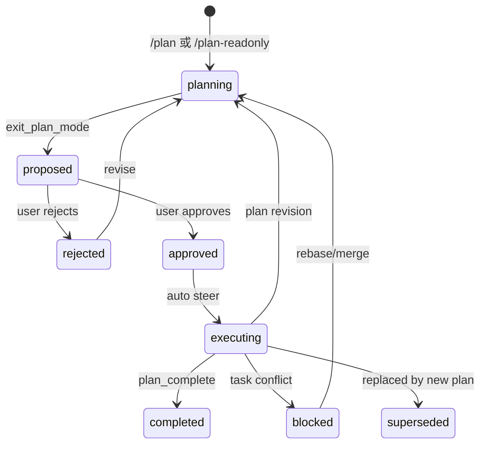
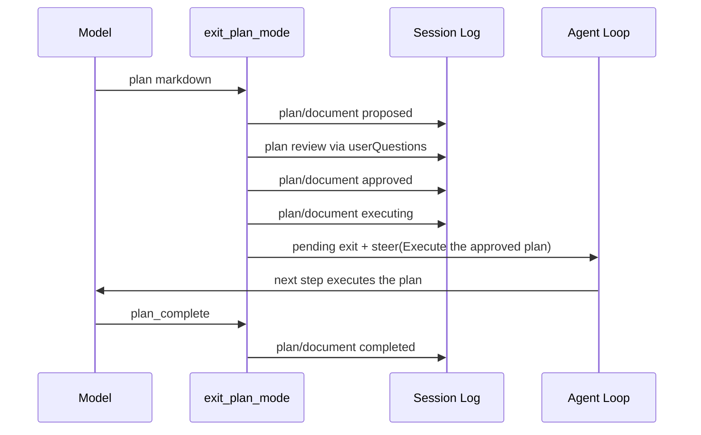

# Plan Execution Lifecycle — Design

## 目标状态机



## 核心原则

1. **plan mode 与 plan document 解耦**：`plan/mode` 仍是行为约束；`plan/document` 是产物生命周期。
2. **批准即执行**：批准后自动追加 `executing` 并注入执行指令，不要求用户再次发消息。
3. **所有事实都是 session 事件**：plan/spec/task-basis 都通过 whole-value 事件持久化，resume/fork/compaction 可重建。
4. **soft guidance 不破坏**：plan mode 不直接写 sandbox/approval；只读规划靠 `/plan-readonly` 桥接或独立策略。

## 数据模型

### `plan/document` 扩展

```ts
'plan/document': {
  planId: string
  title: string
  markdown: string
  status: 'draft' | 'proposed' | 'approved' | 'executing' | 'completed' | 'superseded' | 'rejected'
  round: number
  sourceEventSeqs: number[]
  sourceToolCallId?: string
  feedback?: string
}
```

- `draft` 为可选未来状态，本轮不写入。
- `superseded` 用于并行 plan 或 plan 被新 plan 取代。
- projection 返回 `{ latest, revisions }`，UI 用 latest 显示当前状态。

### `spec/document`

保持现有：

```ts
'spec/document': {
  specId: string
  planId: string
  revision: number
  title: string
  content: string
  status: 'draft' | 'active' | 'superseded'
  basisPlanRevision: number
  basisSpecVersions: Record<string, number>
}
```

### `task/basis` / `task/conflict`

保持现有：

```ts
'task/basis': {
  taskId: string
  planSeq: number
  specSeqs: Record<string, number>
  capturedAtEventSeq: number
}

'task/conflict': {
  taskId: string
  basisPlanSeq: number
  currentPlanSeq: number
  changedSpecs: { specId: string; fromSeq: number; toSeq: number }[]
  verdict: 'safe' | 'needs-merge' | 'blocked'
  reason: string
}
```

## 批准即执行流程



## 强制产出检查

在 `agent/pre-step` 或 `turn/end` 检查：

- plan mode 激活
- 且当前 turn 没有新增 `plan/document`（`proposed/approved/executing`）
- 则注入一条插件来源提醒：`You are still in plan mode. Submit a complete plan through exit_plan_mode; prose is not a plan.`
- 每个 turn 最多一次，不阻塞 step。

## spec 工具

### `spec_write`

- 校验存在 `approved` 或 `executing` 的 plan
- 调用 `ctx.planSpec.write(session, input)`
- 返回 `{ specId, revision }`

### `spec_read`

- 调用 `ctx.planSpec.current(session, specId)` 或 `ctx.planSpec.list(session, planId)`
- 返回最新 spec 文档或列表

## task-basis 接入

- `ctx.taskBasis.capture(session, taskId)`：在 subagent/workflow/goal 启动前调用。
- `ctx.taskBasis.check(session, taskId)`：在提交前调用，追加 `task/conflict`。
- 先在 `packages/plan/task-basis` 内完成 service 与测试，再接入执行路径。

## 非目标

- 不把 plan mode 变成强沙箱。
- 不实现并行 plan 调度器。
- 不新增 plan 文件系统产物。
- 不在本仓库修改 Harness Plugins 的 omdsh TUI。
