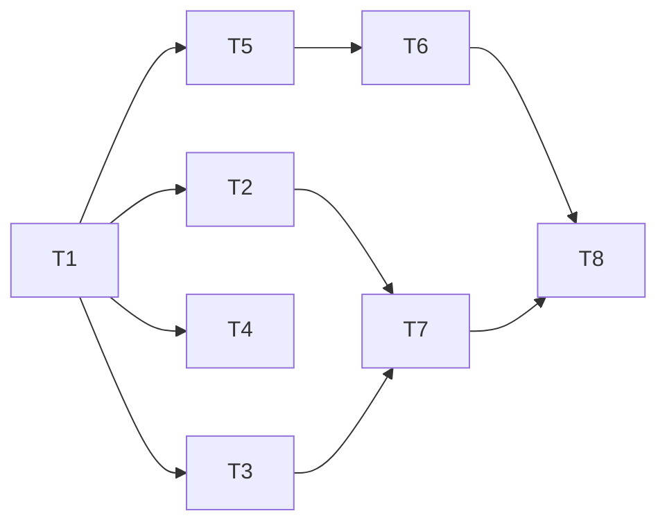

# Tasks — Plan Execution Lifecycle

## T1 — 扩展 `plan/document` 状态与投影

- Owner: `packages/plan/plan-mode`
- Dependencies: 无
- Scope:
  - `plan/document` 新增 `executing`、`completed`、`superseded` 状态
  - `PlanDocumentProjection` 类型同步
  - `plan-document` projection 支持新状态
  - invariant 校验新状态枚举
- Acceptance:
  - 新状态可写入并通过 invariant
  - projection 返回 latest 与完整 revisions
- Verification:
  - `./node_modules/.bin/tsc -b packages/plan/plan-mode/tsconfig.json --pretty false`
  - `./node_modules/.bin/vitest run packages/plan/plan-mode`

## T2 — `exit_plan_mode` 批准后自动进入执行

- Owner: `packages/plan/plan-mode`
- Dependencies: T1
- Scope:
  - 批准后追加 `approved` 与 `executing` 两个 `plan/document`
  - 注入执行指令 `Execute the approved plan. Start with the first task.`
  - 保持 plan mode 退出逻辑不变
- Acceptance:
  - 批准后 log 同时含 `approved` 与 `executing`
  - 执行指令作为 plugin 来源 user message 进入下一步
  - `plan-review` e2e 不回归
- Verification:
  - `./node_modules/.bin/vitest run packages/plan/plan-mode`
  - `DSH_SNAPSHOT=replay ./node_modules/.bin/vitest run --config vitest.web.config.ts apps/web/tests/plan-review.e2e.ts`

## T3 — 新增 `plan_complete` 工具

- Owner: `packages/plan/plan-mode`
- Dependencies: T1
- Scope:
  - 注册 `plan_complete` 工具
  - 始终注册，仅当存在 `executing` plan 时执行成功
  - 成功后追加 `plan/document: completed`
- Acceptance:
  - 非 executing 状态执行失败
  - 成功后 projection 最新状态为 completed
- Verification:
  - `./node_modules/.bin/vitest run packages/plan/plan-mode packages/core/tools/tests/gen-tool-catalog.spec.ts`

## T4 — plan mode 强制产出检查

- Owner: `packages/plan/plan-mode`
- Dependencies: T1
- Scope:
  - 在 `agent/pre-step` 检查 plan mode 下是否已提交计划
  - 未提交时注入提醒消息
  - 每 turn 最多一次
- Acceptance:
  - 只读探索未提交计划时收到提醒
  - 提交 `exit_plan_mode` 后不再提醒
- Verification:
  - `./node_modules/.bin/vitest run packages/plan/plan-mode`

## T5 — spec 工具 `spec_write` / `spec_read`

- Owner: `packages/plan/plan-spec`
- Dependencies: T1
- Scope:
  - 注册 `spec_write` 与 `spec_read` 工具
  - `spec_write` 校验存在 `approved` 或 `executing` plan
  - `spec_read` 读取 latest 或按 plan 列出
- Acceptance:
  - spec 写入/读取通过真实 session log
  - 无 approved/executing plan 时 `spec_write` 失败
  - tool catalog 更新
- Verification:
  - `./node_modules/.bin/tsc -b packages/plan/plan-spec/tsconfig.json --pretty false`
  - `./node_modules/.bin/vitest run packages/plan/plan-spec packages/core/tools/tests/gen-tool-catalog.spec.ts`

## T6 — task-basis 接入执行路径

- Owner: `packages/plan/task-basis`
- Dependencies: T1, T5
- Scope:
  - 完成 `ctx.taskBasis.capture/check` service 与测试
  - 已接入 `tool-workflow`：workflow 启动时 capture，结束前 check
  - 已接入 `tool-subagent`：foreground subagent 启动时 capture，返回前 check
  - 已接入 `tool-goal`：create_goal 时 capture，update_goal complete/blocked 前 check
- Acceptance:
  - plan/spec 变化后 `check` 生成 `needs-merge` 或 `blocked`
  - 无变化生成 `safe`
  - 事件可回放
- Verification:
  - `./node_modules/.bin/tsc -b packages/plan/task-basis/tsconfig.json --pretty false`
  - `./node_modules/.bin/vitest run packages/plan/task-basis`

## T7 — Web UI 投影更新

- Owner: `packages/client/ui-plan`, `packages/client/ui-user-questions`
- Dependencies: T1, T2, T3
- Scope:
  - `PlanDocumentDock` 渲染 `executing/completed/superseded` 状态
  - plan-review 卡片批准后显示执行中状态
- Acceptance:
  - 新状态 UI 可渲染，组件测试覆盖
- Verification:
  - `./node_modules/.bin/vitest run packages/client/ui-plan packages/client/ui-user-questions`

## T8 — omdsh 终端消费层

- Owner: Harness Plugins `packages/client/omdsh`
- Dependencies: T1-T7
- Scope:
  - 消费 `plan-document` / `plan` / `task/conflict` projection
  - 终端 Plan Review Dock 与状态行
  - 不维护自己的 plan 状态机
- Current state:
  - omdsh 已具备 plan/state、plan-review 交互和 Plan 状态行
  - TuiPlanSnapshot 已增加 documentStatus/documentTitle 字段（host 投影已提供）
  - state 已处理 `plan/document` 与 `task/conflict`：状态行显示执行/完成/取代，冲突显示 notice
  - 新增 `plan-doc` utility dock：从 `documentMarkdown` 渲染完整计划文档
  - 完整修订历史列表仍可后续增强
- Acceptance:
  - 终端可审批 plan、查看 plan 文档、看到冲突提示
- Verification:
  - Harness Plugins 仓库内 typecheck 与测试

## 执行顺序

